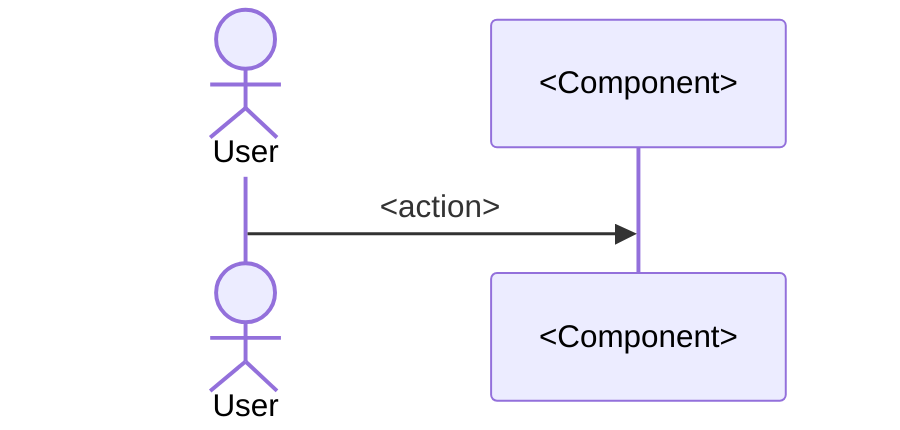
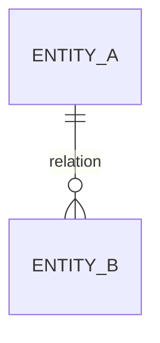

<!--
ANALYSIS DOCUMENT TEMPLATE — /system-analis
Narrative: Indonesian. Code identifiers & technical terms: English.
Fill every applicable section. Skip conditional sections per their rules:
  §5 API Contract  → only if feature touches an API/HTTP layer
  §8 ERD           → only if there are entities / schema changes
  §9 Before/After  → only for feature_type=existing (skip for new)
Diagrams: Mermaid. Before = real code. After = convention-compliant idealization.
-->

# Analisis: <Nama Fitur>

## 1. Metadata
- **Fitur**: <nama>
- **Slug**: <feature-slug>
- **Tanggal**: YYYY-MM-DD
- **Tipe**: new | existing
- **Status**: draft | reviewed | approved
- **Area/Modul terdampak**: <daftar dari recon>
- **Convention ref**: <path standar yang dipatuhi, mis. docs/conventions.md atau CLAUDE.md>
- **Recommended implementer model**: claude-sonnet-4-6
<!-- Untuk fitur yang dipecah: tambahkan "Parent doc: <path>" dan "Sub-features: T1..." -->

## 2. Deskripsi & Tujuan
Fitur apa, kegunaannya untuk apa, problem yang diselesaikan. Tulis dari perspektif pengguna.

## 3. Scope
- **In-scope**: <yang dikerjakan>
- **Out-of-scope**: <yang sengaja tidak dikerjakan — jadi guardrail untuk §12.4>

## 4. Requirement & Edge Cases
- **Happy path**: <alur normal>
- **Edge cases / error**: <daftar kondisi tepi & penanganannya>
- **Non-functional** (bila relevan): perf, security, auth, concurrency.

## 5. API Contract  <!-- CONDITIONAL: hanya jika menyentuh API/HTTP -->
| Method | Path | Auth | Request | Response | Status |
|--------|------|------|---------|----------|--------|
| <GET>  | </x> | <y>  | <schema>| <schema> | <200/4xx> |

Contoh payload:
```json
{ }
```

## 6. Sequence Diagram


## 7. Class Diagram
```mermaid
classDiagram
    class <Name> {
        +<field>
        +<method()>
    }
```

## 8. ERD  <!-- CONDITIONAL: hanya jika ada entitas / perubahan skema -->


## 9. Before / After  <!-- CONDITIONAL: hanya untuk tipe=existing; skip jika new -->
**Before** (cerminan kode nyata):
```mermaid
classDiagram
```
**After** (idealisasi patuh-konvensi, konsisten dgn elemen yang di-reuse):
```mermaid
classDiagram
```
**Delta narasi**: apa yang berubah dari perilaku/struktur lama.
<!-- Jika API atau skema ikut berubah, sertakan before/after API contract & ERD di sini juga. -->

## 10. Rekomendasi Implementasi (Reuse vs New)
Untuk tiap komponen, putuskan & beri alasan, sebut **file/class nyata** dari recon:
- **Reuse**: `<existing class/file>` — kenapa cocok dipakai ulang.
- **New**: `<komponen baru>` — kenapa harus baru, dan bagaimana mematuhi convention ref.
- **Modify**: `<existing>` — perubahan apa.

## 11. Dampak & Risiko
- **File berubah**: <daftar>
- **Migrasi data**: <ada/tidak, detail>
- **Breaking change**: <ada/tidak>
- **Tech-debt tercatat**: <kode existing yang non-konformant tapi sengaja dipertahankan>

---

## 12. Handoff Contract
> Interface formal untuk implementer (Sonnet 4.6). Self-contained briefing — redundansi terkontrol disengaja. Jangan mengandalkan implementer melompat baca banyak referensi.

### 12.1 Header
- `source_doc`: <path absolut dokumen ini>
- `convention_ref`: <path absolut file standar>
- `feature_type`: new | existing
- `recommended_implementer_model`: claude-sonnet-4-6

### 12.2 Task List (terurut, per-unit-logis)
| id | desc | targets | mode | refs | depends_on |
|----|------|---------|------|------|------------|
| T1 | <aksi konkret> | `<path>` [CREATE] / [MODIFY] | reuse \| new \| modify | §6, §7 | — |
| T2 | ... | ... | ... | ... | T1 |

Untuk tiap task, sertakan **konteks inline** seperlunya (signature interface yang harus diimplement, struct yang diubah) agar implementer tidak perlu baca ulang banyak file. Gunakan **path absolut**, jangan referensi kabur ("service yang tadi").

### 12.3 Acceptance Criteria (checklist biner)
- [ ] <kondisi testable, ✓/✗>
- [ ] <...>

### 12.4 Out-of-Scope Guardrails (instruksi negatif eksplisit)
- JANGAN ubah `<file/area>`.
- JANGAN tambah dependency baru tanpa konfirmasi.
- JANGAN <hal lain dari §3 out-of-scope>.

### 12.5 Konvensi Relevan (restated)
Kutip ringkas aturan kunci dari `convention_ref` yang menyentuh fitur ini (naming, pattern, layering) — jangan andalkan implementer menyerap seluruh file standar.
- <aturan 1>
- <aturan 2>
