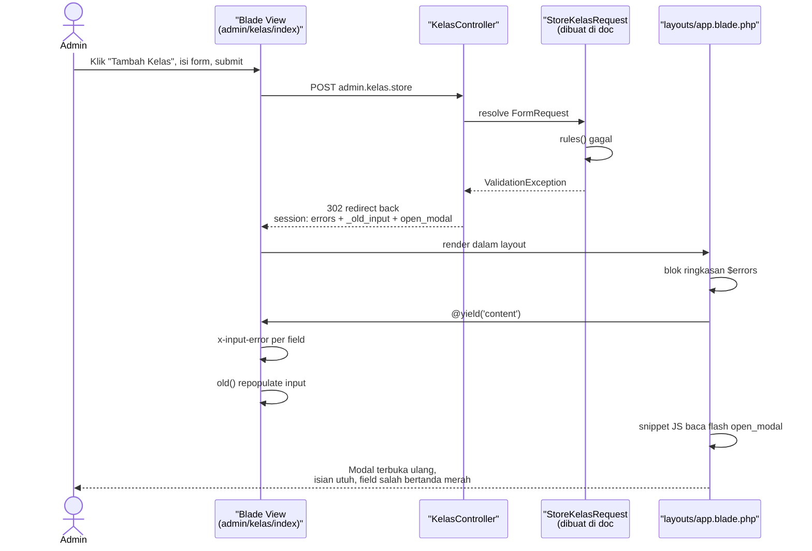
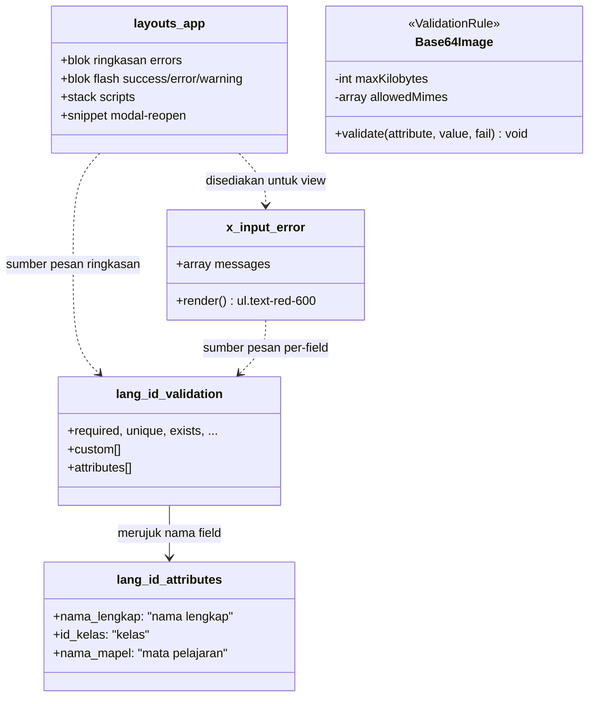
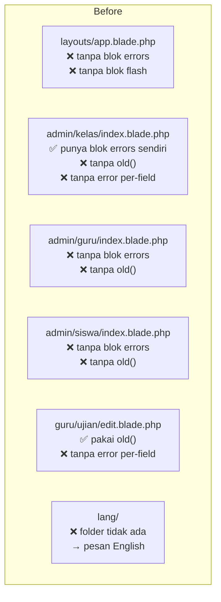
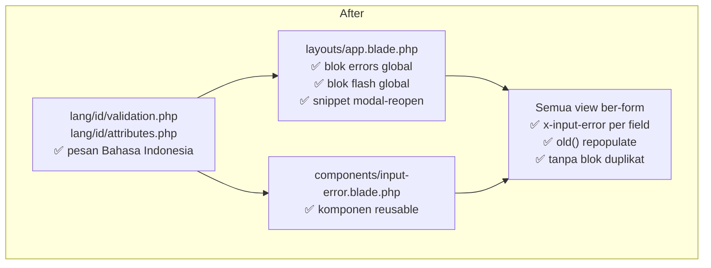

# Analisis: Fondasi Validasi (Sub-dokumen #1)

## 1. Metadata

- **Fitur**: Fondasi validasi — pesan Bahasa Indonesia, tampilan error per-field, modal auto-reopen
- **Slug**: `validasi-form-01-fondasi`
- **Tanggal**: 2026-07-30
- **Tipe**: `existing`
- **Status**: draft
- **Area/Modul terdampak**: `lang/`, `resources/views/components/`, `resources/views/layouts/app.blade.php`, `app/Rules/`
- **Convention ref**: `G:\laragon\www\elearning-sdn-cibodas-2\docs\conventions.md`
- **Parent doc**: `G:\laragon\www\elearning-sdn-cibodas-2\docs\analysis\2026-07-30-validasi-form-menyeluruh.md`
- **Recommended implementer model**: `claude-sonnet-4-6`
- **Depends on**: — (dokumen pertama)
- **Blocks**: sub-dokumen #2, #3, #4, #5

## 2. Deskripsi & Tujuan

Empat sub-dokumen berikutnya akan memasang rules validasi yang benar di ±36 endpoint. Tapi rules yang benar tidak berguna kalau pengguna tidak bisa melihat pelanggarannya. Dokumen ini membangun lapisan tampilnya lebih dulu.

Sekarang, ketika seorang admin salah mengisi form tambah siswa, yang terjadi adalah: halaman reload, modal yang tadi dibuka tertutup, semua isian hilang, dan di atas halaman muncul tulisan `The nis has already been taken.` — dalam bahasa Inggris, tanpa petunjuk field mana yang bermasalah, di halaman yang formnya sudah tidak terlihat lagi. Admin harus membuka modal lagi dan mengisi ulang dari nol.

Setelah dokumen ini, yang terjadi adalah: halaman reload, **modal terbuka kembali otomatis**, semua isian masih ada, dan tepat di bawah field NIS ada tulisan merah `NIS sudah terdaftar.`

Lima hal yang dibangun:

1. **File bahasa Indonesia** untuk semua pesan validasi Laravel.
2. **Komponen Blade `<x-input-error>`** supaya menampilkan error per-field cukup satu baris, tidak perlu menulis `@error` berulang di ±14 view.
3. **Blok ringkasan error & flash message global** di layout, menggantikan blok yang sekarang ditulis ulang tidak konsisten di ~5 view.
4. **Mekanisme modal auto-reopen** — bagian yang paling menentukan kenyamanan, karena hampir semua form CRUD di aplikasi ini hidup di dalam Flowbite modal.
5. **Custom rule `Base64Image`** — rule bersama untuk memvalidasi payload gambar dari kamera. Ditempatkan di sini, bukan di sub-dokumen manapun, karena **dua** sub-dokumen memakainya: #3 untuk `face_samples.*` saat mendaftarkan wajah guru/siswa, dan #5 untuk `image` di tujuh endpoint face recognition. Kalau ditaruh di salah satunya, #3 dan #5 tidak lagi independen dan harus dikerjakan berurutan. Dokumen ini hanya **membuat** class-nya; yang **memakainya** adalah #3 dan #5.

## 3. Scope

**In-scope:**
- `lang/id/validation.php` — terjemahan seluruh pesan validasi bawaan Laravel 12
- `lang/id/attributes.php` — nama field manusiawi yang dipakai lintas form (opsional per-form via `attributes()`)
- `resources/views/components/input-error.blade.php` — komponen error per-field
- `resources/views/components/form-modal-script.blade.php` **atau** snippet inline di layout — logika modal-reopen
- Modifikasi `resources/views/layouts/app.blade.php` — blok `$errors` ringkasan + flash `success`/`error`/`warning` global, plus pemanggilan snippet modal-reopen
- Menghapus blok flash/error duplikat dari view yang sudah punya, agar tidak tampil dua kali
- `app/Rules/Base64Image.php` — custom rule bersama, **dibuat** di sini tapi **belum dipakai** di endpoint mana pun

**Out-of-scope:**
- Tidak membuat FormRequest apa pun — itu tugas #2–#5
- Tidak mengubah controller
- Tidak mengubah rules validasi yang sudah terpasang di endpoint mana pun. Membuat class `Base64Image` diizinkan; **memasangnya** ke endpoint adalah tugas #3 dan #5
- Tidak menambah dependency npm/composer (Flowbite & SweetAlert2 sudah tersedia via CDN)
- Tidak menyentuh `resources/views/admin/laporan_pdf.blade.php` dan `resources/views/guru/laporan/pdf.blade.php` (template PDF, tidak punya form dan tidak memakai layout `app`)
- Tidak mengubah `welcome.blade.php`

## 4. Requirement & Edge Cases

### Happy path
1. Pengguna membuka halaman, mengklik tombol yang memicu Flowbite modal, mengisi form, submit.
2. FormRequest (dibuat di dokumen lain) menolak input.
3. Laravel redirect back dengan `$errors` dan input lama tersimpan di session.
4. View merender: ringkasan error di atas halaman (dari layout), pesan merah per-field (dari `<x-input-error>`), dan setiap input terisi ulang lewat `old()`.
5. Snippet JS di layout membaca flash key `open_modal`, lalu membuka kembali modal dengan ID tersebut.
6. Pengguna melihat modal terbuka dengan isian utuh dan penanda merah di field yang salah.

### Edge cases

| Kondisi | Penanganan |
|---|---|
| Validasi gagal pada form yang **bukan** di modal (mis. `guru/ujian/create`) | Tidak ada flash `open_modal`; snippet JS tidak melakukan apa pun. Error tetap tampil per-field. |
| JavaScript mati / gagal dimuat | Error tetap tampil di ringkasan atas halaman dan per-field. Hanya kenyamanan auto-reopen yang hilang, bukan informasinya. Ini alasan pendekatan server-side dipilih. |
| Beberapa modal di satu halaman (mis. satu modal edit per baris tabel di `admin/kelas/index`) | Flash `open_modal` berisi ID spesifik termasuk primary key, mis. `editKelasModal-7`. Hanya modal itu yang dibuka. |
| Field `password` gagal validasi | `old()` **tidak** boleh mengisi ulang input password — Laravel sudah otomatis mengecualikan field bernama `password` dari `withInput()`. Jangan paksa mengisinya. |
| Field bertipe `file` gagal validasi | Tidak bisa direpopulate — batasan browser, bukan bug. Tampilkan pesan yang menjelaskan file perlu dipilih ulang. |
| Error pada field array (`soal.0.pertanyaan`, `absensi.5.status`) | `<x-input-error>` menerima key bertitik apa adanya: `$errors->get('soal.0.pertanyaan')`. |
| View lama yang sudah punya blok `@if($errors->any())` sendiri | **Harus dihapus**, kalau tidak error tampil dua kali (sekali dari layout, sekali dari view). Daftar view terdampak ada di §12.2 T5. |
| Modal dibuka ulang tapi Flowbite belum siap | Snippet dijalankan di dalam `DOMContentLoaded` **dan** setelah script Flowbite CDN (yang ada di akhir `<body>`). Urutan ini wajib. |

### Non-functional
- **Keamanan**: pesan validasi tidak boleh membocorkan informasi sistem. Khususnya pesan login tetap generik (`Username atau password salah.`) — jangan bedakan "username tidak ada" vs "password salah", karena itu memudahkan enumerasi akun.
- **Aksesibilitas**: pesan error dikaitkan ke input dengan `aria-describedby` dan diberi `role="alert"` supaya pembaca layar mengumumkannya.
- **Performa**: tidak ada dampak — semuanya render-time Blade, tanpa query tambahan.

## 5. API Contract

Dokumen ini tidak menambah atau mengubah endpoint. Yang berubah adalah **bentuk respons validasi gagal** yang berlaku umum setelah #2–#5 terpasang:

| Konteks | Trigger | Respons | Status |
|---|---|---|---|
| Form Blade biasa | submit form HTML | `302` redirect back + session `errors` + session `_old_input` | 302 |
| Endpoint AJAX | `Accept: application/json` atau `X-Requested-With: XMLHttpRequest` | JSON body berisi `message` + `errors` | 422 |

Bentuk JSON 422 yang dihasilkan Laravel otomatis (tidak perlu ditulis manual), dicantumkan agar sisi JS di #5 tahu apa yang harus diurai:

```json
{
  "message": "Data yang diberikan tidak valid.",
  "errors": {
    "image": ["Format gambar wajah tidak valid."],
    "kelas": ["Kelas yang dipilih tidak terdaftar."]
  }
}
```

## 6. Sequence Diagram

Alur validasi gagal pada form di dalam modal — inilah alur yang dibangun dokumen ini:



## 7. Class Diagram

Dokumen ini tidak membuat PHP class. Yang dibuat adalah artefak Blade & konfigurasi bahasa — digambarkan sebagai struktur komponen:



<!-- §8 ERD dilewati: tidak ada entitas maupun perubahan skema pada dokumen ini. -->

## 9. Before / After

### Before (cerminan kode nyata)

Kondisi faktual hasil recon, bukan perkiraan:



Fakta yang mendasari diagram di atas:
- `@error` : **0 kemunculan** di seluruh `resources/views/`
- `old(` : hanya di `guru/ujian/edit.blade.php`
- `$errors` / `session(` di `layouts/app.blade.php` : **0 kemunculan**
- `lang/` : direktori tidak ada
- View yang punya blok error/flash sendiri: `admin/kelas/index`, `guru/absensi/index`, `guru/scanner`, `guru/ujian/edit`, `siswa/akademik/presensi`

### After (idealisasi patuh-konvensi)



### Delta narasi

| Aspek | Before | After |
|---|---|---|
| Bahasa pesan validasi | English default Laravel | Bahasa Indonesia |
| Error per-field | tidak ada sama sekali | `<x-input-error>` di setiap field |
| Repopulate input | 1 view | semua view ber-form (diselesaikan bertahap di #2–#5) |
| Ringkasan error | ditulis ulang di 5 view, tidak konsisten | satu blok di layout |
| Flash message | ditulis ulang per view | satu blok di layout |
| Modal setelah validasi gagal | tertutup, isian hilang | terbuka ulang, isian utuh |

**Tidak ada perubahan perilaku backend.** Semua rules dan alur controller sama persis. Yang berubah murni lapisan presentasi dan bahasa.

## 10. Rekomendasi Implementasi (Reuse vs New)

### Reuse
- **`resources/views/layouts/app.blade.php`** — layout tunggal yang sudah dipakai semua halaman ter-autentikasi. Blok error/flash global ditempelkan di sini, tepat sebelum `@yield('content')` di `<div id="main-content">`. Ini tempat yang benar karena satu perubahan langsung menjangkau semua halaman.
- **`@stack('scripts')`** yang sudah ada di baris 355 — dipakai apa adanya, tidak perlu mekanisme baru untuk menyisipkan script per-view.
- **Flowbite CDN** (baris 268) — API modal-nya dipakai untuk reopen. Jangan pasang Flowbite dari npm; ini akan menyebabkan dua instance.
- **SweetAlert2 CDN** (baris 271) — sudah dipakai untuk konfirmasi hapus. **Jangan** dipakai untuk pesan validasi; error validasi harus tampil di form, bukan di popup (lihat keputusan #4 di dokumen induk).
- **Pola `old()` di `guru/ujian/edit.blade.php`** — sudah benar, jadikan acuan gaya untuk view lain. Jangan diubah.
- **Kelas Tailwind yang sudah dipakai untuk error** di `admin/kelas/index.blade.php` baris 23 (`text-red-800 bg-red-50 border-red-200` + varian dark) — pakai palet yang sama supaya konsisten visual.

### New
- **`lang/id/validation.php`** — struktur standar Laravel: key per-rule, plus array `custom` dan `attributes`. Laravel 12 tidak menyertakan file bahasa di skeleton, jadi ini murni baru.
- **`lang/id/attributes.php`** — pemisahan opsional tapi disarankan: nama field yang dipakai lintas banyak form (`id_kelas` → "kelas") ditaruh di sini sekali, bukan diulang di `attributes()` tiap FormRequest.
- **`resources/views/components/input-error.blade.php`** — komponen Blade anonim. Folder `components/` belum ada, dibuat baru.
- **Snippet modal-reopen** — JS kecil di layout. Tidak butuh library.

### Modify
- **`resources/views/layouts/app.blade.php`** — tambah dua blok Blade + satu blok `<script>`.
- **5 view yang punya blok error/flash sendiri** — hapus bloknya agar tidak dobel. Daftar lengkap di §12.2 T5.

## 11. Dampak & Risiko

**File berubah:**

| Path | Aksi |
|---|---|
| `lang/id/validation.php` | CREATE |
| `lang/id/attributes.php` | CREATE |
| `resources/views/components/input-error.blade.php` | CREATE |
| `app/Rules/Base64Image.php` | CREATE |
| `resources/views/layouts/app.blade.php` | MODIFY |
| `resources/views/admin/kelas/index.blade.php` | MODIFY (hapus blok duplikat) |
| `resources/views/guru/absensi/index.blade.php` | MODIFY (hapus blok duplikat) |
| `resources/views/guru/scanner.blade.php` | MODIFY (hapus blok duplikat) |
| `resources/views/guru/ujian/edit.blade.php` | MODIFY (hapus blok duplikat) |
| `resources/views/siswa/akademik/presensi.blade.php` | MODIFY (hapus blok duplikat) |

**Migrasi data:** tidak ada.

**Breaking change:** tidak ada. Tanpa `lang/id/`, Laravel jatuh ke pesan English — jadi menambahkannya murni aditif.

**Risiko:**

| Risiko | Mitigasi |
|---|---|
| Pesan tampil dua kali karena blok lama tidak dihapus | T5 mendaftarkan kelimanya secara eksplisit; kriteria terima memeriksanya satu per satu |
| `APP_LOCALE` ternyata bukan `id` di `.env` lokal | Verifikasi `.env`; `.env.example` sudah `APP_LOCALE=id`. Kalau `.env` berbeda, pesan tetap English meski file sudah benar — ini penyebab kebingungan yang paling mungkin |
| Snippet modal-reopen jalan sebelum Flowbite siap | Tempatkan snippet **setelah** tag script Flowbite (baris 268), bukan di `<head>` |
| Cache view lama masih dipakai | Jalankan `php artisan view:clear` setelah selesai |
| Config cache menahan locale lama | Jalankan `php artisan config:clear` |

**Tech-debt tercatat:** view `guru/scanner.blade.php` disebut "Legacy Dashboard Scanner" di `routes/web.php:95` dan mungkin redundan dengan modul absensi guru yang baru. Blok error duplikatnya tetap dibersihkan, tapi **jangan** hapus view atau route-nya.

---

## 12. Handoff Contract

### 12.1 Header

- `source_doc`: `G:\laragon\www\elearning-sdn-cibodas-2\docs\analysis\2026-07-30-validasi-form-01-fondasi.md`
- `parent_doc`: `G:\laragon\www\elearning-sdn-cibodas-2\docs\analysis\2026-07-30-validasi-form-menyeluruh.md`
- `convention_ref`: `G:\laragon\www\elearning-sdn-cibodas-2\docs\conventions.md`
- `glossary_ref`: `G:\laragon\www\elearning-sdn-cibodas-2\CONTEXT.md`
- `feature_type`: `existing`
- `recommended_implementer_model`: `claude-sonnet-4-6`

### 12.2 Task List

| id | desc | targets | mode | refs | depends_on |
|----|------|---------|------|------|------------|
| T1 | Buat file terjemahan validasi Bahasa Indonesia | `G:\laragon\www\elearning-sdn-cibodas-2\lang\id\validation.php` [CREATE] | new | §4, T1 detail | — |
| T2 | Buat file nama atribut lintas-form | `G:\laragon\www\elearning-sdn-cibodas-2\lang\id\attributes.php` [CREATE] | new | T2 detail | T1 |
| T3 | Buat komponen Blade error per-field | `G:\laragon\www\elearning-sdn-cibodas-2\resources\views\components\input-error.blade.php` [CREATE] | new | T3 detail | — |
| T4 | Tambah blok errors + flash global & snippet modal-reopen di layout | `G:\laragon\www\elearning-sdn-cibodas-2\resources\views\layouts\app.blade.php` [MODIFY] | modify | §6, T4 detail | T3 |
| T5 | Hapus blok error/flash duplikat dari 5 view | 5 path di T5 detail [MODIFY] | modify | §11 | T4 |
| T6 | Buat custom rule bersama `Base64Image` | `G:\laragon\www\elearning-sdn-cibodas-2\app\Rules\Base64Image.php` [CREATE] | new | T6 detail | — |
| T7 | Bersihkan cache & verifikasi | — | — | §12.3 | T1–T6 |

---

#### T1 — `lang/id/validation.php`

Laravel 12 tidak menyertakan file bahasa di skeleton. Buat file baru dengan struktur standar. Yang **wajib** ada minimal rule-rule yang benar-benar dipakai di project ini (dari #2–#5): `required`, `string`, `integer`, `numeric`, `array`, `boolean`, `date`, `date_format`, `after`, `before`, `max`, `min`, `in`, `unique`, `exists`, `file`, `mimes`, `mimetypes`, `image`, `confirmed`, `regex`. Sertakan juga sisanya agar lengkap.

Struktur yang benar:

```php
<?php

return [
    'accepted' => ':attribute harus diterima.',
    'after' => ':attribute harus berisi tanggal setelah :date.',
    // ... dst
    'required' => ':attribute wajib diisi.',
    'unique' => ':attribute sudah terdaftar.',
    'exists' => ':attribute yang dipilih tidak terdaftar.',

    'max' => [
        'array'   => ':attribute tidak boleh lebih dari :max item.',
        'file'    => ':attribute tidak boleh lebih dari :max kilobita.',
        'numeric' => ':attribute tidak boleh lebih dari :max.',
        'string'  => ':attribute tidak boleh lebih dari :max karakter.',
    ],

    // Pesan khusus per field+rule. Diisi seperlunya oleh #2–#5.
    'custom' => [
        'password' => [
            'min' => 'Password minimal :min karakter.',
        ],
    ],

    // Dimuat dari attributes.php agar tidak dobel-maintain.
    'attributes' => require __DIR__ . '/attributes.php',
];
```

**Penting soal `:attribute` dan `max`:** rule `max` punya empat varian tipe. Kalau ditulis sebagai string tunggal, pesan untuk file akan berbunyi "tidak boleh lebih dari 20480 karakter" — membingungkan. Struktur array-per-tipe di atas wajib dipakai untuk `max`, `min`, `size`, `between`, dan `gt`/`gte`/`lt`/`lte`.

Nada bahasa: langsung dan sederhana, karena pemakainya guru dan admin sekolah dasar. `":attribute wajib diisi."` bukan `":attribute merupakan sebuah keharusan."`

---

#### T2 — `lang/id/attributes.php`

Nama field manusiawi yang dipakai di lebih dari satu form. Tanpa ini, pesan akan berbunyi "Id kelas wajib diisi." — Laravel menghumanisasi nama kolom secara mekanis dan hasilnya jelek untuk kolom seperti `id_kelas` dan `nama_lengkap`.

```php
<?php

return [
    'nama_lengkap'    => 'nama lengkap',
    'nip'             => 'NIP',
    'nis'             => 'NIS',
    'username'        => 'username',
    'password'        => 'password',
    'id_kelas'        => 'kelas',
    'id_kelas_wali'   => 'kelas wali',
    'target_kelas'    => 'kelas tujuan',
    'kelas'           => 'kelas',
    'nama_kelas'      => 'nama kelas',
    'nama_mapel'      => 'mata pelajaran',
    'mata_pelajaran'  => 'mata pelajaran',
    'mapel'           => 'mata pelajaran',
    'mapel_ajar'      => 'mata pelajaran yang diajar',
    'kode'            => 'kode mata pelajaran',
    'judul'           => 'judul',
    'instruksi'       => 'instruksi',
    'deadline'        => 'batas waktu pengumpulan',
    'file_tugas'      => 'file lampiran tugas',
    'file_jawaban'    => 'file jawaban',
    'file_materi'     => 'file materi',
    'file_soal'       => 'file soal',
    'type'            => 'tipe materi',
    'tipe'            => 'tipe ujian',
    'waktu_menit'     => 'durasi ujian',
    'teks_essay'      => 'teks soal essay',
    'nilai'           => 'nilai',
    'hari'            => 'hari',
    'jam_mulai'       => 'jam mulai',
    'jam_selesai'     => 'jam selesai',
    'guru_id'         => 'guru',
    'siswa_id'        => 'siswa',
    'siswa_ids'       => 'daftar siswa',
    'ids'             => 'data yang dipilih',
    'status'          => 'status kehadiran',
    'keterangan'      => 'keterangan',
    'tanggal'         => 'tanggal',
    'kkm'             => 'KKM',
    'image'           => 'gambar wajah',
    'face_samples'    => 'sample foto wajah',
    'sample_count'    => 'nomor sample',
    'soal'            => 'daftar soal',
    'jawaban'         => 'jawaban',
    'pertanyaan'      => 'pertanyaan',
    'opsi_a'          => 'opsi A',
    'opsi_b'          => 'opsi B',
    'opsi_c'          => 'opsi C',
    'opsi_d'          => 'opsi D',
    'jawaban_benar'   => 'jawaban benar',
];
```

Nama ditulis **huruf kecil** karena akan disisipkan di tengah kalimat. Laravel mengkapitalisasi awal pesan secara otomatis. Kecuali akronim (`NIP`, `NIS`, `KKM`) yang tetap kapital.

---

#### T3 — `resources/views/components/input-error.blade.php`

Komponen Blade anonim. Folder `components/` belum ada — buat.

```blade
@props(['messages' => [], 'name' => null])

@php
    $messages = $messages ?: ($name ? $errors->get($name) : []);
@endphp

@if (! empty($messages))
    <ul {{ $attributes->merge(['class' => 'mt-1.5 space-y-1 text-sm text-red-600 dark:text-red-400']) }}
        role="alert"
        @if($name) id="{{ $name }}-error" @endif>
        @foreach ((array) $messages as $message)
            <li>{{ $message }}</li>
        @endforeach
    </ul>
@endif
```

Menerima dua bentuk pemakaian, keduanya sah:

```blade
{{-- Bentuk ringkas, disarankan --}}
<x-input-error name="nama_kelas" />

{{-- Bentuk eksplisit, untuk key bertitik pada field array --}}
<x-input-error :messages="$errors->get('soal.'.$index.'.pertanyaan')" />
```

Palet warna mengikuti yang sudah dipakai di `admin/kelas/index.blade.php` baris 23, termasuk varian `dark:`.

Untuk aksesibilitas, input yang punya error sebaiknya menunjuk ke komponen ini:

```blade
<input type="text" name="nama_kelas"
       value="{{ old('nama_kelas') }}"
       @error('nama_kelas') aria-invalid="true" aria-describedby="nama_kelas-error" @enderror
       class="...">
<x-input-error name="nama_kelas" />
```

---

#### T4 — Modifikasi `resources/views/layouts/app.blade.php`

**Tiga sisipan.** Jangan mengubah apa pun di luar ketiganya — struktur sidebar, navbar, dan script sidebar-toggle harus utuh.

**Sisipan 1 — blok flash & ringkasan error.** Tempatkan di dalam `<div id="main-content">`, tepat **sebelum** `@yield('content')`. Kode existing di baris 261–265 adalah:

```blade
<div id="main-content" class="min-h-screen pt-24 bg-gray-50 transition-all duration-300">
    <div class="p-6">
        @yield('content')
    </div>
</div>
```

Menjadi:

```blade
<div id="main-content" class="min-h-screen pt-24 bg-gray-50 transition-all duration-300">
    <div class="p-6">

        @if (session('success'))
            <div class="p-4 mb-4 text-sm text-green-800 rounded-lg bg-green-50 border border-green-200 dark:bg-gray-800 dark:text-green-400 dark:border-green-800" role="alert">
                <span class="font-medium">Berhasil!</span> {{ session('success') }}
            </div>
        @endif

        @if (session('warning'))
            <div class="p-4 mb-4 text-sm text-amber-800 rounded-lg bg-amber-50 border border-amber-200 dark:bg-gray-800 dark:text-amber-400 dark:border-amber-800" role="alert">
                <span class="font-medium">Perhatian!</span> {{ session('warning') }}
            </div>
        @endif

        @if (session('error'))
            <div class="p-4 mb-4 text-sm text-red-800 rounded-lg bg-red-50 border border-red-200 dark:bg-gray-800 dark:text-red-400 dark:border-red-800" role="alert">
                <span class="font-medium">Gagal!</span> {{ session('error') }}
            </div>
        @endif

        @if ($errors->any())
            <div class="p-4 mb-4 text-sm text-red-800 rounded-lg bg-red-50 border border-red-200 dark:bg-gray-800 dark:text-red-400 dark:border-red-800" role="alert">
                <span class="font-medium">Periksa kembali isian berikut:</span>
                <ul class="list-disc pl-5 mt-1.5 space-y-1">
                    @foreach ($errors->all() as $error)
                        <li>{{ $error }}</li>
                    @endforeach
                </ul>
            </div>
        @endif

        @yield('content')
    </div>
</div>
```

**Sisipan 2 — snippet modal-reopen.** Tempatkan **setelah** tag script Flowbite yang ada di baris 268, sebelum `@stack('scripts')`. Urutan ini wajib: Flowbite harus sudah terdefinisi.

```blade
@if (session('open_modal'))
<script>
    document.addEventListener('DOMContentLoaded', function () {
        var modalId = @json(session('open_modal'));
        var modalEl = document.getElementById(modalId);
        if (!modalEl) return;

        // Flowbite v3 mengekspos Modal secara global lewat bundle CDN.
        if (typeof Modal !== 'undefined') {
            new Modal(modalEl, { backdrop: 'static' }).show();
            return;
        }

        // Fallback: klik tombol pemicunya.
        var trigger = document.querySelector('[data-modal-toggle="' + modalId + '"]');
        if (trigger) trigger.click();
    });
</script>
@endif
```

Fallback lewat `trigger.click()` disertakan karena nama global yang diekspos bundle Flowbite CDN bisa berbeda antar versi minor, dan layout memuat versi `3.1.2` yang dipin di URL CDN. Fallback ini membuat snippet tetap bekerja tanpa perlu menebak API-nya.

**Sisipan 3 — `aria-live` untuk pengumuman pembaca layar.** Opsional tapi disarankan: tambahkan `aria-live="polite"` pada wrapper blok flash agar perubahan diumumkan.

**Catatan penting untuk implementer:** flash key `open_modal` **belum di-set oleh siapa pun** setelah T4 selesai. Yang meng-set-nya adalah controller di sub-dokumen #2 dan #3. Jadi setelah dokumen ini selesai, snippet ini tidak akan pernah aktif — dan itu benar. Jangan menambahkan `->with('open_modal', ...)` ke controller mana pun di dokumen ini.

Cara #2/#3 nanti memakainya, dicantumkan di sini sebagai kontrak agar konsisten:

```php
// Di FormRequest, override failedValidation atau set di controller:
return back()
    ->withErrors($validator)
    ->withInput()
    ->with('open_modal', 'editKelasModal-' . $id);
```

---

#### T5 — Hapus blok duplikat

Kelima view berikut sudah punya blok flash dan/atau error sendiri. Setelah T4, blok itu akan menghasilkan tampilan dobel. Hapus **hanya** blok flash/error-nya; jangan sentuh bagian lain dari view.

| Path absolut | Yang dihapus |
|---|---|
| `G:\laragon\www\elearning-sdn-cibodas-2\resources\views\admin\kelas\index.blade.php` | blok `@if(session('success'))` (baris ~17-21) dan `@if($errors->any())` (baris ~22-30) |
| `G:\laragon\www\elearning-sdn-cibodas-2\resources\views\guru\absensi\index.blade.php` | blok flash/error yang ada |
| `G:\laragon\www\elearning-sdn-cibodas-2\resources\views\guru\scanner.blade.php` | blok flash/error yang ada |
| `G:\laragon\www\elearning-sdn-cibodas-2\resources\views\guru\ujian\edit.blade.php` | blok flash/error yang ada; **JANGAN** hapus `old()` yang sudah dipakai di view ini |
| `G:\laragon\www\elearning-sdn-cibodas-2\resources\views\siswa\akademik\presensi.blade.php` | blok flash/error yang ada |

Cara menemukannya: cari `session('success')`, `session('error')`, `session('warning')`, dan `$errors->any()` di tiap file. Baris nomor di tabel adalah perkiraan dari recon — **verifikasi dengan membaca file**, jangan hapus berdasarkan nomor baris saja.

Di `admin/kelas/index.blade.php` juga tambahkan `<x-input-error name="nama_kelas" />` di bawah kedua input `nama_kelas` (modal add di baris ~127 dan modal edit di baris ~85), dan ubah `value="{{ $kelas->nama_kelas }}"` menjadi `value="{{ old('nama_kelas', $kelas->nama_kelas) }}"`. Ini menjadikan file itu contoh acuan lengkap untuk pola yang akan diikuti #2–#5.

---

#### T6 — `app/Rules/Base64Image.php`

Folder `app/Rules/` belum ada. Buat.

Rule ini memvalidasi payload gambar data-URI yang dikirim kamera browser. Ia dibuat di dokumen ini karena dipakai oleh **dua** sub-dokumen yang harus tetap saling independen (#3 dan #5). Setelah dokumen ini selesai, class ini ada tapi belum dipanggil dari mana pun — itu keadaan yang benar.

Yang harus diperiksa rule ini, berurutan:

1. Nilainya string.
2. Berbentuk data-URI dengan penanda `;base64,` — inilah yang mencegah crash `$imageParts[1]` di tujuh tempat.
3. MIME type-nya gambar yang diizinkan (`jpeg`, `jpg`, `png`).
4. Bagian base64-nya bisa di-decode.
5. Hasil decode-nya benar-benar gambar (`getimagesizefromstring`), bukan file lain yang dibungkus header gambar.
6. Ukurannya tidak melebihi batas.

```php
<?php

namespace App\Rules;

use Closure;
use Illuminate\Contracts\Validation\ValidationRule;

class Base64Image implements ValidationRule
{
    /** @param int $maxKilobytes Batas ukuran setelah decode. */
    public function __construct(
        private int $maxKilobytes = 4096,
        private array $allowedMimes = ['image/jpeg', 'image/jpg', 'image/png'],
    ) {}

    public function validate(string $attribute, mixed $value, Closure $fail): void
    {
        if (! is_string($value) || $value === '') {
            $fail('Data gambar tidak terkirim. Pastikan kamera aktif lalu coba lagi.');

            return;
        }

        // Bentuk yang diharapkan: data:image/jpeg;base64,/9j/4AAQ...
        if (! str_contains($value, ';base64,')) {
            $fail('Format data gambar tidak dikenali. Muat ulang halaman lalu coba lagi.');

            return;
        }

        [$header, $payload] = explode(';base64,', $value, 2);

        $mime = str_replace('data:', '', $header);
        if (! in_array(strtolower($mime), $this->allowedMimes, true)) {
            $fail('Tipe gambar tidak didukung. Gunakan JPEG atau PNG.');

            return;
        }

        $binary = base64_decode($payload, true);   // strict mode
        if ($binary === false || $binary === '') {
            $fail('Data gambar rusak dan tidak bisa dibaca. Coba ambil ulang.');

            return;
        }

        if (@getimagesizefromstring($binary) === false) {
            $fail('Data yang dikirim bukan gambar yang valid.');

            return;
        }

        if (strlen($binary) > $this->maxKilobytes * 1024) {
            $fail("Ukuran gambar melebihi batas {$this->maxKilobytes} kilobita.");
        }
    }
}
```

Catatan teknis:
- `explode(';base64,', $value, 2)` dengan limit `2` — penting, karena payload base64 bisa mengandung karakter yang tak terduga.
- `base64_decode($payload, true)` — parameter kedua mengaktifkan strict mode, sehingga input yang bukan base64 valid mengembalikan `false` alih-alih sampah.
- `@getimagesizefromstring` — `@` menekan warning untuk input yang bukan gambar; nilai kembaliannya yang dipakai untuk memutuskan.
- Batas default `4096` KB (4 MB) cukup lapang untuk satu frame kamera. #5 boleh menurunkannya lewat konstruktor untuk endpoint tertentu.

Pesan error ditulis dengan instruksi pemulihan ("Muat ulang halaman lalu coba lagi") karena yang menemuinya adalah siswa SD yang tidak akan paham istilah teknis.

---

#### T7 — Bersihkan cache & verifikasi

```bash
php artisan view:clear
php artisan config:clear
```

Lalu verifikasi `APP_LOCALE=id` benar-benar terbaca:

```bash
php artisan tinker --execute="echo app()->getLocale();"
```

Harus mencetak `id`. Kalau mencetak `en`, periksa `.env` — nilai di `.env.example` sudah benar tapi `.env` lokal bisa berbeda.

Uji pesan sudah tersambung:

```bash
php artisan tinker --execute="echo __('validation.required', ['attribute' => 'nama kelas']);"
```

Harus mencetak `nama kelas wajib diisi.` — kalau mencetak string English atau literal `validation.required`, file bahasanya belum terbaca.

### 12.3 Acceptance Criteria

- [ ] `lang/id/validation.php` ada, dan `__('validation.required', ['attribute' => 'x'])` mengembalikan pesan Bahasa Indonesia
- [ ] `lang/id/attributes.php` ada dan di-`require` dari `validation.php` pada key `attributes`
- [ ] Rule `max`, `min`, `size`, `between` ditulis sebagai array per-tipe (`array`/`file`/`numeric`/`string`), bukan string tunggal
- [ ] `app()->getLocale()` mengembalikan `id`
- [ ] `resources/views/components/input-error.blade.php` ada dan menerima **baik** `name="field"` **maupun** `:messages="..."`
- [ ] `<x-input-error name="nama_kelas" />` tidak merender apa pun ketika tidak ada error pada field itu
- [ ] `layouts/app.blade.php` punya blok `session('success')`, `session('warning')`, `session('error')`, dan `$errors->any()`
- [ ] Blok-blok itu berada **di dalam** `<div class="p-6">` dan **sebelum** `@yield('content')`
- [ ] Snippet modal-reopen berada **setelah** tag `<script>` Flowbite, bukan di `<head>`
- [ ] Snippet modal-reopen dibungkus `@if (session('open_modal'))` sehingga tidak dirender di halaman tanpa error
- [ ] Kelima view di T5 tidak lagi punya blok flash/error sendiri
- [ ] Membuka halaman `admin/kelas`, `guru/absensi`, `guru/scanner`, `guru/ujian/{id}/edit`, `siswa/rekap-presensi` — tidak ada pesan flash yang tampil dua kali
- [ ] `admin/kelas/index.blade.php` punya `<x-input-error name="nama_kelas" />` di kedua modal dan `old('nama_kelas', ...)` di input edit
- [ ] Submit form tambah kelas dengan nama kosong → pesan Bahasa Indonesia tampil di bawah field, bukan cuma di atas halaman
- [ ] Sidebar, navbar, dropdown user, toggle sidebar, dan konfirmasi hapus SweetAlert2 masih berfungsi normal setelah layout diubah
- [ ] `app/Rules/Base64Image.php` ada dan meng-implement `Illuminate\Contracts\Validation\ValidationRule`
- [ ] `Base64Image` menolak string tanpa `;base64,` **tanpa** melempar exception (uji: validasi nilai `"bukan-gambar"`)
- [ ] `Base64Image` menolak data-URI yang MIME-nya bukan gambar (uji: `"data:text/plain;base64,aGFsbw=="`)
- [ ] `Base64Image` menerima data-URI JPEG yang valid
- [ ] `Base64Image` **belum dipanggil** dari FormRequest atau controller mana pun setelah dokumen ini
- [ ] `vendor/bin/pint --test` lolos untuk file PHP yang disentuh
- [ ] `npm run build` sukses tanpa error baru

### 12.4 Out-of-Scope Guardrails

- **JANGAN** membuat FormRequest apa pun di dokumen ini. Semuanya milik #2–#5.
- **JANGAN** mengubah rules validasi di controller mana pun. Tidak satu baris.
- **JANGAN** menambahkan `->with('open_modal', ...)` ke controller. Itu tugas #2 dan #3. Setelah dokumen ini, snippet modal-reopen memang tidak akan pernah aktif — itu keadaan yang benar.
- **JANGAN** memasang `Base64Image` ke endpoint, FormRequest, atau controller mana pun. Dokumen ini hanya membuat class-nya. Yang memakainya adalah #3 (`face_samples.*`) dan #5 (`image` di tujuh endpoint). Class yang belum terpakai setelah dokumen ini adalah keadaan yang benar.
- **JANGAN** memakai SweetAlert2 untuk menampilkan pesan validasi. Error harus tampil di form.
- **JANGAN** menambah dependency npm atau composer. Flowbite dan SweetAlert2 sudah tersedia via CDN.
- **JANGAN** memasang Flowbite dari npm bundle — layout memuatnya via CDN, dua instance akan bertabrakan.
- **JANGAN** membuat `tailwind.config.js`. Project ini Tailwind v4 via plugin Vite; file itu tidak dipakai.
- **JANGAN** mengubah struktur sidebar, navbar, atau script sidebar-toggle di `layouts/app.blade.php`.
- **JANGAN** menyentuh `resources/views/admin/laporan_pdf.blade.php`, `resources/views/guru/laporan/pdf.blade.php`, atau `welcome.blade.php`.
- **JANGAN** menghapus view atau route `guru/scanner` meski dikomentari sebagai "Legacy".
- **JANGAN** membuat automated test.
- **JANGAN** mengubah skema database. Tidak ada migrasi di dokumen ini.

### 12.5 Konvensi Relevan (restated)

Dikutip dari `docs/conventions.md` — bagian yang menyentuh dokumen ini:

- **§5** — Error per-field wajib pakai `<x-input-error>`, jangan tulis `@error` mentah berulang. Input wajib repopulate dengan `old()`. Blok ringkasan error & flash ada di layout secara global; jangan duplikasi di view.
- **§9** — Semua yang dibaca pengguna akhir dalam **Bahasa Indonesia**. `APP_LOCALE=id`.
- **§8** — PSR-12 via Laravel Pint. Jalankan `vendor/bin/pint` sebelum selesai.
- **§1** — Tailwind v4 tanpa `tailwind.config.js`. Flowbite & SweetAlert2 via CDN, bukan npm.
- **§2** — Komponen Blade anonim ada di `resources/views/components/`. File bahasa di `lang/id/`.
- **Nada bahasa** — pemakai aplikasi ini guru dan admin SD. Pesan harus langsung dan sederhana: "Nama kelas wajib diisi." bukan "Kolom nama kelas merupakan sebuah keharusan untuk dilengkapi."
