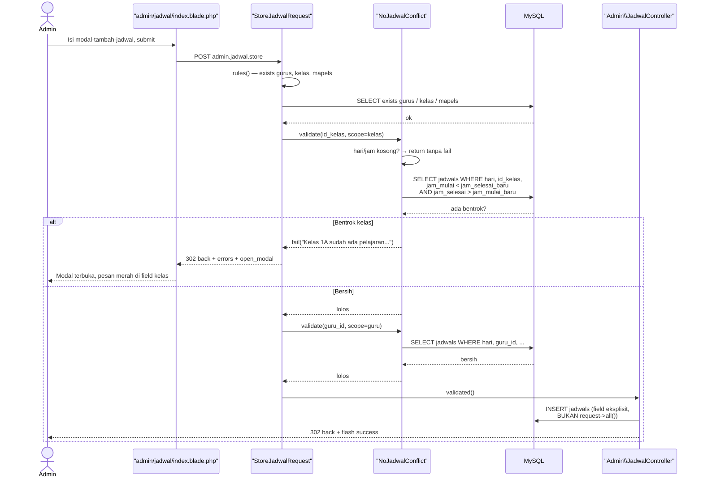
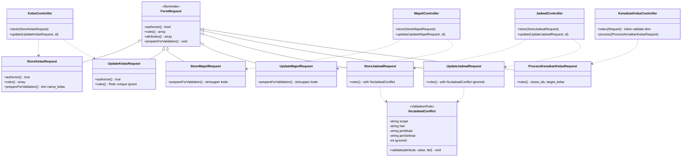
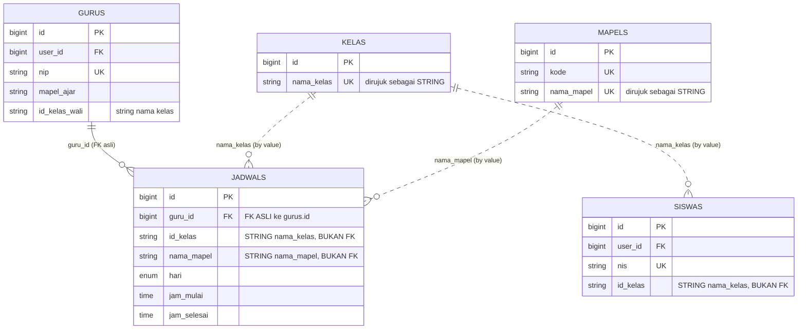
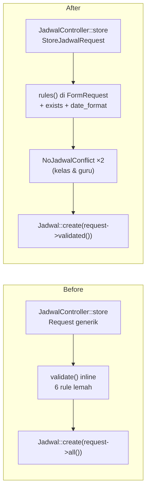

# Analisis: Validasi Admin — Master Data (Sub-dokumen #2)

## 1. Metadata

- **Fitur**: Validasi form master data admin — Kelas, Mapel, Jadwal, Kenaikan Kelas
- **Slug**: `validasi-form-02-admin-master-data`
- **Tanggal**: 2026-07-30
- **Tipe**: `existing`
- **Status**: draft
- **Area/Modul terdampak**: `Admin\KelasController`, `Admin\MapelController`, `Admin\JadwalController`, `Admin\KenaikanKelasController` + 4 view
- **Convention ref**: `G:\laragon\www\elearning-sdn-cibodas-2\docs\conventions.md`
- **Parent doc**: `G:\laragon\www\elearning-sdn-cibodas-2\docs\analysis\2026-07-30-validasi-form-menyeluruh.md`
- **Recommended implementer model**: `claude-sonnet-4-6`
- **Depends on**: sub-dokumen #1 (Fondasi) — **wajib selesai lebih dulu**

## 2. Deskripsi & Tujuan

Master data adalah fondasi seluruh aplikasi: setiap materi, tugas, ujian, jadwal, dan absensi merujuk ke Kelas dan Mapel. Kalau master data-nya bisa kotor, semua yang di atasnya ikut kotor — dan tidak ada validasi di lapisan atas yang bisa menyelamatkannya, karena lapisan atas justru memvalidasi *terhadap* master data ini.

Kondisi sekarang tidak seburuk domain lain: Kelas dan Mapel sudah punya `unique` yang benar, dan Jadwal sudah punya `exists:gurus,id` untuk `guru_id`. Tapi ada empat lubang nyata.

**Pertama, mass-assignment mentah di Jadwal.** `Admin\JadwalController` baris 55 dan 73 memanggil `Jadwal::create($request->all())` dan `$jadwal->update($request->all())`. Apa pun yang dikirim di request masuk ke query — termasuk field yang tidak divalidasi dan tidak dimaksudkan. Ini pola yang paling langsung berbahaya di keseluruhan pekerjaan validasi ini.

**Kedua, jadwal boleh bertumpuk.** Tidak ada pemeriksaan tumpang-tindih sama sekali. Admin bisa menyimpan Matematika 07:00–08:00 dan IPA 07:30–08:30 di kelas 1A hari Senin. Ini bukan sekadar data jelek — `AbsensiController::index` baris 27-31 mencari jadwal aktif dengan `->first()`, jadi presensi mandiri siswa akan tercatat ke mapel mana pun yang kebetulan terambil lebih dulu. Bentrok jadwal secara langsung menghasilkan absensi yang salah mapel.

**Ketiga, jam tidak berformat.** `jam_mulai` dan `jam_selesai` hanya `required`, tanpa `date_format`. Rule `after:jam_mulai` yang dipasang di `jam_selesai` bekerja di atas dasar yang tidak dijamin bentuknya, sehingga hasilnya tidak bisa diandalkan.

**Keempat, Kenaikan Kelas memindahkan siswa ke kelas yang mungkin tidak ada.** `target_kelas` hanya `string|max:50` — admin bisa memindahkan seluruh angkatan ke kelas `"7A"` yang tidak pernah terdaftar, dan siswa-siswa itu langsung hilang dari semua daftar berbasis kelas. Parameter `kkm` di baris 19 juga dibaca lewat `$request->get('kkm', 75)` tanpa validasi apa pun, padahal dipakai sebagai ambang perbandingan numerik.

## 3. Scope

**In-scope:**

| Endpoint | FormRequest baru |
|---|---|
| `POST admin/kelas` | `StoreKelasRequest` |
| `PUT admin/kelas/{kelas}` | `UpdateKelasRequest` |
| `POST admin/mapel` | `StoreMapelRequest` |
| `PUT admin/mapel/{mapel}` | `UpdateMapelRequest` |
| `POST admin/jadwal` | `StoreJadwalRequest` |
| `PUT admin/jadwal/{jadwal}` | `UpdateJadwalRequest` |
| `POST admin/kenaikan-kelas` | `ProcessKenaikanKelasRequest` |

Plus:
- Custom rule `App\Rules\NoJadwalConflict` — dipakai dua arah (bentrok kelas & bentrok guru)
- Menghapus `$request->all()` dari `Admin\JadwalController`
- Pasang `<x-input-error>` + `old()` + flash `open_modal` di 4 view

**Out-of-scope:**
- Tidak menyentuh `destroy` di keempat controller (tidak menerima input form; hanya route param)
- Tidak menyentuh `getGuruMapels` (endpoint AJAX read-only, hanya route param `{id}`)
- Tidak memvalidasi parameter filter GET (`?kelas=`, `?guru_id=`, `?search=`) — keputusan #7 dokumen induk
- Tidak menambah constraint database (unique index / foreign key) — validasi di lapisan aplikasi saja
- Tidak menyeragamkan penamaan modal yang inkonsisten
- Tidak mengubah logika perhitungan rata-rata nilai di `KenaikanKelasController::index`

## 4. Requirement & Edge Cases

### 4.1 Kelas

Rules yang benar:

```php
// StoreKelasRequest
'nama_kelas' => ['required', 'string', 'max:50', 'unique:kelas,nama_kelas'],

// UpdateKelasRequest — kecualikan baris yang sedang diedit
'nama_kelas' => ['required', 'string', 'max:50',
                 Rule::unique('kelas', 'nama_kelas')->ignore($this->route('kelas'))],
```

**Perhatian pada `->ignore()`:** route-nya `Route::resource('/kelas', ...)` dengan parameter `{kelas}`, dan controller menerima `$id` lalu memanggil `Kelas::findOrFail($id)`. Jadi `$this->route('kelas')` mengembalikan **string ID**, bukan model — karena controller tidak memakai route model binding. `->ignore()` menerima ID mentah, jadi ini benar. Jangan mengubah controller jadi route model binding di dokumen ini.

Kode existing sudah memakai `'unique:kelas,nama_kelas,' . $id` yang secara fungsional sama. Bentuk `Rule::unique()->ignore()` lebih disukai per konvensi §4.2 (rules sebagai array, bisa disisipi Rule object).

| Edge case | Penanganan |
|---|---|
| Nama kelas dengan spasi berlebih (`" 1A "`) | Tambah `prepareForValidation()` yang men-`trim()`. Tanpa ini, `"1A"` dan `" 1A"` dianggap dua kelas berbeda oleh `unique` |
| Nama kelas beda kapitalisasi (`"1a"` vs `"1A"`) | MySQL default collation `utf8mb4_unicode_ci` **case-insensitive**, jadi `unique` sudah menolaknya. Tidak perlu rule tambahan |
| Menghapus kelas yang masih dipakai siswa | **Di luar cakupan** — ini validasi pada `destroy`, dan `destroy` tidak menerima input form. Dicatat sebagai risiko di §11 |

### 4.2 Mapel

```php
// StoreMapelRequest
'kode'       => ['required', 'string', 'max:20', 'unique:mapels,kode'],
'nama_mapel' => ['required', 'string', 'max:100', 'unique:mapels,nama_mapel'],

// UpdateMapelRequest
'kode'       => ['required', 'string', 'max:20',
                 Rule::unique('mapels', 'kode')->ignore($this->route('mapel'))],
'nama_mapel' => ['required', 'string', 'max:100',
                 Rule::unique('mapels', 'nama_mapel')->ignore($this->route('mapel'))],
```

**Penting — `strtoupper` harus dipindah ke `prepareForValidation()`.** Controller existing memanggil `strtoupper($request->kode)` **setelah** validasi (baris 30 dan 47). Akibatnya `unique` memeriksa `"mtk"` sementara yang tersimpan `"MTK"` — sehingga kode `"mtk"` bisa lolos meski `"MTK"` sudah ada. (Pada collation case-insensitive MySQL ini kebetulan tertangkap, tapi bergantung pada collation adalah kerapuhan yang tidak perlu.)

Perbaikannya:

```php
protected function prepareForValidation(): void
{
    $this->merge([
        'kode' => strtoupper(trim((string) $this->input('kode'))),
    ]);
}
```

Lalu controller cukup memakai `$request->validated()` tanpa `strtoupper` lagi.

### 4.3 Jadwal — bagian paling substansial

```php
// Store & Update sama, kecuali pengecualian ID pada rule bentrok
'guru_id'     => ['required', 'integer', 'exists:gurus,id'],
'id_kelas'    => ['required', 'string', 'exists:kelas,nama_kelas'],
'nama_mapel'  => ['required', 'string', 'exists:mapels,nama_mapel'],
'hari'        => ['required', Rule::in(['Senin','Selasa','Rabu','Kamis','Jumat','Sabtu'])],
'jam_mulai'   => ['required', 'date_format:H:i'],
'jam_selesai' => ['required', 'date_format:H:i', 'after:jam_mulai'],
```

**Soal `date_format:H:i` vs `H:i:s`.** Kolomnya bertipe `time` di MySQL, dan input HTML `<input type="time">` mengirim `"07:30"` (tanpa detik) secara default. Jadi `H:i` adalah format yang benar untuk input. Tapi kalau view memakai `step="1"` pada input time, browser bisa mengirim `"07:30:00"`. Verifikasi `resources/views/admin/jadwal/index.blade.php` — kalau ada `step`, pakai `date_format:H:i,H:i:s` (Laravel menerima beberapa format dipisah koma).

**Rule bentrok.** Satu custom rule dipakai dua kali:

```php
'id_kelas' => [
    'required', 'string', 'exists:kelas,nama_kelas',
    new NoJadwalConflict(
        scope: 'kelas',
        hari: $this->input('hari'),
        jamMulai: $this->input('jam_mulai'),
        jamSelesai: $this->input('jam_selesai'),
        ignoreId: $this->route('jadwal'),   // null saat store
    ),
],
'guru_id' => [
    'required', 'integer', 'exists:gurus,id',
    new NoJadwalConflict(
        scope: 'guru',
        hari: $this->input('hari'),
        jamMulai: $this->input('jam_mulai'),
        jamSelesai: $this->input('jam_selesai'),
        ignoreId: $this->route('jadwal'),
    ),
],
```

**Logika deteksi tumpang-tindih.** Dua rentang `[a1, a2)` dan `[b1, b2)` bertumpuk bila `a1 < b2 && b1 < a2`. Perhatikan tanda **kurang dari, bukan kurang-dari-sama-dengan** — jadwal 07:00–08:00 dan 08:00–09:00 **tidak** bertumpuk; keduanya sah dan berurutan. Ini penting: kalau memakai `<=`, sistem akan menolak jadwal berurutan yang normal.

```php
// Di dalam NoJadwalConflict::validate()
$conflict = Jadwal::query()
    ->where('hari', $this->hari)
    ->when($this->scope === 'kelas',
        fn ($q) => $q->where('id_kelas', $value),
        fn ($q) => $q->where('guru_id', $value))
    ->when($this->ignoreId, fn ($q) => $q->where('id', '!=', $this->ignoreId))
    ->where('jam_mulai', '<', $this->jamSelesai)
    ->where('jam_selesai', '>', $this->jamMulai)
    ->exists();
```

| Edge case | Penanganan |
|---|---|
| `hari` / `jam_mulai` / `jam_selesai` sendiri tidak valid | Rule bentrok akan membandingkan `null` dan menghasilkan query tak bermakna. **Wajib** `bail` di awal `validate()`: kalau salah satu dari ketiganya kosong, `return` tanpa memanggil `$fail()` — biarkan rule field masing-masing yang melapor. Melaporkan "jadwal bentrok" padahal jamnya belum diisi itu menyesatkan |
| Edit jadwal tanpa mengubah apa pun | `ignoreId` mengecualikan baris itu sendiri, jadi tidak dianggap bentrok dengan dirinya |
| `jam_selesai` lebih awal dari `jam_mulai` | Ditangkap `after:jam_mulai`, bukan oleh rule bentrok |
| Jadwal melintasi tengah malam (23:00–01:00) | **Tidak didukung** dan tidak perlu — ini SD. Rule bentrok akan berperilaku aneh untuk kasus ini, tapi `after:jam_mulai` sudah menolaknya lebih dulu |
| Guru yang sama, kelas yang sama, jam yang sama, mapel berbeda | Ditolak oleh bentrok kelas. Benar — satu kelas tidak bisa belajar dua mapel sekaligus |
| Mapel yang dipilih bukan mapel yang diampu guru itu | **Di luar cakupan.** Ada tabel `guru_mapels` dan endpoint AJAX `getGuruMapels` untuk dependent dropdown, jadi UI sudah membatasinya. Menambah `exists` terhadap `guru_mapels` akan menolak data lama yang mungkin tidak punya baris pivot (`GuruAbsensiController:51-53` membuktikan data seperti itu ada). Dicatat sebagai risiko di §11 |

### 4.4 Kenaikan Kelas

```php
// ProcessKenaikanKelasRequest
'siswa_ids'     => ['required', 'array', 'min:1'],
'siswa_ids.*'   => ['integer', 'exists:siswas,id'],
'target_kelas'  => ['required', 'string', 'exists:kelas,nama_kelas'],
'current_kelas' => ['nullable', 'string', 'exists:kelas,nama_kelas'],
```

`current_kelas` dipakai di baris 67 untuk redirect (`route('admin.kenaikan.index', ['kelas' => $request->current_kelas])`) tapi tidak pernah divalidasi. Ditambahkan sebagai `nullable` karena hanya memengaruhi tujuan redirect, bukan data.

| Edge case | Penanganan |
|---|---|
| `target_kelas` sama dengan kelas siswa sekarang | Diizinkan. Admin mungkin sengaja menahan siswa di kelas yang sama (tidak naik). Menolaknya akan menghalangi kasus sah |
| `siswa_ids` berisi ID dari kelas yang berbeda-beda | Diizinkan. Admin bisa memilih lintas kelas; `update` hanya mengubah `id_kelas`, tidak ada asumsi keseragaman asal |
| `siswa_ids` kosong / tidak dikirim | Ditolak `required|array|min:1`. Tanpa `min:1`, array kosong lolos `array` dan menghasilkan operasi 0-baris yang membingungkan ("Berhasil menaikkan 0 siswa") |
| `kkm` di halaman index | **Bukan** milik FormRequest ini — `kkm` adalah parameter GET di `index()`, bukan input form `process()`. Lihat catatan di bawah |

**Soal `kkm`.** Dokumen induk mencantumkan `kkm` sebagai temuan, dan keputusan #7 menetapkannya `nullable|numeric|min:0|max:100`. Tapi `kkm` dibaca di `index()` sebagai query parameter GET (`$request->get('kkm', 75)`), bukan sebagai input form ke `process()`. Sementara keputusan #7 juga menyatakan validasi filter GET di luar cakupan.

**Resolusi konflik ini:** `kkm` **divalidasi**, karena berbeda dari filter GET lain — ia bukan penyaring daftar, ia ambang perbandingan numerik yang menentukan rekomendasi naik/tidak naik seorang siswa, dan nilai non-numerik akan membuat perbandingan `$totalAvg >= $kkm` berperilaku tak terduga. Karena `index()` adalah GET tanpa form, validasinya ditulis **inline di controller** sebagai pengecualian yang dibenarkan, bukan sebagai FormRequest:

```php
public function index(Request $request)
{
    $validated = $request->validate([
        'kelas' => ['nullable', 'string', 'exists:kelas,nama_kelas'],
        'kkm'   => ['nullable', 'numeric', 'min:0', 'max:100'],
    ]);

    $kkm = $validated['kkm'] ?? 75;
    // ...
}
```

Ini satu-satunya tempat di seluruh lima dokumen yang mempertahankan validasi inline. Catat alasannya di komentar kode agar tidak dianggap kelalaian.

### 4.5 Non-functional

- **Keamanan**: menutup mass-assignment di Jadwal adalah perbaikan keamanan paling konkret di dokumen ini.
- **Otorisasi**: keempat controller sudah di balik `role:admin`. Tidak ada konsep "kepemilikan" pada master data — semua admin setara. Jadi `authorize()` di ketujuh FormRequest **`return true`**. Ini pengecualian sah dari keputusan #3 dokumen induk, yang menyangkut kepemilikan resource milik guru/siswa.
- **Concurrency**: dua admin menyimpan jadwal bentrok secara bersamaan bisa lolos keduanya (race antara `exists()` check dan `INSERT`). Tidak dimitigasi — hanya ada satu admin di sekolah ini. Dicatat di §11.
- **Performa**: rule bentrok menambah satu query `exists()` per submit. Tidak signifikan.

## 5. API Contract

Tidak ada endpoint baru. Yang berubah adalah kontrak validasi endpoint yang sudah ada.

| Method | Path | Route name | Auth | Request (field tervalidasi) | Respons sukses | Respons gagal |
|---|---|---|---|---|---|---|
| POST | `/admin/kelas` | `admin.kelas.store` | `auth` + `role:admin` | `nama_kelas` | 302 back + flash `success` | 302 back + `errors` + `_old_input` + `open_modal=addKelasModal` |
| PUT | `/admin/kelas/{kelas}` | `admin.kelas.update` | idem | `nama_kelas` | 302 back + flash `success` | 302 back + `open_modal=editKelasModal-{id}` |
| POST | `/admin/mapel` | `admin.mapel.store` | idem | `kode`, `nama_mapel` | 302 back + flash `success` | 302 back + `open_modal=addMapelModal` |
| PUT | `/admin/mapel/{mapel}` | `admin.mapel.update` | idem | `kode`, `nama_mapel` | 302 back + flash `success` | 302 back + `open_modal=editMapelModal-{id}` |
| POST | `/admin/jadwal` | `admin.jadwal.store` | idem | `guru_id`, `id_kelas`, `nama_mapel`, `hari`, `jam_mulai`, `jam_selesai` | 302 back + flash `success` | 302 back + `open_modal=modal-tambah-jadwal` |
| PUT | `/admin/jadwal/{jadwal}` | `admin.jadwal.update` | idem | idem | 302 back + flash `success` | 302 back + `open_modal=modal-edit-jadwal-{id}` |
| POST | `/admin/kenaikan-kelas` | `admin.kenaikan.process` | idem | `siswa_ids[]`, `target_kelas`, `current_kelas?` | 302 redirect ke index + flash `success` | 302 back + `errors` (tanpa `open_modal` — form inline) |

Contoh payload Jadwal:

```json
{
  "guru_id": 3,
  "id_kelas": "1A",
  "nama_mapel": "Matematika",
  "hari": "Senin",
  "jam_mulai": "07:00",
  "jam_selesai": "08:00"
}
```

Contoh payload Kenaikan Kelas:

```json
{
  "siswa_ids": [12, 15, 19],
  "target_kelas": "2A",
  "current_kelas": "1A"
}
```

## 6. Sequence Diagram

Alur paling kompleks di dokumen ini — simpan Jadwal dengan pemeriksaan bentrok:



## 7. Class Diagram



## 8. ERD

Tidak ada perubahan skema. ERD dicantumkan untuk menunjukkan **relasi yang divalidasi** — perhatikan bahwa relasi ke `kelas` dan `mapels` adalah relasi lewat *nama*, bukan foreign key:



Garis putus-putus (`||..o{`) menandai relasi **by value** yang tidak dijamin database — inilah yang rule `exists:` tutup di lapisan aplikasi. Hanya `guru_id` yang punya foreign key sungguhan.

## 9. Before / After

### Before — `Admin\JadwalController::store` (kode nyata, baris 44-58)

```php
public function store(Request $request)
{
    $request->validate([
        'guru_id' => 'required|exists:gurus,id',
        'id_kelas' => 'required|string',              // ❌ tanpa exists
        'nama_mapel' => 'required|string',            // ❌ tanpa exists
        'hari' => 'required|in:Senin,Selasa,Rabu,Kamis,Jumat,Sabtu',
        'jam_mulai' => 'required',                    // ❌ tanpa format
        'jam_selesai' => 'required|after:jam_mulai',  // ❌ tanpa format
    ]);

    Jadwal::create($request->all());                  // ❌ mass-assignment

    return back()->with('success', 'Jadwal pelajaran berhasil ditambahkan.');
}
```

### After

```php
public function store(StoreJadwalRequest $request)
{
    Jadwal::create($request->validated());

    return back()->with('success', 'Jadwal pelajaran berhasil ditambahkan.');
}
```

Dengan rules pindah ke `StoreJadwalRequest` sebagaimana §4.3.

### Delta struktur



### Delta perilaku yang dialami pengguna

| Skenario | Before | After |
|---|---|---|
| Simpan jadwal dengan `id_kelas` = `"9Z"` (tidak ada) | Tersimpan. Jadwal hantu yang tidak terlihat di kelas mana pun | Ditolak: "Kelas yang dipilih tidak terdaftar." |
| Simpan Matematika 07:00–08:00 lalu IPA 07:30–08:30 di 1A Senin | Keduanya tersimpan. Presensi mandiri jadi salah mapel | Yang kedua ditolak: "Kelas 1A sudah ada pelajaran pada rentang jam tersebut." |
| Simpan jadwal guru yang sudah mengajar di kelas lain pada jam sama | Tersimpan | Ditolak: "Guru tersebut sudah mengajar di kelas lain pada rentang jam tersebut." |
| Simpan 07:00–08:00 lalu 08:00–09:00 di kelas sama | Tersimpan | **Tetap tersimpan** — berurutan, bukan bertumpuk |
| Kirim field tambahan lewat devtools (mis. `created_at`) | Masuk ke query lewat `$request->all()` | Diabaikan — hanya `validated()` yang dipakai |
| Kode mapel `"mtk"` saat `"MTK"` sudah ada | Bergantung collation | Ditolak konsisten — dinormalisasi sebelum `unique` |
| Kenaikan kelas ke `"7A"` yang tidak ada | Siswa dipindah ke kelas hantu, hilang dari semua daftar | Ditolak: "Kelas tujuan yang dipilih tidak terdaftar." |
| Validasi gagal di modal | Modal tertutup, isian hilang | Modal terbuka ulang, isian utuh, field salah bertanda |

**Delta API contract:** tidak ada perubahan method/path/route name. Yang berubah: himpunan field yang diterima menyempit ke yang tervalidasi saja (dampak dari membuang `$request->all()`), dan respons gagal kini menyertakan `_old_input` + `open_modal`.

**Delta ERD:** tidak ada. Nol migrasi.

## 10. Rekomendasi Implementasi (Reuse vs New)

### Reuse
- **`Admin\KelasController`, `Admin\MapelController`, `Admin\JadwalController`, `Admin\KenaikanKelasController`** — struktur method dipertahankan. Hanya signature parameter dan pemakaian `validated()` yang berubah. Jangan restrukturisasi.
- **`App\Models\Jadwal`, `Kelas`, `Mapel`, `Siswa`, `Guru`** — dipakai apa adanya. Tidak menambah relasi, scope, atau cast.
- **`<x-input-error>`** dari dokumen #1 — dipakai di keempat view.
- **Snippet modal-reopen** dari dokumen #1 — diaktifkan dengan flash `open_modal` dari controller.
- **Blok flash & ringkasan error di layout** dari dokumen #1 — jangan tambah blok lokal di view.
- **`DB::transaction`** di `KenaikanKelasController::process` (baris 62) — sudah ada dan benar, pertahankan.
- **Rule `in:Senin,...`** yang sudah ada di Jadwal — benar, hanya diubah bentuknya jadi `Rule::in([...])` per konvensi §4.2.
- **`exists:gurus,id`** yang sudah ada di Jadwal — benar, satu-satunya `exists` yang sudah terpasang di dokumen ini. Pertahankan.
- **`exists:siswas,id`** di `siswa_ids.*` (baris 57) — sudah benar, pertahankan.

### New
- **7 FormRequest** di `app/Http/Requests/` — folder ini belum ada, dibuat oleh dokumen ini atau #3/#4/#5, mana pun yang dijalankan lebih dulu.
- **`app/Rules/NoJadwalConflict.php`** — folder `app/Rules/` juga belum ada.

### Modify
- **4 controller** — signature method + buang `$request->all()` + tambah flash `open_modal`.
- **4 view** — pasang `<x-input-error>`, `old()`, dan pastikan nama field cocok dengan rules.

## 11. Dampak & Risiko

**File berubah:**

| Path | Aksi |
|---|---|
| `app/Http/Requests/StoreKelasRequest.php` | CREATE |
| `app/Http/Requests/UpdateKelasRequest.php` | CREATE |
| `app/Http/Requests/StoreMapelRequest.php` | CREATE |
| `app/Http/Requests/UpdateMapelRequest.php` | CREATE |
| `app/Http/Requests/StoreJadwalRequest.php` | CREATE |
| `app/Http/Requests/UpdateJadwalRequest.php` | CREATE |
| `app/Http/Requests/ProcessKenaikanKelasRequest.php` | CREATE |
| `app/Rules/NoJadwalConflict.php` | CREATE |
| `app/Http/Controllers/Admin/KelasController.php` | MODIFY |
| `app/Http/Controllers/Admin/MapelController.php` | MODIFY |
| `app/Http/Controllers/Admin/JadwalController.php` | MODIFY |
| `app/Http/Controllers/Admin/KenaikanKelasController.php` | MODIFY |
| `resources/views/admin/kelas/index.blade.php` | MODIFY |
| `resources/views/admin/mapel/index.blade.php` | MODIFY |
| `resources/views/admin/jadwal/index.blade.php` | MODIFY |
| `resources/views/admin/kenaikan/index.blade.php` | MODIFY |

**Migrasi data:** tidak ada.

**Breaking change:** tidak ada dari sisi pengguna. Dari sisi data: jadwal bentrok yang **sudah ada** di database tidak akan otomatis terdeteksi atau dihapus — rule hanya berlaku pada penyimpanan baru. Kalau ada bentrok lama, admin harus memperbaikinya manual. Ini konsekuensi wajar, tapi perlu diberitahu ke pengguna.

**Risiko:**

| Risiko | Mitigasi |
|---|---|
| Implementer menulis `exists:kelas,id` | Guardrail eksplisit di §12.4; kriteria terima memeriksa string ini tidak muncul |
| `date_format:H:i` menolak input yang mengirim detik | T3 mewajibkan verifikasi atribut `step` pada input time di view lebih dulu |
| Rule bentrok memakai `<=` sehingga menolak jadwal berurutan | Kriteria terima menguji kasus 07:00–08:00 + 08:00–09:00 harus **lolos** |
| Rule bentrok melapor saat `hari`/jam belum diisi | Guard `return` awal diwajibkan di §4.3; kriteria terima mengujinya |
| Jadwal bentrok lama di database | Beri tahu pengguna; tidak ada perbaikan otomatis |
| Nama modal salah di flash `open_modal` | ID persis dicantumkan di §5 dan §12.2, hasil verifikasi langsung dari view |
| `$this->route('kelas')` mengembalikan model, bukan ID | Controller tidak memakai route model binding (`findOrFail($id)` manual), jadi yang dikembalikan string ID. Jangan ubah ke route model binding |

**Tech-debt tercatat:**

1. **Penamaan modal tidak konsisten** — `addKelasModal`/`editKelasModal-{id}` (camelCase) vs `modal-tambah-jadwal`/`modal-edit-jadwal-{id}` (kebab-case) vs `addMapelModal`/`editMapelModal-{id}`. Dipertahankan apa adanya karena menyeragamkannya berarti menyentuh JS dan `data-modal-target` di banyak tempat tanpa manfaat fungsional.
2. **`destroy` tidak memeriksa apakah master data masih dipakai.** Menghapus kelas `"1A"` tidak dicegah meski ada siswa, jadwal, materi, tugas, dan absensi yang merujuknya sebagai string. Karena bukan foreign key, database tidak akan menghalangi, dan semua baris perujuk jadi menggantung. Ini masalah nyata tapi bukan validasi form — `destroy` tidak menerima input. Perlu pekerjaan terpisah.
3. **Bentrok jadwal masih mungkin lolos lewat race condition** — dua submit bersamaan. Tidak dimitigasi karena hanya ada satu admin.
4. **Mapel jadwal tidak diverifikasi terhadap `guru_mapels`.** Guru bisa dijadwalkan mengajar mapel yang tidak diampunya kalau dropdown dilewati. Tidak divalidasi karena data lama mungkin tidak punya baris pivot.
5. **`kkm` divalidasi inline**, satu-satunya pengecualian dari pola FormRequest di kelima dokumen. Alasannya di §4.4; wajib ditulis sebagai komentar di kode.

---

## 12. Handoff Contract

### 12.1 Header

- `source_doc`: `G:\laragon\www\elearning-sdn-cibodas-2\docs\analysis\2026-07-30-validasi-form-02-admin-master-data.md`
- `parent_doc`: `G:\laragon\www\elearning-sdn-cibodas-2\docs\analysis\2026-07-30-validasi-form-menyeluruh.md`
- `depends_on_doc`: `G:\laragon\www\elearning-sdn-cibodas-2\docs\analysis\2026-07-30-validasi-form-01-fondasi.md` — **wajib selesai lebih dulu**
- `convention_ref`: `G:\laragon\www\elearning-sdn-cibodas-2\docs\conventions.md`
- `glossary_ref`: `G:\laragon\www\elearning-sdn-cibodas-2\CONTEXT.md`
- `feature_type`: `existing`
- `recommended_implementer_model`: `claude-sonnet-4-6`

### 12.2 Task List

| id | desc | targets | mode | refs | depends_on |
|----|------|---------|------|------|------------|
| T1 | Buat custom rule `NoJadwalConflict` | `app\Rules\NoJadwalConflict.php` [CREATE] | new | §4.3 | — |
| T2 | Buat 2 FormRequest Kelas | `app\Http\Requests\StoreKelasRequest.php`, `UpdateKelasRequest.php` [CREATE] | new | §4.1 | — |
| T3 | Buat 2 FormRequest Mapel | `app\Http\Requests\StoreMapelRequest.php`, `UpdateMapelRequest.php` [CREATE] | new | §4.2 | — |
| T4 | Verifikasi format input time di view jadwal, lalu buat 2 FormRequest Jadwal | `app\Http\Requests\StoreJadwalRequest.php`, `UpdateJadwalRequest.php` [CREATE] | new | §4.3 | T1 |
| T5 | Buat FormRequest Kenaikan Kelas | `app\Http\Requests\ProcessKenaikanKelasRequest.php` [CREATE] | new | §4.4 | — |
| T6 | Sambungkan `KelasController` + flash `open_modal` | `app\Http\Controllers\Admin\KelasController.php` [MODIFY] | modify | §5 | T2 |
| T7 | Sambungkan `MapelController`, pindahkan `strtoupper` | `app\Http\Controllers\Admin\MapelController.php` [MODIFY] | modify | §4.2 | T3 |
| T8 | Sambungkan `JadwalController`, **buang `$request->all()`** | `app\Http\Controllers\Admin\JadwalController.php` [MODIFY] | modify | §9 | T4 |
| T9 | Sambungkan `KenaikanKelasController` + validasi `kkm` inline di `index` | `app\Http\Controllers\Admin\KenaikanKelasController.php` [MODIFY] | modify | §4.4 | T5 |
| T10 | Pasang `<x-input-error>` + `old()` di 4 view | 4 path di T10 detail [MODIFY] | modify | §12.3 | T6–T9 |
| T11 | Pint + verifikasi manual | — | — | §12.3 | T1–T10 |

---

#### T1 — `app/Rules/NoJadwalConflict.php`

Folder `app/Rules/` belum ada. Buat.

```php
<?php

namespace App\Rules;

use App\Models\Jadwal;
use Closure;
use Illuminate\Contracts\Validation\ValidationRule;

class NoJadwalConflict implements ValidationRule
{
    public function __construct(
        private string $scope,          // 'kelas' | 'guru'
        private ?string $hari,
        private ?string $jamMulai,
        private ?string $jamSelesai,
        private int|string|null $ignoreId = null,
    ) {}

    public function validate(string $attribute, mixed $value, Closure $fail): void
    {
        // WAJIB: jangan melapor bentrok kalau data waktunya belum lengkap.
        // Rule field masing-masing yang akan melapor soal itu.
        if (blank($this->hari) || blank($this->jamMulai) || blank($this->jamSelesai)) {
            return;
        }

        $conflict = Jadwal::query()
            ->where('hari', $this->hari)
            ->when(
                $this->scope === 'kelas',
                fn ($q) => $q->where('id_kelas', $value),
                fn ($q) => $q->where('guru_id', $value),
            )
            ->when($this->ignoreId, fn ($q) => $q->where('id', '!=', $this->ignoreId))
            // Tumpang-tindih: a1 < b2 DAN b1 < a2.
            // Pakai < dan >, BUKAN <= dan >=, supaya jadwal berurutan
            // (07:00-08:00 lalu 08:00-09:00) tetap diizinkan.
            ->where('jam_mulai', '<', $this->jamSelesai)
            ->where('jam_selesai', '>', $this->jamMulai)
            ->exists();

        if ($conflict) {
            $fail($this->scope === 'kelas'
                ? "Kelas :input sudah ada pelajaran lain pada hari {$this->hari} di rentang jam tersebut."
                : "Guru yang dipilih sudah mengajar di jadwal lain pada hari {$this->hari} di rentang jam tersebut.");
        }
    }
}
```

Catatan: `:input` pada pesan akan diganti Laravel dengan nilai yang dikirim. Untuk scope `guru` jangan pakai `:input` karena nilainya ID numerik yang tidak bermakna bagi pengguna.

---

#### T2 — FormRequest Kelas

```php
<?php

namespace App\Http\Requests;

use Illuminate\Foundation\Http\FormRequest;

class StoreKelasRequest extends FormRequest
{
    public function authorize(): bool
    {
        // Master data: semua admin setara, tidak ada konsep kepemilikan.
        // Role sudah dijaga RoleMiddleware (role:admin) di routes/web.php.
        return true;
    }

    protected function prepareForValidation(): void
    {
        $this->merge([
            'nama_kelas' => trim((string) $this->input('nama_kelas')),
        ]);
    }

    public function rules(): array
    {
        return [
            'nama_kelas' => ['required', 'string', 'max:50', 'unique:kelas,nama_kelas'],
        ];
    }
}
```

`UpdateKelasRequest` sama, kecuali rules:

```php
use Illuminate\Validation\Rule;

public function rules(): array
{
    return [
        'nama_kelas' => [
            'required', 'string', 'max:50',
            Rule::unique('kelas', 'nama_kelas')->ignore($this->route('kelas')),
        ],
    ];
}
```

`$this->route('kelas')` mengembalikan **string ID** karena controller memakai `Kelas::findOrFail($id)` manual, bukan route model binding.

Nama atribut sudah ada di `lang/id/attributes.php` (`nama_kelas` → "nama kelas") dari dokumen #1, jadi method `attributes()` tidak perlu di-override kecuali butuh nama yang berbeda dari default global.

---

#### T3 — FormRequest Mapel

```php
protected function prepareForValidation(): void
{
    $this->merge([
        'kode'       => strtoupper(trim((string) $this->input('kode'))),
        'nama_mapel' => trim((string) $this->input('nama_mapel')),
    ]);
}

public function rules(): array
{
    return [
        'kode'       => ['required', 'string', 'max:20', 'unique:mapels,kode'],
        'nama_mapel' => ['required', 'string', 'max:100', 'unique:mapels,nama_mapel'],
    ];
}
```

Update memakai `Rule::unique(...)->ignore($this->route('mapel'))` untuk **kedua** field.

---

#### T4 — FormRequest Jadwal

**Langkah pertama, sebelum menulis kode:** buka `G:\laragon\www\elearning-sdn-cibodas-2\resources\views\admin\jadwal\index.blade.php` dan periksa input `jam_mulai` / `jam_selesai`. Kalau ada atribut `step`, browser akan mengirim detik dan `date_format:H:i` akan menolaknya. Dalam kasus itu pakai `'date_format:H:i,H:i:s'`.

```php
use App\Rules\NoJadwalConflict;
use Illuminate\Validation\Rule;

public function authorize(): bool
{
    return true;
}

public function rules(): array
{
    $ignoreId = $this->route('jadwal');   // null pada Store

    return [
        'guru_id' => [
            'required', 'integer', 'exists:gurus,id',
            new NoJadwalConflict(
                'guru',
                $this->input('hari'),
                $this->input('jam_mulai'),
                $this->input('jam_selesai'),
                $ignoreId,
            ),
        ],
        'id_kelas' => [
            'required', 'string', 'exists:kelas,nama_kelas',
            new NoJadwalConflict(
                'kelas',
                $this->input('hari'),
                $this->input('jam_mulai'),
                $this->input('jam_selesai'),
                $ignoreId,
            ),
        ],
        'nama_mapel'  => ['required', 'string', 'exists:mapels,nama_mapel'],
        'hari'        => ['required', Rule::in(['Senin', 'Selasa', 'Rabu', 'Kamis', 'Jumat', 'Sabtu'])],
        'jam_mulai'   => ['required', 'date_format:H:i'],
        'jam_selesai' => ['required', 'date_format:H:i', 'after:jam_mulai'],
    ];
}
```

`StoreJadwalRequest` dan `UpdateJadwalRequest` bisa berbagi lewat parent class abstrak, atau ditulis dua kali — pilih yang lebih jelas dibaca. Kalau memakai parent, letakkan di `app/Http/Requests/JadwalRequest.php` sebagai `abstract class`.

**`exists:kelas,nama_kelas` — bukan `exists:kelas,id`.** Lihat §12.4.

---

#### T5 — FormRequest Kenaikan Kelas

```php
public function authorize(): bool
{
    return true;
}

public function rules(): array
{
    return [
        'siswa_ids'     => ['required', 'array', 'min:1'],
        'siswa_ids.*'   => ['integer', 'exists:siswas,id'],
        'target_kelas'  => ['required', 'string', 'exists:kelas,nama_kelas'],
        'current_kelas' => ['nullable', 'string', 'exists:kelas,nama_kelas'],
    ];
}

public function messages(): array
{
    return [
        'siswa_ids.required' => 'Pilih minimal satu siswa yang akan dinaikkan.',
        'siswa_ids.min'      => 'Pilih minimal satu siswa yang akan dinaikkan.',
    ];
}
```

---

#### T6–T9 — Sambungkan controller

Pola untuk keempatnya. Contoh `KelasController`:

```php
use App\Http\Requests\StoreKelasRequest;
use App\Http\Requests\UpdateKelasRequest;

public function store(StoreKelasRequest $request)
{
    Kelas::create($request->validated());

    return back()->with('success', 'Kelas berhasil ditambahkan.');
}

public function update(UpdateKelasRequest $request, $id)
{
    $kelas = Kelas::findOrFail($id);
    $kelas->update($request->validated());

    return back()->with('success', 'Kelas berhasil diperbarui.');
}
```

**Flash `open_modal` saat validasi gagal.** Karena FormRequest melempar `ValidationException` sebelum controller dieksekusi, controller tidak bisa menambahkan flash. Override `failedValidation()` di FormRequest:

```php
use Illuminate\Contracts\Validation\Validator;
use Illuminate\Validation\ValidationException;

protected function failedValidation(Validator $validator): void
{
    throw (new ValidationException($validator))
        ->redirectTo(url()->previous())
        ->errorBag('default');
}
```

Cara yang lebih sederhana dan cukup: set flash lewat session langsung di `failedValidation()` sebelum melempar.

```php
protected function failedValidation(Validator $validator): void
{
    session()->flash('open_modal', $this->modalId());

    parent::failedValidation($validator);
}

protected function modalId(): string
{
    return 'addKelasModal';
}
```

ID modal per request (hasil verifikasi langsung dari view — **jangan menebak**):

| FormRequest | `modalId()` |
|---|---|
| `StoreKelasRequest` | `'addKelasModal'` |
| `UpdateKelasRequest` | `'editKelasModal-' . $this->route('kelas')` |
| `StoreMapelRequest` | `'addMapelModal'` |
| `UpdateMapelRequest` | `'editMapelModal-' . $this->route('mapel')` |
| `StoreJadwalRequest` | `'modal-tambah-jadwal'` |
| `UpdateJadwalRequest` | `'modal-edit-jadwal-' . $this->route('jadwal')` |
| `ProcessKenaikanKelasRequest` | **tidak ada** — form inline, jangan set flash |

**`JadwalController` (T8) — yang wajib berubah:**

```php
// Baris 55, SEBELUM
Jadwal::create($request->all());
// SESUDAH
Jadwal::create($request->validated());

// Baris 73, SEBELUM
$jadwal->update($request->all());
// SESUDAH
$jadwal->update($request->validated());
```

**`MapelController` (T7)** — hapus `strtoupper()` dari baris 30 dan 47; normalisasi sudah terjadi di `prepareForValidation()`, jadi `validated()['kode']` sudah kapital.

**`KenaikanKelasController` (T9)** — `process()` memakai FormRequest. `index()` mendapat validasi inline dengan komentar penjelas:

```php
public function index(Request $request)
{
    // Pengecualian sadar dari pola FormRequest: ini endpoint GET tanpa form,
    // tapi `kkm` bukan filter biasa — ia ambang numerik yang menentukan
    // rekomendasi naik/tidak naik, jadi nilai non-numerik harus ditolak.
    // Lihat docs/analysis/2026-07-30-validasi-form-02-admin-master-data.md §4.4
    $validated = $request->validate([
        'kelas' => ['nullable', 'string', 'exists:kelas,nama_kelas'],
        'kkm'   => ['nullable', 'numeric', 'min:0', 'max:100'],
    ]);

    $selectedKelas = $validated['kelas'] ?? null;
    $kkm = $validated['kkm'] ?? 75;
    // ... sisa method tidak berubah
}
```

---

#### T10 — Pasang error per-field & `old()` di view

| Path absolut | Field yang butuh `<x-input-error>` + `old()` |
|---|---|
| `...\resources\views\admin\kelas\index.blade.php` | `nama_kelas` (2 tempat: modal add & tiap modal edit) |
| `...\resources\views\admin\mapel\index.blade.php` | `kode`, `nama_mapel` (modal add & tiap modal edit) |
| `...\resources\views\admin\jadwal\index.blade.php` | `guru_id`, `id_kelas`, `nama_mapel`, `hari`, `jam_mulai`, `jam_selesai` (modal tambah & tiap modal edit) |
| `...\resources\views\admin\kenaikan\index.blade.php` | `target_kelas`, `siswa_ids` (form inline) |

Pola untuk input teks:

```blade
<input type="text" name="nama_kelas"
       value="{{ old('nama_kelas', $kelas->nama_kelas ?? '') }}"
       class="..." >
<x-input-error name="nama_kelas" />
```

Pola untuk `<select>`:

```blade
<select name="id_kelas" class="...">
    <option value="">-- Pilih Kelas --</option>
    @foreach($kelasOptions as $kls)
        <option value="{{ $kls }}"
            {{ old('id_kelas', $j->id_kelas ?? '') == $kls ? 'selected' : '' }}>
            {{ $kls }}
        </option>
    @endforeach
</select>
<x-input-error name="id_kelas" />
```

Pola untuk error array (`siswa_ids`):

```blade
<x-input-error :messages="$errors->get('siswa_ids')" />
```

**Catatan penting soal modal edit di dalam loop.** Halaman kelas/mapel/jadwal merender satu modal edit per baris tabel. Ketika validasi gagal pada salah satunya, `old()` bersifat global — jadi **semua** modal edit akan menampilkan nilai `old()` yang sama. Karena hanya satu modal yang dibuka ulang (yang ID-nya ada di flash `open_modal`), efek samping ini tidak terlihat pengguna. Jangan mencoba membuat `old()` per-baris; itu kerumitan tanpa manfaat.

`old('nama_kelas', $kelas->nama_kelas)` pada modal yang **tidak** dibuka akan menampilkan nilai `old` alih-alih nilai aslinya, tapi karena modalnya tertutup dan halaman akan di-reload lagi setelah submit berikutnya, ini tidak menimbulkan masalah nyata.

---

#### T11 — Pint & verifikasi manual

```bash
vendor/bin/pint app/Http/Requests app/Rules app/Http/Controllers/Admin
php artisan view:clear
```

Lalu jalankan verifikasi di §12.3.

### 12.3 Acceptance Criteria

**Rules & exists**
- [ ] String `exists:kelas,id` **tidak muncul** di file mana pun yang dibuat/diubah
- [ ] String `exists:mapels,id` **tidak muncul** di file mana pun
- [ ] `id_kelas` di `StoreJadwalRequest` & `UpdateJadwalRequest` memakai `exists:kelas,nama_kelas`
- [ ] `nama_mapel` memakai `exists:mapels,nama_mapel`
- [ ] `target_kelas` di `ProcessKenaikanKelasRequest` memakai `exists:kelas,nama_kelas`
- [ ] `jam_mulai` & `jam_selesai` punya `date_format`, dan formatnya cocok dengan yang dikirim view (verifikasi atribut `step`)

**Mass-assignment**
- [ ] `$request->all()` **tidak muncul** lagi di `Admin\JadwalController`
- [ ] Keempat controller memakai `$request->validated()`, bukan `$request->all()` atau akses properti langsung untuk data yang disimpan

**Bentrok jadwal — uji manual, semua harus sesuai**
- [ ] Simpan Matematika Senin 07:00–08:00 di kelas 1A → **berhasil**
- [ ] Simpan IPA Senin 07:30–08:30 di kelas 1A → **ditolak** dengan pesan bentrok kelas
- [ ] Simpan IPA Senin 08:00–09:00 di kelas 1A → **berhasil** (berurutan, bukan bertumpuk)
- [ ] Simpan guru yang sama Senin 07:30–08:30 di kelas 2A → **ditolak** dengan pesan bentrok guru
- [ ] Edit jadwal Matematika Senin 07:00–08:00 tanpa mengubah apa pun → **berhasil** (tidak bentrok dengan diri sendiri)
- [ ] Submit form jadwal dengan `hari` kosong → pesan yang muncul soal **hari wajib diisi**, **bukan** soal bentrok jadwal

**Mapel**
- [ ] Buat mapel kode `"MTK"`, lalu coba buat kode `"mtk"` → **ditolak** sebagai duplikat
- [ ] `strtoupper()` sudah tidak ada di `MapelController`; normalisasi ada di `prepareForValidation()`

**Kenaikan Kelas**
- [ ] Submit tanpa memilih siswa → ditolak "Pilih minimal satu siswa yang akan dinaikkan."
- [ ] Submit dengan `target_kelas` yang tidak terdaftar → ditolak
- [ ] Buka `admin/kenaikan-kelas?kkm=abc` → ditolak dengan pesan validasi, bukan error PHP
- [ ] Buka `admin/kenaikan-kelas?kkm=80` → halaman tampil normal dengan KKM 80
- [ ] Komentar penjelas alasan validasi inline ada di `KenaikanKelasController::index`

**UX**
- [ ] Submit form tambah kelas dengan nama kosong → modal `addKelasModal` **terbuka kembali** otomatis
- [ ] Submit form edit kelas dengan nama duplikat → modal `editKelasModal-{id}` yang benar terbuka kembali
- [ ] Submit form tambah jadwal yang bentrok → modal `modal-tambah-jadwal` terbuka kembali dengan semua pilihan dropdown masih terpilih
- [ ] Pesan error muncul dalam **Bahasa Indonesia** tepat di bawah field yang salah
- [ ] Ringkasan error di atas halaman muncul **sekali**, tidak dobel
- [ ] `ProcessKenaikanKelasRequest` **tidak** men-set flash `open_modal` (form-nya inline)

**Otorisasi**
- [ ] `authorize()` di ketujuh FormRequest `return true`, dengan komentar yang menjelaskan kenapa (master data, semua admin setara)

**Umum**
- [ ] `vendor/bin/pint --test` lolos untuk semua file yang disentuh
- [ ] Tidak ada file migrasi baru
- [ ] Semua CRUD keempat entitas masih berfungsi untuk input yang **valid** (regresi)

### 12.4 Out-of-Scope Guardrails

- **JANGAN** menulis `exists:kelas,id` atau `exists:mapels,id`. Kolom `id_kelas` bertipe `string` berisi `nama_kelas` (mis. `"1A"`). Rule yang benar `exists:kelas,nama_kelas`. Menulis `exists:kelas,id` akan menolak 100% input yang sah. Baca `CONTEXT.md` §Flagged ambiguities kalau ragu.
- **JANGAN** mengubah skema database. Nol migrasi di dokumen ini. Jangan menambah foreign key, jangan mengubah `id_kelas` jadi `kelas_id`, jangan menambah unique index.
- **JANGAN** mengubah controller ke route model binding. Keempatnya memakai `findOrFail($id)` manual; `$this->route('kelas')` bergantung pada ini untuk mengembalikan string ID.
- **JANGAN** memakai `<=` / `>=` pada perbandingan tumpang-tindih jam. Jadwal berurutan (08:00 mulai tepat saat 08:00 selesai) harus **diizinkan**.
- **JANGAN** memanggil `$fail()` di `NoJadwalConflict` ketika `hari`/`jam_mulai`/`jam_selesai` kosong. Guard `return` di awal wajib ada.
- **JANGAN** menambah validasi ke method `destroy` di controller mana pun. Tidak menerima input form.
- **JANGAN** menyentuh `Admin\JadwalController::getGuruMapels`. Endpoint AJAX read-only.
- **JANGAN** memvalidasi parameter filter GET selain `kkm` dan `kelas` di `KenaikanKelasController::index`. Filter `?search=`, `?guru_id=` di controller lain dibiarkan.
- **JANGAN** menambah validasi `guru_mapels` pada `nama_mapel` di Jadwal. Data lama mungkin tidak punya baris pivot.
- **JANGAN** menyeragamkan penamaan modal. Pakai ID persis yang ada di tabel §12.2 T6–T9.
- **JANGAN** mengubah logika perhitungan rata-rata nilai di `KenaikanKelasController::index`.
- **JANGAN** menambah blok `@if($errors->any())` atau `@if(session('success'))` di view. Sudah ada di layout dari dokumen #1.
- **JANGAN** membuat FormRequest untuk domain lain (guru, siswa, materi, tugas, ujian, absensi). Itu dokumen #3, #4, #5.
- **JANGAN** membuat automated test.
- **JANGAN** menambah dependency composer atau npm.
- **JANGAN** mencoba memperbaiki jadwal bentrok yang sudah ada di database. Rule hanya berlaku untuk penyimpanan baru.

### 12.5 Konvensi Relevan (restated)

Dikutip dari `docs/conventions.md`:

- **§4.1** — Validasi ditulis di FormRequest, bukan inline `$request->validate()` di controller. Satu-satunya pengecualian di dokumen ini: `kkm` di `KenaikanKelasController::index`, dengan komentar penjelas wajib.
- **§4.2** — Rules ditulis sebagai **array** (`['required', 'string']`), bukan string pipe (`'required|string'`). `authorize()` memeriksa kepemilikan; untuk master data admin, `return true` adalah benar.
- **§4.3** — **`id_kelas` bukan foreign key.** `exists:kelas,nama_kelas`, bukan `exists:kelas,id`. Ini jebakan paling berbahaya di project ini.
- **§6** — Controller tipis: terima FormRequest, panggil Eloquent, redirect. **Jangan** `Model::create($request->all())` — selalu `validated()`.
- **§3** — FormRequest dinamai `<Aksi><Entitas>Request`. Custom Rule `PascalCase` deskriptif di `app/Rules/`.
- **§5** — Error per-field pakai `<x-input-error>`. Input repopulate dengan `old()`. Jangan duplikasi blok error/flash di view.
- **§7** — Role dijaga `RoleMiddleware` di route; kepemilikan dijaga `authorize()`. Jangan tambah Gate/Policy/Spatie.
- **§8** — PSR-12 via Pint. Import class di blok `use`, jangan FQCN inline.
- **§9** — Semua pesan ke pengguna dalam Bahasa Indonesia.
