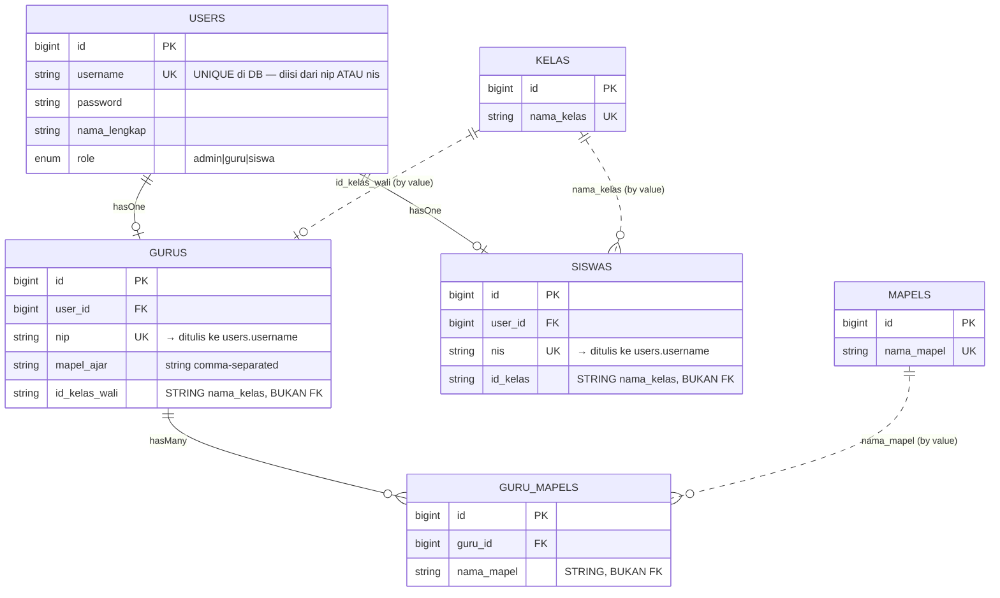

# Analisis: Validasi Admin — Guru & Siswa (Sub-dokumen #3)

## 1. Metadata

- **Fitur**: Validasi form manajemen Guru & Siswa oleh Admin, termasuk pendaftaran biometrik wajah
- **Slug**: `validasi-form-03-admin-guru-siswa`
- **Tanggal**: 2026-07-30
- **Tipe**: `existing`
- **Status**: draft
- **Area/Modul terdampak**: `AdminController` (6 method), `resources/views/admin/guru/index.blade.php`, `resources/views/admin/siswa/index.blade.php`
- **Convention ref**: `G:\laragon\www\elearning-sdn-cibodas-2\docs\conventions.md`
- **Parent doc**: `G:\laragon\www\elearning-sdn-cibodas-2\docs\analysis\2026-07-30-validasi-form-menyeluruh.md`
- **Recommended implementer model**: `claude-sonnet-4-6`
- **Depends on**: sub-dokumen #1 (Fondasi) — **wajib selesai lebih dulu**, khususnya `app/Rules/Base64Image.php`

## 2. Deskripsi & Tujuan

Form tambah/edit Guru dan Siswa adalah form terbesar dan paling sering dipakai di aplikasi ini. Admin sekolah memakainya untuk mendaftarkan seluruh guru dan siswa di awal tahun ajaran — puluhan sampai ratusan entri. Form ini juga yang paling merugikan ketika validasi gagal, karena selain data teks, ia menyertakan **20 sample foto wajah** yang diambil dari kamera. Kehilangan isian berarti mengambil ulang 20 foto.

Kondisi sekarang punya satu masalah yang jauh lebih serius dari yang lain.

**Tabrakan NIP dengan NIS menghasilkan error 500.** Kolom `users.username` punya constraint `unique()` di level database (`0001_01_01_000000_create_users_table.php` baris 16). Tapi `storeGuru` hanya memvalidasi `unique:gurus,nip`, dan `storeSiswa` hanya `unique:siswas,nis`. Keduanya lalu menulis nilai itu ke `users.username`. Jadi kalau seorang guru berNIP `12345` didaftarkan sementara sudah ada siswa berNIS `12345`, validasi lolos, lalu `User::create()` melanggar constraint database dan melempar `QueryException` — admin melihat halaman error 500, bukan pesan "NIP sudah dipakai". Datanya sendiri aman karena seluruh operasi ada di dalam `DB::transaction`, jadi rollback terjadi. Tapi dari sisi pengguna ini kegagalan total tanpa penjelasan.

Ini bukan skenario yang jauh-jauh. NIS siswa SD di banyak sekolah adalah angka pendek, dan NIP guru juga angka. Tabrakan sangat mungkin.

**Referensi master data tidak diperiksa.** `id_kelas` di form siswa hanya `string|max:50`, dan `mapel_ajar.*` hanya `string`. Admin bisa mendaftarkan siswa ke kelas yang tidak ada, atau memberi guru mapel yang tidak terdaftar. Siswa yang masuk ke kelas hantu akan hilang dari semua daftar berbasis kelas, sementara akunnya tetap bisa login.

**Payload wajah tidak divalidasi isinya.** `face_samples.*` hanya `string`. Apa pun yang berbentuk string diterima sebagai "foto wajah", lalu di-`base64_decode` dan ditulis ke `storage/app/public/dataset/` sebagai `.jpg`. Kode existing memang memeriksa `count($imageParts) == 2` sebelum menulis (baris 139, 227, 375, 449) sehingga tidak crash — tapi ia hanya melewati sample yang bentuknya salah tanpa memberi tahu siapa pun. Admin mengira 20 foto tersimpan padahal mungkin hanya 3, lalu heran kenapa pengenalan wajah tidak pernah berhasil. Dan file sampah tetap bisa ditulis ke folder dataset dengan nama `.jpg` selama bentuk data-URI-nya benar meski isinya bukan gambar.

**Password tidak dibatasi atas.** `password` hanya `min:6` tanpa `max`. Laravel/bcrypt memotong input di 72 byte secara diam-diam, jadi password 200 karakter akan terpotong tanpa pemberitahuan.

## 3. Scope

**In-scope:**

| Endpoint | Route name | FormRequest baru |
|---|---|---|
| `POST admin/guru` | `admin.guru.store` | `StoreGuruRequest` |
| `PUT admin/guru/{id}` | `admin.guru.update` | `UpdateGuruRequest` |
| `DELETE admin/guru` | `admin.guru.bulk_destroy` | `BulkDestroyGuruRequest` |
| `POST admin/siswa` | `admin.siswa.store` | `StoreSiswaRequest` |
| `PUT admin/siswa/{id}` | `admin.siswa.update` | `UpdateSiswaRequest` |
| `DELETE admin/siswa` | `admin.siswa.bulk_destroy` | `BulkDestroySiswaRequest` |

Plus:
- Memasang `Base64Image` (dari #1) pada `face_samples.*`
- Menutup celah `unique:users,username`
- Pasang `<x-input-error>` + `old()` + flash `open_modal` di 2 view

**Out-of-scope:**
- `destroyGuru` / `destroySiswa` (single delete) — hanya route param, tanpa input form
- `indexGuru` / `indexSiswa` — filter GET, keputusan #7 dokumen induk
- `downloadLaporanBulananHadir` — tanpa input
- Tidak mengubah alur penyimpanan foto wajah maupun pemanggilan `train.py`
- Tidak memperbaiki inkonsistensi `gurus.mapel_ajar` (string comma-separated) vs tabel pivot `guru_mapels` — keduanya tetap ditulis seperti sekarang
- Tidak menambah validasi keunikan wali kelas (lihat §11, butuh keputusan bisnis)
- Tidak mengubah skema database

## 4. Requirement & Edge Cases

### 4.1 Guru — rules yang benar

```php
// StoreGuruRequest
public function rules(): array
{
    return [
        'nama_lengkap'   => ['required', 'string', 'max:255'],
        'nip'            => [
            'required', 'string', 'max:255',
            'unique:gurus,nip',
            'unique:users,username',      // ← menutup tabrakan NIP↔NIS
        ],
        'password'       => ['required', 'string', 'min:6', 'max:72'],
        'id_kelas_wali'  => ['nullable', 'string', 'max:50', 'exists:kelas,nama_kelas'],
        'mapel_ajar'     => ['nullable', 'array'],
        'mapel_ajar.*'   => ['string', 'exists:mapels,nama_mapel'],
        'face_samples'   => ['nullable', 'array', 'max:20'],
        'face_samples.*' => [new Base64Image(maxKilobytes: 2048)],
    ];
}
```

```php
// UpdateGuruRequest — dua pengecualian yang berbeda targetnya
public function rules(): array
{
    $guru = Guru::findOrFail($this->route('id'));

    return [
        'nama_lengkap'   => ['required', 'string', 'max:255'],
        'nip'            => [
            'required', 'string', 'max:255',
            Rule::unique('gurus', 'nip')->ignore($guru->id),
            Rule::unique('users', 'username')->ignore($guru->user_id),
        ],
        'password'       => ['nullable', 'string', 'min:6', 'max:72'],
        'id_kelas_wali'  => ['nullable', 'string', 'max:50', 'exists:kelas,nama_kelas'],
        'mapel_ajar'     => ['nullable', 'array'],
        'mapel_ajar.*'   => ['string', 'exists:mapels,nama_mapel'],
        'face_samples'   => ['nullable', 'array', 'max:20'],
        'face_samples.*' => [new Base64Image(maxKilobytes: 2048)],
    ];
}
```

**Perhatikan dua `ignore()` yang berbeda.** `Rule::unique('gurus','nip')->ignore($guru->id)` mengecualikan baris di tabel `gurus`, sedangkan `Rule::unique('users','username')->ignore($guru->user_id)` mengecualikan baris di tabel `users`. Memakai ID yang sama untuk keduanya adalah kesalahan yang mudah terjadi dan akibatnya halus: admin tidak bisa menyimpan form edit tanpa mengubah NIP, karena NIP-nya sendiri dianggap duplikat di `users`.

Route-nya `Route::put('/guru/{id}', ...)` — parameternya bernama `id`, jadi `$this->route('id')`.

### 4.2 Siswa — rules yang benar

```php
// StoreSiswaRequest
'nama_lengkap' => ['required', 'string', 'max:255'],
'nis'          => [
    'required', 'string', 'max:255',
    'unique:siswas,nis',
    'unique:users,username',       // ← menutup tabrakan NIS↔NIP
],
'id_kelas'     => ['required', 'string', 'max:50', 'exists:kelas,nama_kelas'],
'password'     => ['required', 'string', 'min:6', 'max:72'],
'face_samples'   => ['nullable', 'array', 'max:20'],
'face_samples.*' => [new Base64Image(maxKilobytes: 2048)],
```

```php
// UpdateSiswaRequest
$siswa = Siswa::findOrFail($this->route('id'));

'nis' => [
    'required', 'string', 'max:255',
    Rule::unique('siswas', 'nis')->ignore($siswa->id),
    Rule::unique('users', 'username')->ignore($siswa->user_id),
],
'password' => ['nullable', 'string', 'min:6', 'max:72'],
// sisanya sama dengan Store
```

Perbedaan Store vs Update pada `password`: `required` saat create, `nullable` saat update (kosong berarti "jangan ubah password"). Kode existing sudah benar soal ini (baris 187 dan 421 memeriksa `$request->filled('password')`) — pertahankan.

### 4.3 Bulk destroy

```php
// BulkDestroyGuruRequest
'ids'   => ['required', 'array', 'min:1'],
'ids.*' => ['integer', 'exists:gurus,id'],

// BulkDestroySiswaRequest
'ids'   => ['required', 'array', 'min:1'],
'ids.*' => ['integer', 'exists:siswas,id'],
```

Kode existing sudah punya `required|array` + `exists` yang benar. Tambahannya hanya `min:1` (agar array kosong tidak menghasilkan "0 data berhasil dihapus") dan `integer`.

### 4.4 Edge cases

| Kondisi | Penanganan |
|---|---|
| NIP guru baru sama dengan NIS siswa yang sudah ada | **Ditolak** oleh `unique:users,username` dengan pesan jelas. Sebelumnya: error 500 |
| NIS siswa baru sama dengan NIP guru yang sudah ada | Idem, arah sebaliknya |
| NIP baru sama dengan `username` admin (`"admin"`) | Ditolak oleh `unique:users,username`. Ini benar — akan mengunci akun admin |
| Edit guru tanpa mengubah NIP | Lolos, karena `ignore()` mengecualikan baris guru **dan** baris user-nya |
| Edit guru, kosongkan password | Password tidak berubah. `nullable` mengizinkannya, dan controller sudah memeriksa `filled()` |
| `mapel_ajar` tidak dikirim sama sekali | Lolos (`nullable`). Controller menyimpan `'-'` sebagai `mapel_ajar` — perilaku existing, dipertahankan |
| `mapel_ajar` berisi mapel yang tidak terdaftar | **Ditolak** oleh `exists:mapels,nama_mapel` |
| `id_kelas_wali` diisi kelas yang tidak ada | **Ditolak** oleh `exists:kelas,nama_kelas` |
| `face_samples` berisi 25 item | **Ditolak** oleh `max:20`. `train.py` mengharapkan format `User.[ID].[1..20].jpg`; lebih dari 20 berarti penamaan meleset dari yang diasumsikan |
| `face_samples` berisi item yang bukan data-URI gambar | **Ditolak** oleh `Base64Image` dengan pesan spesifik. Sebelumnya: diam-diam dilewati |
| `face_samples` kosong / tidak dikirim | Lolos. Guru/siswa didaftarkan tanpa biometrik — perilaku existing yang sah (`AdminController` baris 162 dan 398 punya pesan khusus untuk ini) |
| Password 200 karakter | **Ditolak** oleh `max:72`. Sebelumnya: dipotong diam-diam oleh bcrypt |
| Validasi gagal setelah 20 foto diambil | Foto **hilang** — `old()` tidak bisa mengembalikan array base64 sebesar itu ke DOM secara praktis. Lihat catatan di bawah |

**Soal foto yang hilang saat validasi gagal.** Ini batasan nyata yang tidak diselesaikan dokumen ini. 20 foto base64 berukuran total beberapa megabyte; menaruhnya kembali ke DOM lewat `old()` akan membuat halaman sangat berat dan session membengkak. Mitigasi yang praktis: karena field teks (nama, NIP, kelas) kini divalidasi dengan benar dan pesannya jelas, admin akan tahu kesalahannya sebelum sampai ke tahap ambil foto — asalkan urutan pengisian form memang teks dulu, foto kemudian. Verifikasi urutan itu di view; kalau tombol ambil-foto ada di atas field teks, tidak perlu diubah tapi catat sebagai tech-debt UX.

### 4.5 Non-functional

- **Keamanan**: `unique:users,username` menutup jalur error 500 yang membocorkan stack trace kalau `APP_DEBUG=true`. `Base64Image` mencegah penulisan file arbitrer ke `storage/app/public/dataset/` — folder yang **dapat diakses publik** setelah `storage:link`. Ini yang paling penting dari seluruh dokumen ini dari sisi keamanan.
- **Otorisasi**: kedua controller di balik `role:admin`. Tidak ada konsep kepemilikan — semua admin setara. Jadi `authorize()` di keenam FormRequest **`return true`**, sama seperti dokumen #2.
- **Performa**: `Base64Image` memanggil `getimagesizefromstring` untuk 20 sample per submit. Untuk gambar beberapa ratus KB ini di bawah 100 ms total — dapat diterima. Yang jauh lebih lambat di alur ini adalah `train.py` yang berjalan setelahnya.
- **Concurrency**: dua admin mendaftarkan NIP yang sama bersamaan bisa lolos validasi keduanya, lalu satu gagal di constraint database. Karena ada `DB::transaction`, yang gagal me-rollback bersih. Tidak dimitigasi lebih jauh — hanya ada satu admin.

## 5. API Contract

| Method | Path | Route name | Auth | Request | Sukses | Gagal |
|---|---|---|---|---|---|---|
| POST | `/admin/guru` | `admin.guru.store` | `auth` + `role:admin` | `nama_lengkap`, `nip`, `password`, `id_kelas_wali?`, `mapel_ajar[]?`, `face_samples[]?` | 302 back + flash `success`/`warning` | 302 back + `errors` + `_old_input` + `open_modal=crud-modal-guru` |
| PUT | `/admin/guru/{id}` | `admin.guru.update` | idem | idem, `password` opsional | 302 back + flash | 302 back + `open_modal=edit-modal-guru-{id}` |
| DELETE | `/admin/guru` | `admin.guru.bulk_destroy` | idem | `ids[]` | 302 back + flash `success` | 302 back + `errors` |
| POST | `/admin/siswa` | `admin.siswa.store` | idem | `nama_lengkap`, `nis`, `id_kelas`, `password`, `face_samples[]?` | 302 back + flash | 302 back + `open_modal=crud-modal-siswa` |
| PUT | `/admin/siswa/{id}` | `admin.siswa.update` | idem | idem, `password` opsional | 302 back + flash | 302 back + `open_modal=edit-modal-siswa-{id}` |
| DELETE | `/admin/siswa` | `admin.siswa.bulk_destroy` | idem | `ids[]` | 302 back + flash | 302 back + `errors` |

Contoh payload store guru:

```json
{
  "nama_lengkap": "Siti Aminah, S.Pd.",
  "nip": "198504122010012003",
  "password": "rahasia123",
  "id_kelas_wali": "3A",
  "mapel_ajar": ["Matematika", "IPA"],
  "face_samples": [
    "data:image/jpeg;base64,/9j/4AAQSkZJRgABAQ...",
    "data:image/jpeg;base64,/9j/4AAQSkZJRgABAQ..."
  ]
}
```

Contoh respons gagal (tabrakan NIP↔NIS — kasus yang sebelumnya 500):

```json
{
  "message": "Data yang diberikan tidak valid.",
  "errors": {
    "nip": ["NIP sudah dipakai sebagai username akun lain."]
  }
}
```

## 6. Sequence Diagram

Alur store guru dengan biometrik — memperlihatkan di mana validasi baru menyela:

```mermaid
sequenceDiagram
    actor Admin
    participant V as "admin/guru/index.blade.php"
    participant FR as "StoreGuruRequest"
    participant B64 as "Base64Image (dari #1)"
    participant DB as MySQL
    participant C as "AdminController::storeGuru"
    participant PY as "PythonRunner + train.py"

    Admin->>V: Isi crud-modal-guru, ambil 20 foto, submit
    V->>FR: POST admin.guru.store

    FR->>DB: unique gurus.nip
    DB-->>FR: bersih
    FR->>DB: unique users.username (BARU)
    DB-->>FR: bersih
    FR->>DB: exists kelas.nama_kelas (id_kelas_wali)
    FR->>DB: exists mapels.nama_mapel (mapel_ajar.*)
    DB-->>FR: bersih

    loop 20 sample
        FR->>B64: validate(face_samples.N)
        B64->>B64: cek ;base64, → MIME → decode → getimagesizefromstring → ukuran
    end

    alt Ada sample tidak valid
        B64-->>FR: fail
        FR-->>V: 302 back + errors + open_modal=crud-modal-guru
        V-->>Admin: Modal terbuka, teks utuh, pesan error jelas<br/>(foto perlu diambil ulang)
    else Semua valid
        C->>DB: DB::transaction → User + Guru + GuruMapel
        DB-->>C: ok
        C->>C: tulis 20 file ke dataset/
        C->>PY: runRaw(train.py)
        PY-->>C: trainer.yml ada?
        C-->>Admin: 302 back + flash success/warning
    end
```

Perhatikan bahwa validasi terjadi **sebelum** `DB::transaction` dan **sebelum** penulisan file — jadi tidak ada file sampah yang tertulis ketika validasi gagal. Pada kondisi sekarang, sample yang bentuknya salah dilewati *setelah* transaksi berhasil, sehingga data guru tersimpan dengan dataset yang tidak lengkap.

## 7. Class Diagram

```mermaid
classDiagram
    class FormRequest {
        <<Illuminate>>
        +authorize() bool
        +rules() array
    }

    class StoreGuruRequest {
        +authorize() true
        +rules() array
        +modalId() "crud-modal-guru"
    }
    class UpdateGuruRequest {
        +rules() double ignore
        +modalId() "edit-modal-guru-{id}"
    }
    class BulkDestroyGuruRequest {
        +rules() ids array
    }
    class StoreSiswaRequest {
        +modalId() "crud-modal-siswa"
    }
    class UpdateSiswaRequest {
        +modalId() "edit-modal-siswa-{id}"
    }
    class BulkDestroySiswaRequest {
        +rules() ids array
    }

    class Base64Image {
        <<ValidationRule>>
        +validate(attribute, value, fail)
    }

    class AdminController {
        +storeGuru(StoreGuruRequest)
        +updateGuru(UpdateGuruRequest, id)
        +bulkDestroyGuru(BulkDestroyGuruRequest)
        +storeSiswa(StoreSiswaRequest)
        +updateSiswa(UpdateSiswaRequest, id)
        +bulkDestroySiswa(BulkDestroySiswaRequest)
    }

    class User {
        +username UK
        +nama_lengkap
        +password
        +role
    }
    class Guru {
        +user_id FK
        +nip UK
        +mapel_ajar
        +id_kelas_wali
    }
    class Siswa {
        +user_id FK
        +nis UK
        +id_kelas
    }
    class GuruMapel {
        +guru_id FK
        +nama_mapel
    }

    FormRequest <|-- StoreGuruRequest
    FormRequest <|-- UpdateGuruRequest
    FormRequest <|-- BulkDestroyGuruRequest
    FormRequest <|-- StoreSiswaRequest
    FormRequest <|-- UpdateSiswaRequest
    FormRequest <|-- BulkDestroySiswaRequest

    StoreGuruRequest ..> Base64Image
    UpdateGuruRequest ..> Base64Image
    StoreSiswaRequest ..> Base64Image
    UpdateSiswaRequest ..> Base64Image

    AdminController ..> StoreGuruRequest
    AdminController ..> UpdateGuruRequest
    AdminController ..> BulkDestroyGuruRequest
    AdminController ..> StoreSiswaRequest
    AdminController ..> UpdateSiswaRequest
    AdminController ..> BulkDestroySiswaRequest

    User "1" --> "0..1" Guru
    User "1" --> "0..1" Siswa
    Guru "1" --> "*" GuruMapel
```

## 8. ERD

Tidak ada perubahan skema. Yang penting ditunjukkan di sini adalah **kenapa `unique:users,username` diperlukan** — dua tabel berbeda menulis ke satu kolom unik yang sama:



`gurus.nip` dan `siswas.nis` masing-masing unik **di tabelnya sendiri**, tapi keduanya bermuara ke `users.username` yang unik **secara global**. Inilah celah yang ditutup: keunikan per-tabel tidak menjamin keunikan global.

## 9. Before / After

### Before — `AdminController::storeGuru` (kode nyata, baris 90-101)

```php
public function storeGuru(Request $request)
{
    $request->validate([
        'nama_lengkap' => 'required|string|max:255',
        'nip' => 'required|string|unique:gurus,nip',   // ❌ tanpa unique:users,username
        'mapel_ajar' => 'nullable|array',
        'mapel_ajar.*' => 'string',                    // ❌ tanpa exists
        'password' => 'required|string|min:6',         // ❌ tanpa max:72
        'id_kelas_wali' => 'nullable|string|max:50',   // ❌ tanpa exists
        'face_samples' => 'nullable|array',            // ❌ tanpa max:20
        'face_samples.*' => 'string'                   // ❌ apa pun diterima
    ]);
    // ...
}
```

### After

```php
public function storeGuru(StoreGuruRequest $request)
{
    $validated = $request->validated();
    // ... sisa logika tidak berubah, hanya sumber datanya
}
```

Dengan rules pindah ke `StoreGuruRequest` sebagaimana §4.1.

### Delta perilaku yang dialami pengguna

| Skenario | Before | After |
|---|---|---|
| Daftar guru NIP `12345`, sudah ada siswa NIS `12345` | **Halaman error 500** (`QueryException`, constraint `users_username_unique`) | Ditolak rapi: "NIP sudah dipakai sebagai username akun lain." |
| Daftar siswa ke kelas `"9Z"` yang tidak ada | Tersimpan. Siswa hilang dari semua daftar kelas tapi tetap bisa login | Ditolak: "Kelas yang dipilih tidak terdaftar." |
| Beri guru mapel `"Sihir"` yang tidak terdaftar | Tersimpan di `gurus.mapel_ajar` dan `guru_mapels` | Ditolak: "Mata pelajaran yang diajar yang dipilih tidak terdaftar." |
| Kirim 5 dari 20 `face_samples` berbentuk salah | 15 file tertulis, 5 dilewati **tanpa peringatan**. Admin tidak tahu | Ditolak dengan pesan spesifik per sample; tidak ada file tertulis |
| Kirim `face_samples` berisi data-URI gambar palsu (header benar, isi bukan gambar) | File `.jpg` sampah tertulis ke folder publik `storage/app/public/dataset/` | Ditolak: "Data yang dikirim bukan gambar yang valid." |
| Kirim 50 `face_samples` | 50 file tertulis dengan penamaan di luar asumsi `train.py` | Ditolak: maksimum 20 |
| Password 200 karakter | Dipotong bcrypt di 72 byte, diam-diam | Ditolak: maksimum 72 karakter |
| Edit guru tanpa mengubah NIP | Lolos | Lolos (dua `ignore()` yang benar) |
| Validasi gagal di modal tambah guru | Modal tertutup, semua isian **dan 20 foto** hilang | Modal terbuka ulang, isian teks utuh. Foto tetap perlu diambil ulang (§4.4) |

**Delta API contract:** tidak ada perubahan method/path/route name. Respons gagal kini konsisten 302+`errors` alih-alih kadang 500.

**Delta ERD:** tidak ada. Nol migrasi.

## 10. Rekomendasi Implementasi (Reuse vs New)

### Reuse
- **`AdminController`** — keenam method dipertahankan strukturnya. Yang berubah hanya signature dan sumber data (`validated()`). Alur biometrik, `DB::transaction`, penulisan file, dan pemanggilan `train.py` **tidak disentuh**.
- **`App\Rules\Base64Image`** dari dokumen #1 — dipakai apa adanya di empat FormRequest. Jangan membuat rule serupa yang baru.
- **`App\Models\User`, `Guru`, `Siswa`, `GuruMapel`, `Kelas`, `Mapel`** — tanpa perubahan.
- **`DB::transaction`** di keempat method store/update (baris 105, 181, 349, 415) — sudah benar, pertahankan persis.
- **Pemeriksaan `count($imageParts) == 2`** di baris 139, 227, 375, 449 — **biarkan tetap ada**. Setelah `Base64Image` terpasang, pemeriksaan ini menjadi redundan, tapi menghapusnya berarti menghilangkan lapisan pertahanan tanpa manfaat. Konvensi §6 juga menyatakan dua lapis tidak merugikan.
- **`$request->filled('password')`** di baris 187 dan 421 — logika "kosong berarti jangan ubah" sudah benar.
- **`<x-input-error>`**, blok flash layout, snippet modal-reopen — dari dokumen #1.
- **`exists:gurus,id` / `exists:siswas,id`** di bulk destroy (baris 278, 500) — sudah benar.

### New
- **6 FormRequest** di `app/Http/Requests/`.

### Modify
- **`AdminController`** — 6 signature method + pemakaian `validated()`.
- **2 view** — `<x-input-error>`, `old()`.

Tidak ada custom Rule baru di dokumen ini; `Base64Image` sudah dibuat di #1 dan `NoJadwalConflict` milik #2.

## 11. Dampak & Risiko

**File berubah:**

| Path | Aksi |
|---|---|
| `app/Http/Requests/StoreGuruRequest.php` | CREATE |
| `app/Http/Requests/UpdateGuruRequest.php` | CREATE |
| `app/Http/Requests/BulkDestroyGuruRequest.php` | CREATE |
| `app/Http/Requests/StoreSiswaRequest.php` | CREATE |
| `app/Http/Requests/UpdateSiswaRequest.php` | CREATE |
| `app/Http/Requests/BulkDestroySiswaRequest.php` | CREATE |
| `app/Http/Controllers/AdminController.php` | MODIFY |
| `resources/views/admin/guru/index.blade.php` | MODIFY |
| `resources/views/admin/siswa/index.blade.php` | MODIFY |

**Migrasi data:** tidak ada.

**Breaking change:** satu efek yang perlu diketahui — kalau di database **sudah ada** guru dan siswa dengan `nip`/`nis` yang bertabrakan (hanya mungkin kalau salah satu dibuat sebelum constraint `users.username` sempat menolaknya, atau lewat seeder), maka form edit untuk salah satunya akan gagal validasi sampai nilainya diubah. Kemungkinannya kecil tapi bukan nol. Periksa dengan:

```sql
SELECT g.nip FROM gurus g JOIN siswas s ON g.nip = s.nis;
```

Kalau ada hasil, perbaiki manual sebelum menerapkan.

**Risiko:**

| Risiko | Mitigasi |
|---|---|
| `ignore()` memakai ID yang salah tabel | §4.1 menjelaskan eksplisit: `$guru->id` untuk `gurus`, `$guru->user_id` untuk `users`. Kriteria terima mengujinya dengan menyimpan form edit tanpa mengubah apa pun |
| Implementer menulis `exists:kelas,id` | Guardrail §12.4 + kriteria terima memeriksa string ini tidak muncul |
| `$this->route('id')` salah nama parameter | Route-nya `/guru/{id}` dan `/siswa/{id}` — parameternya `id`, bukan `guru`/`siswa`. Dicantumkan di §4.1 |
| `Base64Image` menolak sample yang sebenarnya sah karena batas ukuran terlalu ketat | Batas 2048 KB per sample dipilih lapang untuk satu frame kamera. Kalau kamera mengirim resolusi tinggi, naikkan — tapi verifikasi dulu ukuran nyata dari payload sebenarnya |
| Query `Guru::findOrFail()` di dalam `rules()` menambah query per request | Satu query tambahan, dapat diterima. Alternatifnya route model binding, yang tidak boleh diubah di dokumen ini |
| Data lama punya `mapel_ajar` yang tidak ada di tabel `mapels` | Form edit guru tersebut akan gagal sampai mapel-nya diperbaiki. Ini konsekuensi sah dari menambah `exists`, tapi bisa mengejutkan. Periksa dengan query di catatan tech-debt #3 |

**Tech-debt tercatat:**

1. **Keunikan wali kelas tidak divalidasi.** Dua guru bisa sama-sama menjadi wali kelas `"3A"` — tidak ada rule maupun constraint yang mencegahnya. `GuruAbsensiController` mengasumsikan `isWali()` menghasilkan satu kelas, dan dua wali untuk satu kelas akan membuat perilaku absensi ambigu. **Tidak dikerjakan di dokumen ini** karena membutuhkan keputusan bisnis yang belum diambil: apakah satu kelas boleh punya lebih dari satu wali (mis. wali utama + pendamping)? Kalau jawabannya tidak, rule-nya `Rule::unique('gurus','id_kelas_wali')->ignore($guru->id)` dengan pengecualian untuk nilai `null`. Perlu dikonfirmasi ke pemilik sistem lebih dulu.
2. **`gurus.mapel_ajar` (string comma-separated) berdampingan dengan tabel pivot `guru_mapels`** — dua sumber kebenaran untuk hal yang sama, keduanya ditulis di setiap store/update. `GuruAbsensiController:51-53` bahkan punya fallback yang mem-parsing string-nya ketika pivot kosong, yang membuktikan keduanya bisa tidak sinkron. Dipertahankan apa adanya.
3. **Data lama mungkin melanggar `exists` yang baru ditambahkan.** Setelah `exists:mapels,nama_mapel` dan `exists:kelas,nama_kelas` terpasang, guru/siswa yang datanya sudah menyimpang tidak bisa disimpan lewat form edit tanpa dibetulkan. Periksa dengan:
   ```sql
   SELECT id, id_kelas FROM siswas WHERE id_kelas NOT IN (SELECT nama_kelas FROM kelas);
   SELECT id, id_kelas_wali FROM gurus WHERE id_kelas_wali IS NOT NULL AND id_kelas_wali NOT IN (SELECT nama_kelas FROM kelas);
   SELECT guru_id, nama_mapel FROM guru_mapels WHERE nama_mapel NOT IN (SELECT nama_mapel FROM mapels);
   ```
4. **20 foto hilang saat validasi gagal.** Batasan praktis, dijelaskan di §4.4. Solusi sebenarnya adalah submit AJAX, yang sudah ditolak sebagai pendekatan (keputusan #4 dokumen induk).
5. **`face_samples` dikirim dalam satu request POST bersama data teks.** 20 gambar base64 dalam satu request bisa melampaui `post_max_size` / `upload_max_filesize` PHP dan menghasilkan request kosong tanpa pesan yang jelas. Tidak ditangani di sini; kalau muncul, itu masalah konfigurasi PHP, bukan validasi.

---

## 12. Handoff Contract

### 12.1 Header

- `source_doc`: `G:\laragon\www\elearning-sdn-cibodas-2\docs\analysis\2026-07-30-validasi-form-03-admin-guru-siswa.md`
- `parent_doc`: `G:\laragon\www\elearning-sdn-cibodas-2\docs\analysis\2026-07-30-validasi-form-menyeluruh.md`
- `depends_on_doc`: `G:\laragon\www\elearning-sdn-cibodas-2\docs\analysis\2026-07-30-validasi-form-01-fondasi.md` — **wajib selesai lebih dulu**; dokumen ini memakai `app/Rules/Base64Image.php` yang dibuat di sana
- `convention_ref`: `G:\laragon\www\elearning-sdn-cibodas-2\docs\conventions.md`
- `glossary_ref`: `G:\laragon\www\elearning-sdn-cibodas-2\CONTEXT.md`
- `feature_type`: `existing`
- `recommended_implementer_model`: `claude-sonnet-4-6`

### 12.2 Task List

| id | desc | targets | mode | refs | depends_on |
|----|------|---------|------|------|------------|
| T0 | Verifikasi prasyarat: `app/Rules/Base64Image.php` sudah ada dari #1 | — | — | §12.1 | — |
| T1 | Periksa data lama yang akan melanggar rule baru | — (query SQL saja) | — | §11 | — |
| T2 | Buat `StoreGuruRequest` + `UpdateGuruRequest` | `app\Http\Requests\StoreGuruRequest.php`, `UpdateGuruRequest.php` [CREATE] | new | §4.1 | T0 |
| T3 | Buat `StoreSiswaRequest` + `UpdateSiswaRequest` | `app\Http\Requests\StoreSiswaRequest.php`, `UpdateSiswaRequest.php` [CREATE] | new | §4.2 | T0 |
| T4 | Buat 2 FormRequest bulk destroy | `app\Http\Requests\BulkDestroyGuruRequest.php`, `BulkDestroySiswaRequest.php` [CREATE] | new | §4.3 | — |
| T5 | Sambungkan 6 method di `AdminController` | `app\Http\Controllers\AdminController.php` [MODIFY] | modify | §9 | T2, T3, T4 |
| T6 | Pasang `<x-input-error>` + `old()` di view guru | `resources\views\admin\guru\index.blade.php` [MODIFY] | modify | T6 detail | T5 |
| T7 | Pasang `<x-input-error>` + `old()` di view siswa | `resources\views\admin\siswa\index.blade.php` [MODIFY] | modify | T7 detail | T5 |
| T8 | Pint + verifikasi manual | — | — | §12.3 | T1–T7 |

---

#### T0 — Verifikasi prasyarat

```bash
ls G:/laragon/www/elearning-sdn-cibodas-2/app/Rules/Base64Image.php
```

Kalau tidak ada, **berhenti** — dokumen #1 belum dikerjakan. Jangan membuat `Base64Image` di dokumen ini; ia milik #1 dan #5 juga memakainya.

---

#### T1 — Periksa data lama

Jalankan ketiga query di §11 tech-debt #3, plus:

```sql
SELECT g.nip FROM gurus g JOIN siswas s ON g.nip = s.nis;
```

Kalau ada hasil, **laporkan ke pengguna** sebelum melanjutkan — data itu perlu dibetulkan manual, dan form edit untuk baris tersebut akan gagal validasi setelah perubahan ini. Jangan membetulkannya sendiri.

---

#### T2 — FormRequest Guru

```php
<?php

namespace App\Http\Requests;

use App\Models\Guru;
use App\Rules\Base64Image;
use Illuminate\Contracts\Validation\Validator;
use Illuminate\Foundation\Http\FormRequest;
use Illuminate\Validation\Rule;

class StoreGuruRequest extends FormRequest
{
    public function authorize(): bool
    {
        // Manajemen guru: semua admin setara, tidak ada kepemilikan resource.
        // Role sudah dijaga RoleMiddleware (role:admin) di routes/web.php.
        return true;
    }

    public function rules(): array
    {
        return [
            'nama_lengkap'   => ['required', 'string', 'max:255'],
            'nip'            => ['required', 'string', 'max:255', 'unique:gurus,nip', 'unique:users,username'],
            'password'       => ['required', 'string', 'min:6', 'max:72'],
            'id_kelas_wali'  => ['nullable', 'string', 'max:50', 'exists:kelas,nama_kelas'],
            'mapel_ajar'     => ['nullable', 'array'],
            'mapel_ajar.*'   => ['string', 'exists:mapels,nama_mapel'],
            'face_samples'   => ['nullable', 'array', 'max:20'],
            'face_samples.*' => [new Base64Image(maxKilobytes: 2048)],
        ];
    }

    public function messages(): array
    {
        return [
            'nip.unique'            => 'NIP sudah terdaftar.',
            'nip.unique:users'      => 'NIP sudah dipakai sebagai username akun lain.',
            'face_samples.max'      => 'Jumlah sample foto wajah maksimal 20.',
        ];
    }

    protected function failedValidation(Validator $validator): void
    {
        session()->flash('open_modal', 'crud-modal-guru');

        parent::failedValidation($validator);
    }
}
```

**Catatan soal `messages()`:** key `'nip.unique:users'` **tidak didukung** Laravel — dua rule `unique` pada field yang sama menghasilkan key `nip.unique` yang sama, jadi pesannya tidak bisa dibedakan lewat `messages()`. Dua pilihan:

- **Sederhana (disarankan):** satu pesan yang mencakup keduanya, mis. `'nip.unique' => 'NIP ini sudah dipakai oleh akun lain.'` Hapus key kedua.
- **Presisi:** ganti `'unique:users,username'` dengan custom closure yang punya pesannya sendiri:
  ```php
  'nip' => [
      'required', 'string', 'max:255',
      'unique:gurus,nip',
      function ($attribute, $value, $fail) {
          if (\App\Models\User::where('username', $value)->exists()) {
              $fail('NIP sudah dipakai sebagai username akun lain.');
          }
      },
  ],
  ```
  Pada `UpdateGuruRequest`, closure harus mengecualikan user milik guru itu: `->where('id', '!=', $guru->user_id)`.

Pilih yang **presisi** kalau ingin pesannya membedakan kasus; pilih yang **sederhana** kalau cukup satu pesan. Keduanya sah.

`UpdateGuruRequest` — perbedaannya:

```php
public function rules(): array
{
    $guru = Guru::findOrFail($this->route('id'));

    return [
        'nama_lengkap'  => ['required', 'string', 'max:255'],
        'nip'           => [
            'required', 'string', 'max:255',
            Rule::unique('gurus', 'nip')->ignore($guru->id),
            Rule::unique('users', 'username')->ignore($guru->user_id),   // ← user_id, BUKAN guru->id
        ],
        'password'      => ['nullable', 'string', 'min:6', 'max:72'],
        // sisanya identik dengan Store
    ];
}

protected function failedValidation(Validator $validator): void
{
    session()->flash('open_modal', 'edit-modal-guru-' . $this->route('id'));

    parent::failedValidation($validator);
}
```

Route-nya `Route::put('/guru/{id}', ...)` → parameter bernama **`id`**.

---

#### T3 — FormRequest Siswa

Struktur identik dengan T2. Perbedaannya:

```php
// StoreSiswaRequest
'nis'      => ['required', 'string', 'max:255', 'unique:siswas,nis', 'unique:users,username'],
'id_kelas' => ['required', 'string', 'max:50', 'exists:kelas,nama_kelas'],
// tidak ada mapel_ajar, tidak ada id_kelas_wali

// modalId
session()->flash('open_modal', 'crud-modal-siswa');
```

```php
// UpdateSiswaRequest
$siswa = Siswa::findOrFail($this->route('id'));

'nis' => [
    'required', 'string', 'max:255',
    Rule::unique('siswas', 'nis')->ignore($siswa->id),
    Rule::unique('users', 'username')->ignore($siswa->user_id),
],
'password' => ['nullable', 'string', 'min:6', 'max:72'],

// modalId
session()->flash('open_modal', 'edit-modal-siswa-' . $this->route('id'));
```

---

#### T4 — FormRequest bulk destroy

```php
// BulkDestroyGuruRequest
public function authorize(): bool
{
    return true;
}

public function rules(): array
{
    return [
        'ids'   => ['required', 'array', 'min:1'],
        'ids.*' => ['integer', 'exists:gurus,id'],
    ];
}

public function messages(): array
{
    return [
        'ids.required' => 'Pilih minimal satu data guru yang akan dihapus.',
        'ids.min'      => 'Pilih minimal satu data guru yang akan dihapus.',
    ];
}
```

`BulkDestroySiswaRequest` sama, dengan `exists:siswas,id` dan pesan "data siswa". **Tidak** perlu `failedValidation()` — bulk destroy dipicu dari tombol di luar modal.

---

#### T5 — Sambungkan `AdminController`

Ganti signature keenam method. Contoh:

```php
use App\Http\Requests\StoreGuruRequest;
use App\Http\Requests\UpdateGuruRequest;
use App\Http\Requests\BulkDestroyGuruRequest;
use App\Http\Requests\StoreSiswaRequest;
use App\Http\Requests\UpdateSiswaRequest;
use App\Http\Requests\BulkDestroySiswaRequest;

public function storeGuru(StoreGuruRequest $request)
{
    // Hapus blok $request->validate([...]) yang lama.
    // Sisa method TIDAK BERUBAH — DB::transaction, penulisan dataset,
    // pemanggilan train.py, semua pesan flash tetap persis seperti sekarang.
    $user = null;

    DB::transaction(function () use ($request, &$user) {
        // ... kode existing tidak berubah
    });

    // ... kode existing tidak berubah
}
```

**Yang WAJIB dihapus:** blok `$request->validate([...])` di baris 92, 170, 276, 337, 406, 498.

**Yang WAJIB dipertahankan persis:**
- Seluruh `DB::transaction` (baris 105, 181, 349, 415) dan isinya
- Seluruh alur penulisan `face_samples` ke `dataset/`, termasuk pemeriksaan `count($imageParts) == 2`
- Seluruh pemanggilan `PythonRunner::runRaw($pythonScriptPath)` dan pemeriksaan `trainer.yml`
- Semua pesan flash beserta teksnya
- Logika `$request->filled('password')` (baris 187, 421)
- Method `destroyGuru`, `destroySiswa`, `indexGuru`, `indexSiswa`, `downloadLaporanBulananHadir` — **tanpa perubahan apa pun**

Akses data boleh tetap memakai `$request->nip`, `$request->face_samples`, dst. — FormRequest mewarisi `Request`, jadi properti magic tetap bekerja. Mengubahnya ke `$request->validated()['nip']` boleh tapi tidak wajib; yang penting rules-nya sudah pindah. Untuk `Model::create()` massal, gunakan array eksplisit seperti kode existing (sudah benar — tidak ada `$request->all()` di controller ini).

---

#### T6 & T7 — View guru & siswa

| View | Field yang butuh `<x-input-error>` + `old()` |
|---|---|
| `resources\views\admin\guru\index.blade.php` | `nama_lengkap`, `nip`, `password`, `id_kelas_wali`, `mapel_ajar` (array), `face_samples` (array) |
| `resources\views\admin\siswa\index.blade.php` | `nama_lengkap`, `nis`, `id_kelas`, `password`, `face_samples` (array) |

Modal ID yang sudah diverifikasi dari view:
- guru: `crud-modal-guru` (tambah, baris ~27), `edit-modal-guru-{{ $guru->id }}` (edit, baris ~265)
- siswa: `crud-modal-siswa` (tambah, baris ~27), `edit-modal-siswa-{{ $siswa->id }}` (edit, baris ~231)

Pola input teks:

```blade
<input type="text" name="nama_lengkap"
       value="{{ old('nama_lengkap', $guru->user->nama_lengkap ?? '') }}"
       class="..." >
<x-input-error name="nama_lengkap" />
```

Pola password — **jangan** pakai `old()`:

```blade
<input type="password" name="password" id="password-guru" class="..." >
<x-input-error name="password" />
```

Laravel mengecualikan field bernama `password` dari `withInput()`, jadi `old('password')` selalu kosong. Menuliskannya hanya menyesatkan pembaca kode.

Pola checkbox/multi-select `mapel_ajar`:

```blade
@foreach($mapelOptions as $mapel)
    <label>
        <input type="checkbox" name="mapel_ajar[]" value="{{ $mapel }}"
               {{ in_array($mapel, old('mapel_ajar', $selectedMapels ?? [])) ? 'checked' : '' }}>
        {{ $mapel }}
    </label>
@endforeach
<x-input-error :messages="$errors->get('mapel_ajar')" />
<x-input-error :messages="$errors->get('mapel_ajar.*')" />
```

Pola error `face_samples` — kumpulkan semua error sample jadi satu tampilan agar tidak muncul 20 baris:

```blade
@php
    $faceErrors = collect($errors->keys())
        ->filter(fn ($k) => str_starts_with($k, 'face_samples'))
        ->flatMap(fn ($k) => $errors->get($k))
        ->unique()
        ->values()
        ->all();
@endphp
<x-input-error :messages="$faceErrors" />
```

**Verifikasi urutan form** (§4.4): periksa apakah field teks berada **sebelum** tombol ambil-foto di kedua view. Kalau iya, tidak ada yang perlu diubah. Kalau tombol foto ada di atas, **jangan ubah urutannya** — hanya laporkan sebagai catatan UX ke pengguna.

---

#### T8 — Pint & verifikasi

```bash
vendor/bin/pint app/Http/Requests app/Http/Controllers/AdminController.php
php artisan view:clear
```

### 12.3 Acceptance Criteria

**Prasyarat**
- [ ] `app/Rules/Base64Image.php` sudah ada sebelum task lain dimulai
- [ ] Query pemeriksaan data lama sudah dijalankan dan hasilnya dilaporkan ke pengguna

**Celah `username` — inti dokumen ini**
- [ ] `StoreGuruRequest` memvalidasi `nip` terhadap **`users.username`** selain `gurus.nip`
- [ ] `StoreSiswaRequest` memvalidasi `nis` terhadap **`users.username`** selain `siswas.nis`
- [ ] Uji manual: daftarkan siswa NIS `999888`, lalu coba daftarkan guru NIP `999888` → **ditolak dengan pesan validasi**, bukan halaman error 500
- [ ] Uji manual arah sebaliknya: guru NIP `777666` lalu siswa NIS `777666` → ditolak rapi
- [ ] Uji manual: coba daftarkan guru dengan NIP `admin` → ditolak (bertabrakan dengan username admin)

**Pengecualian saat update**
- [ ] `UpdateGuruRequest` memakai `->ignore($guru->id)` untuk tabel `gurus` **dan** `->ignore($guru->user_id)` untuk tabel `users`
- [ ] `UpdateSiswaRequest` memakai `->ignore($siswa->id)` dan `->ignore($siswa->user_id)`
- [ ] Uji manual: buka form edit guru, klik simpan tanpa mengubah apa pun → **berhasil**, tidak ada error duplikat
- [ ] Uji manual: idem untuk siswa → berhasil

**Referensi master data**
- [ ] String `exists:kelas,id` dan `exists:mapels,id` **tidak muncul** di file mana pun
- [ ] `id_kelas` (siswa) memakai `exists:kelas,nama_kelas`
- [ ] `id_kelas_wali` (guru) memakai `exists:kelas,nama_kelas` dan tetap `nullable`
- [ ] `mapel_ajar.*` memakai `exists:mapels,nama_mapel`
- [ ] Uji manual: submit siswa dengan `id_kelas` diubah lewat devtools ke `"9Z"` → ditolak

**Biometrik**
- [ ] `face_samples` punya `max:20`
- [ ] `face_samples.*` memakai `new Base64Image(...)`, bukan `'string'`
- [ ] Uji manual: submit dengan `face_samples[0]` = `"bukan-gambar"` → ditolak dengan pesan, **tidak ada file baru** di `storage/app/public/dataset/`
- [ ] Uji manual: submit dengan 20 foto valid → tersimpan, `train.py` berjalan, pesan flash sesuai perilaku existing
- [ ] Uji manual: submit tanpa `face_samples` → tersimpan dengan pesan "tanpa biometrik wajah" seperti perilaku existing
- [ ] Pemeriksaan `count($imageParts) == 2` di baris 139/227/375/449 **masih ada** (lapisan kedua, sengaja dipertahankan)

**Password**
- [ ] `password` punya `max:72` di keempat FormRequest guru/siswa
- [ ] `password` `required` di Store, `nullable` di Update
- [ ] Uji manual: edit guru dengan password dikosongkan → password lama tetap berlaku (bisa login dengan password lama)

**Bulk destroy**
- [ ] Kedua bulk FormRequest punya `min:1` pada `ids`
- [ ] Uji manual: submit bulk delete tanpa memilih apa pun → pesan "Pilih minimal satu data..."

**UX**
- [ ] Submit form tambah guru dengan NIP kosong → modal `crud-modal-guru` **terbuka kembali** dengan isian teks utuh
- [ ] Submit form edit siswa dengan NIS duplikat → modal `edit-modal-siswa-{id}` yang benar terbuka kembali
- [ ] Pesan error muncul dalam Bahasa Indonesia di bawah field yang bersangkutan
- [ ] Field `password` **tidak** memakai `old()`
- [ ] Error `face_samples` tampil sebagai pesan ringkas, bukan 20 baris berulang
- [ ] Ringkasan error di atas halaman muncul sekali, tidak dobel

**Regresi — wajib masih berfungsi**
- [ ] Tambah guru dengan data valid + 20 foto → berhasil, model ter-train
- [ ] Edit guru mengubah mapel yang diajar → `gurus.mapel_ajar` dan tabel `guru_mapels` keduanya ter-update seperti sebelumnya
- [ ] Tambah siswa dengan data valid → berhasil
- [ ] Hapus guru (single) → data + dataset wajah + akun user terhapus, model di-retrain
- [ ] Bulk hapus siswa → berjalan seperti sebelumnya
- [ ] Filter & pencarian di halaman guru/siswa masih berfungsi
- [ ] `vendor/bin/pint --test` lolos
- [ ] Tidak ada file migrasi baru

### 12.4 Out-of-Scope Guardrails

- **JANGAN** membuat `app/Rules/Base64Image.php`. Sudah dibuat di dokumen #1. Kalau belum ada, berhenti dan laporkan — jangan membuatnya sendiri, karena #5 juga bergantung pada versi yang sama.
- **JANGAN** menulis `exists:kelas,id` atau `exists:mapels,id`. Kolom `id_kelas`, `id_kelas_wali`, dan `nama_mapel` bertipe `string` berisi **nama**, bukan ID. Rule yang benar `exists:kelas,nama_kelas` dan `exists:mapels,nama_mapel`.
- **JANGAN** mengubah skema database. Nol migrasi. Jangan menambah unique index pada `gurus.id_kelas_wali`, jangan mengubah `id_kelas` jadi foreign key.
- **JANGAN** menambah validasi keunikan wali kelas. Butuh keputusan bisnis yang belum diambil (§11 tech-debt #1). Laporkan sebagai temuan, jangan implementasikan.
- **JANGAN** mengubah alur penyimpanan foto wajah, penamaan file `User.[ID].[N].jpg`, atau pemanggilan `train.py`.
- **JANGAN** menghapus pemeriksaan `count($imageParts) == 2` di baris 139, 227, 375, 449. Redundan setelah `Base64Image`, tapi sengaja dipertahankan sebagai lapisan kedua.
- **JANGAN** menyatukan `gurus.mapel_ajar` dengan tabel `guru_mapels`. Keduanya tetap ditulis seperti sekarang.
- **JANGAN** mengubah `destroyGuru`, `destroySiswa`, `indexGuru`, `indexSiswa`, atau `downloadLaporanBulananHadir`.
- **JANGAN** memvalidasi parameter filter GET (`?search=`, `?kelas=`, `?mapel=`) di `indexGuru`/`indexSiswa`.
- **JANGAN** mengubah controller ke route model binding. Route-nya `/{id}` dan `$this->route('id')` bergantung pada itu.
- **JANGAN** memakai `old()` pada field `password`.
- **JANGAN** mengubah urutan field di form. Kalau tombol ambil-foto ada sebelum field teks, laporkan saja sebagai catatan UX.
- **JANGAN** menambah blok `@if($errors->any())` atau `@if(session(...))` di view. Sudah ada di layout dari #1.
- **JANGAN** membuat FormRequest untuk domain lain (kelas, mapel, jadwal, materi, tugas, ujian, absensi). Itu #2, #4, #5.
- **JANGAN** memperbaiki data lama yang melanggar rule baru. Laporkan hasil query T1 ke pengguna dan biarkan mereka memutuskan.
- **JANGAN** membuat automated test.
- **JANGAN** menambah dependency composer atau npm.
- **JANGAN** mengubah `AdminController` ke arsitektur lain (service layer, action class, repository). Controller tetap tipis-tapi-langsung sesuai konvensi §6.

### 12.5 Konvensi Relevan (restated)

Dikutip dari `docs/conventions.md`:

- **§4.1** — Validasi di FormRequest, bukan inline `$request->validate()`. Tidak ada pengecualian di dokumen ini.
- **§4.2** — Rules sebagai **array** (`['required', 'string']`), bukan string pipe. `authorize()` memeriksa kepemilikan; untuk manajemen admin, `return true` dengan komentar penjelas.
- **§4.3** — **`id_kelas` bukan foreign key.** `exists:kelas,nama_kelas`. Jebakan paling berbahaya di project ini.
- **§4.4** — Logika validasi yang butuh parsing non-trivial masuk ke `app/Rules/` sebagai `ValidationRule`. `Base64Image` sudah ada dari #1 — pakai, jangan bikin ulang.
- **§6** — Controller tipis. **Jangan** `$request->all()`. Query yang sudah menyaring tetap dipertahankan meski `authorize()` sudah memeriksa — dua lapis tidak merugikan.
- **§3** — FormRequest dinamai `<Aksi><Entitas>Request`: `StoreGuruRequest`, `BulkDestroySiswaRequest`.
- **§5** — `<x-input-error>` untuk error per-field, `old()` untuk repopulate (kecuali `password`). Jangan duplikasi blok error/flash.
- **§7** — Role dijaga `RoleMiddleware`; kepemilikan dijaga `authorize()`. Jangan tambah Gate/Policy/Spatie.
- **§8** — PSR-12 via Pint. Import di blok `use` — jangan FQCN inline seperti `\App\Models\GuruMapel::create(...)` yang ada di kode lama. Kode baru harus pakai import; kode lama yang tidak disentuh dibiarkan.
- **§9** — Semua pesan ke pengguna dalam Bahasa Indonesia. Pemakainya admin sekolah — pesan harus langsung dan bisa ditindaklanjuti.
