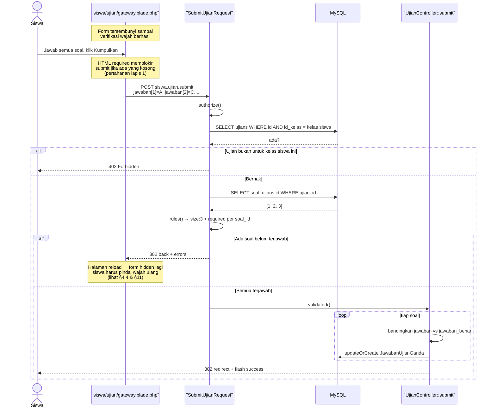
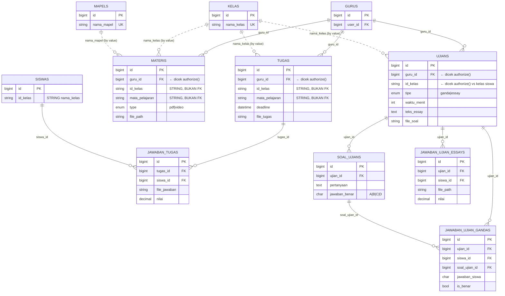
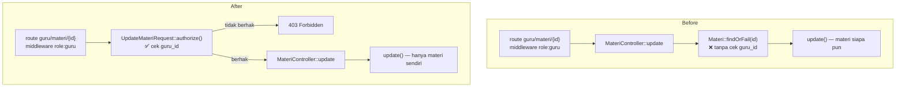

# Analisis: Validasi Guru — Materi, Tugas, Ujian (Sub-dokumen #4)

## 1. Metadata

- **Fitur**: Validasi form Materi, Tugas, dan Ujian (sisi guru) beserta submission siswa; termasuk perbaikan bug validasi submit ujian pilihan ganda
- **Slug**: `validasi-form-04-guru-materi-tugas-ujian`
- **Tanggal**: 2026-07-30
- **Tipe**: `existing`
- **Status**: draft
- **Area/Modul terdampak**: `MateriController`, `TugasController`, `UjianController` + 7 view
- **Convention ref**: `G:\laragon\www\elearning-sdn-cibodas-2\docs\conventions.md`
- **Parent doc**: `G:\laragon\www\elearning-sdn-cibodas-2\docs\analysis\2026-07-30-validasi-form-menyeluruh.md`
- **Recommended implementer model**: `claude-sonnet-4-6`
- **Depends on**: sub-dokumen #1 (Fondasi) — **wajib selesai lebih dulu**

## 2. Deskripsi & Tujuan

Ini dokumen dengan cakupan terbesar (12 FormRequest) dan satu-satunya yang memperbaiki **bug fungsional**, bukan sekadar memperkuat validasi.

**Bug: submit ujian pilihan ganda tidak pernah divalidasi.** Di `UjianController::submit` baris 252-254:

```php
$request->validate([
    'jawaban_*' => 'required|in:A,B,C,D'
]);
```

Wildcard `*` di Laravel hanya bekerja untuk array dengan dot-notation (`jawaban.*` untuk input bernama `jawaban[1]`). Ia **tidak** mencocokkan prefix nama field. Karena view mengirim input bernama `jawaban_1`, `jawaban_2`, dan seterusnya (`siswa/ujian/gateway.blade.php` baris 109), pola `jawaban_*` tidak cocok dengan apa pun — validator menerima array rules yang tidak merujuk field mana pun, lalu lolos tanpa memeriksa apa-apa. Selama ini submit ujian pilihan ganda berjalan tanpa validasi sama sekali. Loop di baris 256-274 kemudian hanya memproses soal yang `$request->has($inputName)`, jadi soal yang tidak dijawab dilewati diam-diam dan tidak tercatat sebagai salah.

**Empat celah IDOR.** Tiga di dokumen ini:

| Lokasi | Kode | Akibat |
|---|---|---|
| `MateriController::update` baris 73 | `Materi::findOrFail($id)` | Guru A mengubah materi guru B |
| `MateriController::destroy` baris 105 | `Materi::findOrFail($id)` | Guru A menghapus materi guru B, **beserta file-nya** |
| `TugasController::update` baris 74 | `Tugas::findOrFail($id)` | Guru A mengubah tugas guru B |
| `TugasController::destroy` baris 107 | `Tugas::findOrFail($id)` | Guru A menghapus tugas guru B |
| `UjianController::nilaiEssay` baris 297 | `JawabanUjianEssay::findOrFail($id)` | Guru A menilai jawaban ujian guru B |

Yang menarik: `TugasController::grade` (baris 214) dan `UjianController::update`/`destroy`/`jawaban` (baris 173, 222, 284) **sudah** memeriksa kepemilikan dengan benar. Jadi ini inkonsistensi yang tertinggal, bukan keputusan desain. Route-nya dijaga `role:guru`, yang hanya memastikan "dia guru" — bukan "dia pemiliknya".

**Referensi master data tidak diperiksa.** `id_kelas` dan `mata_pelajaran` di Materi, Tugas, dan Ujian semua hanya `string|max:N`. Guru bisa membuat materi untuk kelas yang tidak ada — materi itu lalu tidak terlihat oleh siapa pun, dan guru bingung kenapa siswanya tidak menerima apa-apa.

**Deadline tugas boleh di masa lalu.** `'deadline' => 'required|date'` menerima tanggal kapan saja. Tugas dengan deadline lampau tidak bisa dikumpulkan siapa pun (`TugasController::uploadJawaban` baris 180 menolak `now() > $tugas->deadline`), jadi ini pasti salah input — tapi sistem menerimanya tanpa protes.

**Upload file hanya diperiksa ekstensinya.** Kelima endpoint upload memakai `mimes:` tanpa `mimetypes:`. Ekstensi bisa diganti; isi file tidak diperiksa.

## 3. Scope

**In-scope:**

| Endpoint | Route name | FormRequest baru |
|---|---|---|
| `POST guru/materi` | `guru.materi.store` | `StoreMateriRequest` |
| `PUT guru/materi/{id}` | `guru.materi.update` | `UpdateMateriRequest` |
| `DELETE guru/materi` | `guru.materi.bulk_destroy` | `BulkDestroyMateriRequest` |
| `POST guru/tugas` | `guru.tugas.store` | `StoreTugasRequest` |
| `PUT guru/tugas/{id}` | `guru.tugas.update` | `UpdateTugasRequest` |
| `DELETE guru/tugas` | `guru.tugas.bulk_destroy` | `BulkDestroyTugasRequest` |
| `POST guru/tugas/grade/{jawaban_id}` | `guru.tugas.grade` | `GradeTugasRequest` |
| `POST siswa/tugas/{id}/upload` | `siswa.tugas.upload` | `UploadJawabanTugasRequest` |
| `POST guru/ujian` | `guru.ujian.store` | `StoreUjianRequest` |
| `PUT guru/ujian/{id}` | `guru.ujian.update` | `UpdateUjianRequest` |
| `POST siswa/ujian/{id}/submit` | `siswa.ujian.submit` | `SubmitUjianRequest` |
| `POST guru/ujian-essay/{id}/nilai` | `guru.ujian.nilai` | `NilaiEssayRequest` |

Plus:
- **Perbaikan bug**: nama input `jawaban_<id>` → `jawaban[<id>]` di view + loop submit di controller
- Menutup 5 celah IDOR lewat `authorize()`
- `mimetypes:` di lima endpoint upload
- Pasang `<x-input-error>` + `old()` di 7 view

**Out-of-scope:**
- `MateriController::indexGuru`/`indexSiswa`, `TugasController::indexGuru`/`indexSiswa`/`showSiswa`/`submissions`, `UjianController::index`/`indexGuru`/`create`/`edit`/`jawaban` — read-only, filter GET
- `UjianController::destroy` dan `MateriController::destroy`/`TugasController::destroy` — tidak menerima input form, tapi `destroy` Materi & Tugas **tetap** mendapat perbaikan kepemilikan (lihat §4.6)
- Tidak mengubah alur penyimpanan file maupun penghapusan file lama
- Tidak mengubah logika penilaian otomatis pilihan ganda
- Tidak menambah batas waktu/deadline pada submit ujian (lihat §11)
- Tidak mengubah skema database

## 4. Requirement & Edge Cases

### 4.1 Materi

```php
// StoreMateriRequest
'judul'          => ['required', 'string', 'max:255'],
'id_kelas'       => ['required', 'string', 'max:50', 'exists:kelas,nama_kelas'],
'mata_pelajaran' => ['required', 'string', 'max:255', 'exists:mapels,nama_mapel'],
'type'           => ['required', Rule::in(['pdf', 'video'])],
'file_materi'    => [
    'required', 'file', 'max:20480',
    'mimes:pdf,mp4,mkv',
    'mimetypes:application/pdf,video/mp4,video/x-matroska',
],
```

`UpdateMateriRequest` identik, kecuali `file_materi` jadi `['nullable', ...]` — kosong berarti pertahankan file lama. Kode existing sudah benar soal ini (baris 90 memeriksa `hasFile`).

**Selaraskan `type` dengan `mimes`.** Ada ketidakcocokan logis: `type` bisa `pdf` sementara `file_materi` yang diunggah `.mp4`, dan sebaliknya. Tidak dicegah sekarang. Tambahkan pemeriksaan silang lewat `after` hook:

```php
public function withValidator($validator): void
{
    $validator->after(function ($validator) {
        if (! $this->hasFile('file_materi')) {
            return;
        }

        $ext = strtolower($this->file('file_materi')->getClientOriginalExtension());
        $type = $this->input('type');

        if ($type === 'pdf' && $ext !== 'pdf') {
            $validator->errors()->add('file_materi', 'Tipe materi PDF harus diunggah dengan file PDF.');
        }

        if ($type === 'video' && ! in_array($ext, ['mp4', 'mkv'], true)) {
            $validator->errors()->add('file_materi', 'Tipe materi Video harus diunggah dengan file MP4 atau MKV.');
        }
    });
}
```

### 4.2 Tugas

```php
// StoreTugasRequest
'judul'          => ['required', 'string', 'max:255'],
'id_kelas'       => ['required', 'string', 'max:50', 'exists:kelas,nama_kelas'],
'mata_pelajaran' => ['required', 'string', 'max:255', 'exists:mapels,nama_mapel'],
'instruksi'      => ['required', 'string', 'max:10000'],
'deadline'       => ['required', 'date', 'after:now'],        // ← after:now hanya di Store
'file_tugas'     => [
    'nullable', 'file', 'max:12288',
    'mimes:pdf,doc,docx,jpg,jpeg,png,zip',
    'mimetypes:application/pdf,application/msword,application/vnd.openxmlformats-officedocument.wordprocessingml.document,image/jpeg,image/png,application/zip,application/x-zip-compressed',
],
```

```php
// UpdateTugasRequest — deadline TANPA after:now
'deadline' => ['required', 'date'],
```

**Kenapa `after:now` hanya di Store.** Ini keputusan #7 dokumen induk. Kalau `after:now` juga dipasang di Update, guru tidak bisa mengoreksi typo pada judul tugas lama yang deadline-nya sudah lewat — form akan menolak sampai deadline diubah ke masa depan, yang justru membuka kembali tugas yang sudah ditutup. Itu efek samping yang lebih buruk daripada masalah yang dipecahkan.

**Catatan `mimes:jpg` vs `jpeg`.** Kode existing menulis `mimes:pdf,doc,docx,jpg,png,zip`. Di Laravel, `jpg` dan `jpeg` adalah entri berbeda pada daftar `mimes`, dan file `.jpeg` akan **ditolak** oleh `mimes:jpg` saja. Tambahkan `jpeg` — ini memperbaiki penolakan yang salah, bukan melonggarkan validasi.

**Catatan `mimetypes` untuk ZIP.** Browser dan OS mengirim tipe MIME zip secara tidak konsisten: `application/zip`, `application/x-zip-compressed`, dan kadang `application/octet-stream`. Ketiga yang pertama sudah dicantumkan. Kalau saat uji manual file zip yang sah tetap ditolak, periksa MIME sebenarnya dengan `dd($request->file('file_tugas')->getMimeType())` dan tambahkan — **jangan** menambahkan `application/octet-stream` karena itu tipe umum yang meloloskan hampir semua file biner dan meniadakan gunanya `mimetypes`.

```php
// GradeTugasRequest
'nilai' => ['required', 'numeric', 'min:0', 'max:100'],

// UploadJawabanTugasRequest (siswa)
'file_jawaban' => [
    'required', 'file', 'max:10240',
    'mimes:pdf,doc,docx,jpg,jpeg,png',
    'mimetypes:application/pdf,application/msword,application/vnd.openxmlformats-officedocument.wordprocessingml.document,image/jpeg,image/png',
],
```

### 4.3 Ujian — Store & Update

Rules bercabang berdasarkan `tipe`. Kode existing melakukannya dengan **dua panggilan `validate()` berurutan** (baris 64-88), yang berarti error dari cabang kedua hanya muncul setelah cabang pertama lolos — pengguna melihat error bertahap alih-alih sekaligus. Dengan FormRequest, gabungkan jadi satu `rules()` memakai `required_if`:

```php
public function rules(): array
{
    return [
        'judul'          => ['required', 'string', 'max:255'],
        'id_kelas'       => ['required', 'string', 'max:10', 'exists:kelas,nama_kelas'],
        'mata_pelajaran' => ['required', 'string', 'max:255', 'exists:mapels,nama_mapel'],
        'waktu_menit'    => ['required', 'integer', 'min:1', 'max:600'],
        'tipe'           => ['required', Rule::in(['ganda', 'essay'])],

        // Cabang ESSAY
        'teks_essay' => ['required_if:tipe,essay', 'nullable', 'string', 'max:20000'],
        'file_soal'  => [
            'nullable', 'file', 'max:5120',
            'mimes:pdf,jpg,jpeg,png',
            'mimetypes:application/pdf,image/jpeg,image/png',
        ],

        // Cabang GANDA
        'soal'                   => ['required_if:tipe,ganda', 'nullable', 'array', 'min:1', 'max:100'],
        'soal.*.pertanyaan'      => ['required_with:soal', 'string', 'max:2000'],
        'soal.*.opsi_a'          => ['required_with:soal', 'string', 'max:500'],
        'soal.*.opsi_b'          => ['required_with:soal', 'string', 'max:500'],
        'soal.*.opsi_c'          => ['required_with:soal', 'string', 'max:500'],
        'soal.*.opsi_d'          => ['required_with:soal', 'string', 'max:500'],
        'soal.*.jawaban_benar'   => ['required_with:soal', Rule::in(['A', 'B', 'C', 'D'])],
    ];
}
```

`max:600` pada `waktu_menit` (10 jam) — batas atas yang wajar; tanpanya nilai seperti `999999` diterima dan timer JS di view jadi tak berarti.

`max:100` pada `soal` — batas atas agar satu request tidak membawa ribuan soal.

### 4.4 Submit Ujian — perbaikan bug

**Perubahan view.** Di `resources/views/siswa/ujian/gateway.blade.php`, keempat input radio (baris 109, 113, 117, 121) berubah dari:

```blade
name="jawaban_{{ $soal->id }}"
```

menjadi:

```blade
name="jawaban[{{ $soal->id }}]"
```

**Rules yang kini benar-benar bekerja:**

```php
// SubmitUjianRequest
public function rules(): array
{
    $ujian = Ujian::findOrFail($this->route('id'));

    if ($ujian->tipe === 'essay') {
        return [
            'file_jawaban' => [
                'required', 'file', 'max:5120',
                'mimes:pdf,jpg,jpeg,png',
                'mimetypes:application/pdf,image/jpeg,image/png',
            ],
        ];
    }

    // Pilihan ganda: semua soal WAJIB dijawab (keputusan #5 dokumen induk).
    $soalIds = $ujian->soals()->pluck('id');

    $rules = [
        'jawaban' => ['required', 'array', 'size:' . $soalIds->count()],
    ];

    foreach ($soalIds as $soalId) {
        $rules["jawaban.{$soalId}"] = ['required', Rule::in(['A', 'B', 'C', 'D'])];
    }

    return $rules;
}
```

Pendekatan ini lebih kuat dari sekadar `'jawaban.*' => 'required|in:A,B,C,D'`, karena `jawaban.*` hanya memeriksa key yang **dikirim** — siswa yang mengirim satu jawaban saja akan lolos. Dengan menyusun rule per `soal_id` yang sebenarnya ada, soal yang tidak dikirim ikut tertangkap sebagai `required`. `size:` pada array menutup sisanya: key asing yang tidak berkorespondensi dengan soal mana pun membuat jumlahnya tidak cocok.

**Perubahan loop di controller.** Baris 256-274 berubah dari `$request->has('jawaban_' . $soal->id)` menjadi membaca array:

```php
$jawabanInput = $request->validated()['jawaban'];

foreach ($ujian->soals as $soal) {
    $jawabanSiswa = $jawabanInput[$soal->id];      // dijamin ada oleh validasi
    $isBenar = ($jawabanSiswa === $soal->jawaban_benar);

    \App\Models\JawabanUjianGanda::updateOrCreate(
        [
            'ujian_id'      => $ujian->id,
            'siswa_id'      => auth()->user()->siswa->id,
            'soal_ujian_id' => $soal->id,
        ],
        [
            'jawaban_siswa' => $jawabanSiswa,
            'is_benar'      => $isBenar,
        ],
    );
}
```

Pemeriksaan `if ($request->has($inputName))` tidak lagi diperlukan karena validasi menjamin semua key ada — tapi mempertahankannya sebagai `if (! isset($jawabanInput[$soal->id])) continue;` juga tidak salah kalau ingin dua lapis.

**Konsekuensi UX yang serius dan harus dipahami.** Form ujian berada di dalam `<div id="ujian-content" class="hidden">` yang baru ditampilkan setelah verifikasi wajah berhasil (baris 57 dan 217). Kalau validasi server menolak submit, halaman **reload**, `#ujian-content` kembali `hidden`, dan gateway verifikasi wajah muncul lagi — siswa harus **memindai wajah ulang** dan **semua jawaban hilang**.

Untuk siswa SD di tengah ujian, ini bencana kecil. Mitigasinya berlapis:

1. **Atribut `required` HTML sudah ada** di keempat radio (baris 109, 113, 117, 121). Browser modern akan memblokir submit dan menyorot soal yang belum dijawab **sebelum** request terkirim. Ini pertahanan utama dan sudah bekerja hari ini — validasi server adalah jaring kedua untuk kasus JS/HTML dilewati.
2. **Jangan hapus `required` dari view.** Setelah validasi server benar, godaan untuk "membersihkan" atribut `required` yang terasa redundan harus ditolak — atribut itulah yang mencegah skenario kehilangan jawaban.
3. Untuk kasus penolakan yang tetap terjadi, `SubmitUjianRequest` sebaiknya mengarahkan siswa ke pesan yang menjelaskan situasinya dengan jujur, bukan pesan validasi teknis.

Menyelesaikan masalah ini sepenuhnya butuh submit AJAX yang mempertahankan state — pendekatan yang sudah ditolak di keputusan #4 dokumen induk. Dicatat sebagai tech-debt di §11.

### 4.5 Nilai Essay

```php
// NilaiEssayRequest
'nilai' => ['required', 'numeric', 'min:0', 'max:100'],
```

Rules-nya sudah benar di kode existing. Yang ditambahkan dokumen ini adalah `authorize()` — lihat §4.6.

### 4.6 Otorisasi kepemilikan

Ini bagian kedua yang paling penting setelah perbaikan bug. Keputusan #3 dokumen induk.

| FormRequest | `authorize()` |
|---|---|
| `StoreMateriRequest` | `return auth()->user()->guru !== null;` |
| `UpdateMateriRequest` | Materi harus milik guru yang login |
| `BulkDestroyMateriRequest` | `return true` — controller sudah menyaring `where('guru_id', $guruId)` (baris 125) |
| `StoreTugasRequest` | `return auth()->user()->guru !== null;` |
| `UpdateTugasRequest` | Tugas harus milik guru yang login |
| `BulkDestroyTugasRequest` | `return true` — controller sudah menyaring (baris 126) |
| `GradeTugasRequest` | Jawaban harus milik tugas guru yang login |
| `UploadJawabanTugasRequest` | Tugas harus untuk kelas siswa yang login |
| `StoreUjianRequest` | `return auth()->user()->guru !== null;` |
| `UpdateUjianRequest` | Ujian harus milik guru yang login |
| `SubmitUjianRequest` | Ujian harus untuk kelas siswa yang login |
| `NilaiEssayRequest` | Jawaban essay harus milik ujian guru yang login |

Contoh `UpdateMateriRequest::authorize()`:

```php
public function authorize(): bool
{
    $guru = auth()->user()->guru;

    if (! $guru) {
        return false;
    }

    return Materi::where('id', $this->route('id'))
        ->where('guru_id', $guru->id)
        ->exists();
}
```

Contoh `SubmitUjianRequest::authorize()` — menutup celah yang sebelumnya tidak terpikirkan:

```php
public function authorize(): bool
{
    $siswa = auth()->user()->siswa;

    if (! $siswa) {
        return false;
    }

    // Cegah siswa submit ke ujian kelas lain dengan mengganti ID di URL.
    return Ujian::where('id', $this->route('id'))
        ->where('id_kelas', $siswa->id_kelas)
        ->exists();
}
```

`authorize()` yang mengembalikan `false` menghasilkan **403**, bukan pesan validasi. Itu perilaku yang benar: ini bukan kesalahan pengisian form, ini percobaan mengakses yang bukan haknya.

**Untuk `destroy` Materi & Tugas.** Kedua method ini tidak menerima input form, jadi tidak dapat FormRequest. Tapi celah IDOR-nya nyata (dan pada Materi ikut menghapus file). Perbaikannya langsung di controller, mengikuti pola yang **sudah dipakai** `UjianController::destroy` baris 222:

```php
// MateriController::destroy — SEBELUM
$materi = Materi::findOrFail($id);
// SESUDAH
$materi = Materi::where('guru_id', auth()->user()->guru->id)->findOrFail($id);
```

Sama untuk `TugasController::destroy` baris 108. Ini konsisten dengan konvensi §6 dan tidak memerlukan FormRequest.

### 4.7 Edge cases

| Kondisi | Penanganan |
|---|---|
| Siswa submit ujian ganda dengan 1 dari 10 soal terjawab | **Ditolak** — `size:10` dan `required` per soal. Sebelumnya: lolos, 9 soal tidak tercatat |
| Siswa submit ujian ganda kosong total | **Ditolak**. Sebelumnya: lolos dengan nilai 0 tanpa jejak |
| Siswa mengirim `jawaban[999]` untuk soal yang tidak ada di ujian itu | Ditolak — `size:` tidak cocok |
| Siswa mengirim `jawaban[5]` = `"E"` | Ditolak oleh `Rule::in(['A','B','C','D'])` |
| Siswa submit ujian kelas lain via URL | **403** dari `authorize()` |
| Siswa submit ujian essay tanpa file | Ditolak `required` |
| Guru A submit edit materi guru B | **403** dari `authorize()`. Sebelumnya: berhasil |
| Guru A hapus materi guru B | **404** dari `where('guru_id')->findOrFail()`. Sebelumnya: berhasil, file ikut terhapus |
| Guru A menilai jawaban essay ujian guru B | **403**. Sebelumnya: berhasil |
| Guru membuat tugas dengan deadline kemarin | Ditolak `after:now` |
| Guru mengedit tugas lama yang deadline-nya sudah lewat | **Diizinkan** — `after:now` tidak dipasang di Update (§4.2) |
| Guru pilih `type=pdf` tapi unggah `.mp4` | Ditolak oleh pemeriksaan silang §4.1 |
| Guru unggah `.exe` yang di-rename jadi `.pdf` | Ditolak oleh `mimetypes:` |
| Guru unggah file `.jpeg` (bukan `.jpg`) | **Diterima** setelah `jpeg` ditambahkan ke daftar `mimes`. Sebelumnya ditolak salah |
| Ujian ganda disimpan tanpa soal sama sekali | Ditolak `required_if:tipe,ganda` + `min:1` |
| Ujian essay disimpan tanpa `teks_essay` | Ditolak `required_if:tipe,essay` |
| Ganti tipe ujian dari ganda ke essay saat edit | Diizinkan; controller sudah menangani (`$ujian->soals()->delete()` baris 198). Perilaku existing dipertahankan |
| Siswa upload jawaban tugas setelah deadline | Ditolak controller (baris 180-182), **bukan** oleh validasi. Perilaku existing dipertahankan — jangan pindahkan ke FormRequest |

### 4.8 Non-functional

- **Keamanan**: menutup 5 celah IDOR adalah kontribusi keamanan terbesar dari seluruh lima dokumen. `mimetypes:` mencegah file eksekusi tersimpan di `storage/app/public/` yang dapat diakses publik.
- **Integritas data**: perbaikan bug `jawaban_*` memastikan nilai ujian pilihan ganda merefleksikan jawaban lengkap siswa, bukan sebagian.
- **Performa**: `SubmitUjianRequest::rules()` melakukan satu query `pluck('id')` per submit. `authorize()` menambah satu `exists()` per request. Keduanya dapat diterima.
- **Concurrency**: dua submit ujian bersamaan dari siswa yang sama ditangani `updateOrCreate` — idempoten per `soal_ujian_id`. Aman.

## 5. API Contract

| Method | Path | Route name | Auth | Request | Gagal validasi | Gagal otorisasi |
|---|---|---|---|---|---|---|
| POST | `/guru/materi` | `guru.materi.store` | `role:guru` | `judul`, `id_kelas`, `mata_pelajaran`, `type`, `file_materi` | 302 + `errors` | 403 |
| PUT | `/guru/materi/{id}` | `guru.materi.update` | `role:guru` | idem, `file_materi` opsional | 302 + `errors` | **403 (baru)** |
| DELETE | `/guru/materi` | `guru.materi.bulk_destroy` | `role:guru` | `ids[]` | 302 + `errors` | — |
| POST | `/guru/tugas` | `guru.tugas.store` | `role:guru` | `judul`, `id_kelas`, `mata_pelajaran`, `instruksi`, `deadline`, `file_tugas?` | 302 + `errors` | 403 |
| PUT | `/guru/tugas/{id}` | `guru.tugas.update` | `role:guru` | idem | 302 + `errors` | **403 (baru)** |
| DELETE | `/guru/tugas` | `guru.tugas.bulk_destroy` | `role:guru` | `ids[]` | 302 + `errors` | — |
| POST | `/guru/tugas/grade/{jawaban_id}` | `guru.tugas.grade` | `role:guru` | `nilai` | 302 + `errors` | 403 |
| POST | `/siswa/tugas/{id}/upload` | `siswa.tugas.upload` | `role:siswa` | `file_jawaban` | 302 + `errors` | 403 |
| POST | `/guru/ujian` | `guru.ujian.store` | `role:guru` | `judul`, `id_kelas`, `mata_pelajaran`, `waktu_menit`, `tipe`, + cabang | 302 + `errors` | 403 |
| PUT | `/guru/ujian/{id}` | `guru.ujian.update` | `role:guru` | idem | 302 + `errors` | 403 |
| POST | `/siswa/ujian/{id}/submit` | `siswa.ujian.submit` | `role:siswa` | **`jawaban[<soal_id>]`** atau `file_jawaban` | 302 + `errors` | **403 (baru)** |
| POST | `/guru/ujian-essay/{id}/nilai` | `guru.ujian.nilai` | `role:guru` | `nilai` | 302 + `errors` | **403 (baru)** |

Payload submit ujian ganda — **bentuk baru**:

```json
{
  "jawaban": {
    "1": "A",
    "2": "C",
    "3": "B"
  }
}
```

Bentuk lama yang **tidak lagi dipakai**:

```json
{
  "jawaban_1": "A",
  "jawaban_2": "C",
  "jawaban_3": "B"
}
```

Payload store ujian ganda:

```json
{
  "judul": "Ulangan Harian Bab 3",
  "id_kelas": "4A",
  "mata_pelajaran": "Matematika",
  "waktu_menit": 45,
  "tipe": "ganda",
  "soal": [
    {
      "pertanyaan": "Berapa hasil 7 x 8?",
      "opsi_a": "54", "opsi_b": "56", "opsi_c": "48", "opsi_d": "64",
      "jawaban_benar": "B"
    }
  ]
}
```

## 6. Sequence Diagram

Submit ujian pilihan ganda — alur yang diperbaiki:



## 7. Class Diagram

```mermaid
classDiagram
    class FormRequest {
        <<Illuminate>>
        +authorize() bool
        +rules() array
    }

    class StoreMateriRequest {
        +authorize() guru exists
        +withValidator() cek type vs ekstensi
    }
    class UpdateMateriRequest {
        +authorize() materi milik guru
    }
    class BulkDestroyMateriRequest
    class StoreTugasRequest {
        +rules() deadline after:now
    }
    class UpdateTugasRequest {
        +authorize() tugas milik guru
        +rules() deadline tanpa after:now
    }
    class BulkDestroyTugasRequest
    class GradeTugasRequest {
        +authorize() jawaban milik tugas guru
    }
    class UploadJawabanTugasRequest {
        +authorize() tugas untuk kelas siswa
    }
    class StoreUjianRequest {
        +rules() required_if per tipe
    }
    class UpdateUjianRequest {
        +authorize() ujian milik guru
    }
    class SubmitUjianRequest {
        +authorize() ujian untuk kelas siswa
        +rules() rules dinamis per soal_id
    }
    class NilaiEssayRequest {
        +authorize() jawaban milik ujian guru
    }

    class MateriController {
        +store(StoreMateriRequest)
        +update(UpdateMateriRequest, id)
        +destroy(id) scoped by guru_id
        +bulkDestroy(BulkDestroyMateriRequest)
    }
    class TugasController {
        +store(StoreTugasRequest)
        +update(UpdateTugasRequest, id)
        +destroy(id) scoped by guru_id
        +bulkDestroy(BulkDestroyTugasRequest)
        +grade(GradeTugasRequest, jawaban_id)
        +uploadJawaban(UploadJawabanTugasRequest, id)
    }
    class UjianController {
        +store(StoreUjianRequest)
        +update(UpdateUjianRequest, id)
        +submit(SubmitUjianRequest, id)
        +nilaiEssay(NilaiEssayRequest, id)
    }

    FormRequest <|-- StoreMateriRequest
    FormRequest <|-- UpdateMateriRequest
    FormRequest <|-- BulkDestroyMateriRequest
    FormRequest <|-- StoreTugasRequest
    FormRequest <|-- UpdateTugasRequest
    FormRequest <|-- BulkDestroyTugasRequest
    FormRequest <|-- GradeTugasRequest
    FormRequest <|-- UploadJawabanTugasRequest
    FormRequest <|-- StoreUjianRequest
    FormRequest <|-- UpdateUjianRequest
    FormRequest <|-- SubmitUjianRequest
    FormRequest <|-- NilaiEssayRequest

    MateriController ..> StoreMateriRequest
    MateriController ..> UpdateMateriRequest
    MateriController ..> BulkDestroyMateriRequest
    TugasController ..> StoreTugasRequest
    TugasController ..> UpdateTugasRequest
    TugasController ..> BulkDestroyTugasRequest
    TugasController ..> GradeTugasRequest
    TugasController ..> UploadJawabanTugasRequest
    UjianController ..> StoreUjianRequest
    UjianController ..> UpdateUjianRequest
    UjianController ..> SubmitUjianRequest
    UjianController ..> NilaiEssayRequest
```



## 8. ERD

Tidak ada perubahan skema. Ditampilkan untuk memperjelas relasi yang diperiksa `authorize()`:



## 9. Before / After

### Before — `UjianController::submit`, cabang pilihan ganda (kode nyata, baris 250-277)

```php
} else {
    // Logika untuk Pilihan Ganda
    $request->validate([
        'jawaban_*' => 'required|in:A,B,C,D'    // ❌ TIDAK PERNAH MATCH APA PUN
    ]);

    foreach ($ujian->soals as $soal) {
        $inputName = 'jawaban_' . $soal->id;
        if ($request->has($inputName)) {          // ❌ soal tak terjawab dilewati diam-diam
            $jawabanSiswa = $request->input($inputName);
            $isBenar = ($jawabanSiswa === $soal->jawaban_benar);

            \App\Models\JawabanUjianGanda::updateOrCreate(/* ... */);
        }
    }

    return redirect()->route('siswa.ujian.index')->with('success', '...');
}
```

Dan view (baris 109):

```blade
<input type="radio" value="A" name="jawaban_{{ $soal->id }}" ... required>
```

### After

```php
} else {
    // Validasi sudah dijamin SubmitUjianRequest: semua soal terjawab
    // dengan nilai A/B/C/D. Lihat docs/analysis/...-04-... §4.4
    $jawabanInput = $request->validated()['jawaban'];

    foreach ($ujian->soals as $soal) {
        $jawabanSiswa = $jawabanInput[$soal->id];
        $isBenar = ($jawabanSiswa === $soal->jawaban_benar);

        \App\Models\JawabanUjianGanda::updateOrCreate(/* ... tidak berubah */);
    }

    return redirect()->route('siswa.ujian.index')->with('success', '...');
}
```

Dan view:

```blade
<input type="radio" value="A" name="jawaban[{{ $soal->id }}]" ... required>
```

### Before / After — otorisasi Materi



### Delta perilaku yang dialami pengguna

| Skenario | Before | After |
|---|---|---|
| Siswa submit ujian ganda, 3 dari 10 soal terjawab (via devtools) | **Lolos.** 7 soal tidak tercatat, nilai dihitung dari 3 soal saja | Ditolak: semua soal wajib dijawab |
| Siswa submit ujian ganda kosong total | **Lolos.** Nilai 0 tanpa jejak jawaban | Ditolak |
| Siswa submit jawaban `"E"` | **Lolos** dan tersimpan sebagai `jawaban_siswa = 'E'`, `is_benar = false` | Ditolak |
| Siswa submit ke ujian kelas lain | **Berhasil**, jawaban tercatat di ujian kelas lain | 403 |
| Guru A edit materi guru B | **Berhasil** | 403 |
| Guru A hapus materi guru B | **Berhasil**, file fisik ikut terhapus | 404 |
| Guru A edit tugas guru B | **Berhasil** | 403 |
| Guru A nilai jawaban essay ujian guru B | **Berhasil** | 403 |
| Guru buat tugas deadline kemarin | Tersimpan, tak bisa dikumpulkan siapa pun | Ditolak |
| Guru edit tugas lama (deadline lewat), ubah judul | Berhasil | **Tetap berhasil** — `after:now` tidak dipasang di Update |
| Guru pilih `type=pdf`, unggah `.mp4` | Tersimpan, siswa tidak bisa membukanya | Ditolak |
| Guru unggah `.exe` di-rename `.pdf` | Tersimpan di folder publik | Ditolak `mimetypes:` |
| Guru unggah file `.jpeg` untuk tugas | **Ditolak salah** (`mimes:jpg` tidak mencakup `jpeg`) | Diterima |
| Guru simpan ujian ganda tanpa soal | Ditolak (sudah benar sebelumnya) | Ditolak |

**Delta API contract:** satu perubahan bentuk request — nama field submit ujian ganda dari `jawaban_<id>` menjadi `jawaban[<id>]`. Ini **breaking change** pada bentuk payload, tapi tidak ada konsumen eksternal (hanya form Blade), dan tidak ada data tersimpan yang terpengaruh karena `JawabanUjianGanda` berkunci `soal_ujian_id`, bukan nama input.

**Delta ERD:** tidak ada. Nol migrasi.

## 10. Rekomendasi Implementasi (Reuse vs New)

### Reuse
- **Pola cek kepemilikan yang sudah benar** di `TugasController::grade` (baris 214), `UjianController::update` (baris 173), `destroy` (baris 222), `jawaban` (baris 284). Jadikan acuan; **jangan hapus** — konvensi §6 menyatakan dua lapis tidak merugikan.
- **`MateriController`, `TugasController`, `UjianController`** — struktur method dipertahankan, hanya signature + sumber data yang berubah.
- **Alur penyimpanan & penghapusan file** — `Storage::disk('public')->delete()`, `store('materis','public')`, `storeAs('public/soal_ujian', ...)`. Semuanya dipertahankan persis, termasuk ketidakkonsistenan antara `store()` dan `storeAs('public/...')` yang menghasilkan path berbeda (dicatat sebagai tech-debt).
- **`DB::beginTransaction`/`commit`** di `UjianController::store` (baris 91, 126) — dipertahankan.
- **`updateOrCreate`** di `JawabanTugas` (baris 186) dan `JawabanUjianGanda` (baris 262) — idempoten, benar.
- **Pemeriksaan deadline** di `uploadJawaban` (baris 180) — tetap di controller, **jangan** pindahkan ke FormRequest (§4.7).
- **Atribut `required` di radio button** view gateway — pertahankan, ini pertahanan lapis pertama (§4.4).
- **`old()` di `guru/ujian/edit.blade.php`** — sudah benar, jadikan acuan gaya.
- **`<x-input-error>`**, blok flash layout — dari dokumen #1.

### New
- **12 FormRequest** di `app/Http/Requests/`.

Tidak ada custom Rule baru. `Base64Image` (dari #1) tidak dipakai di dokumen ini; tidak ada payload kamera di sini.

### Modify
- **3 controller** — 12 signature + 2 perbaikan kepemilikan pada `destroy` + loop submit ujian.
- **7 view** — `<x-input-error>`, `old()`, dan perubahan nama input di gateway.

## 11. Dampak & Risiko

**File berubah:**

| Path | Aksi |
|---|---|
| `app/Http/Requests/StoreMateriRequest.php` | CREATE |
| `app/Http/Requests/UpdateMateriRequest.php` | CREATE |
| `app/Http/Requests/BulkDestroyMateriRequest.php` | CREATE |
| `app/Http/Requests/StoreTugasRequest.php` | CREATE |
| `app/Http/Requests/UpdateTugasRequest.php` | CREATE |
| `app/Http/Requests/BulkDestroyTugasRequest.php` | CREATE |
| `app/Http/Requests/GradeTugasRequest.php` | CREATE |
| `app/Http/Requests/UploadJawabanTugasRequest.php` | CREATE |
| `app/Http/Requests/StoreUjianRequest.php` | CREATE |
| `app/Http/Requests/UpdateUjianRequest.php` | CREATE |
| `app/Http/Requests/SubmitUjianRequest.php` | CREATE |
| `app/Http/Requests/NilaiEssayRequest.php` | CREATE |
| `app/Http/Controllers/MateriController.php` | MODIFY |
| `app/Http/Controllers/TugasController.php` | MODIFY |
| `app/Http/Controllers/UjianController.php` | MODIFY |
| `resources/views/guru/materi/index.blade.php` | MODIFY |
| `resources/views/guru/tugas/index.blade.php` | MODIFY |
| `resources/views/guru/tugas/submissions.blade.php` | MODIFY |
| `resources/views/guru/ujian/create.blade.php` | MODIFY |
| `resources/views/guru/ujian/edit.blade.php` | MODIFY |
| `resources/views/guru/ujian/jawaban_essay.blade.php` | MODIFY |
| `resources/views/siswa/tugas/show.blade.php` | MODIFY |
| `resources/views/siswa/ujian/gateway.blade.php` | MODIFY (perubahan nama input) |

**Migrasi data:** tidak ada.

**Breaking change:** satu, disengaja — nama input submit ujian ganda. Konsekuensinya:
- Kalau ada siswa yang sedang membuka halaman ujian saat deploy dilakukan, form lama di browser mereka akan mengirim `jawaban_<id>` yang kini ditolak validasi. Mereka harus memuat ulang halaman (dan memindai wajah ulang). **Deploy sebaiknya dilakukan di luar jam ujian.**
- Tidak ada data tersimpan yang terpengaruh.

**Risiko:**

| Risiko | Mitigasi |
|---|---|
| View dan controller tidak sinkron saat perubahan nama input | T7 dan T9 harus dikerjakan bersama, dalam satu langkah. Kriteria terima mengujinya end-to-end |
| Atribut `required` di radio dihapus karena dianggap redundan | Guardrail eksplisit §12.4. Ini pertahanan yang mencegah siswa kehilangan jawaban |
| `size:` pada `jawaban` menolak submit yang sah | Terjadi kalau jumlah soal berubah antara render halaman dan submit (guru mengedit ujian saat siswa mengerjakan). Kemungkinan kecil; kalau jadi masalah nyata, ganti `size:` dengan hanya `required` per soal_id |
| `mimetypes:` menolak file yang sah | Uji manual dengan file nyata dari perangkat pengguna. Kalau ditolak, cek MIME sebenarnya dan tambahkan — **jangan** tambahkan `application/octet-stream` |
| `mimes:jpg` tidak mencakup `jpeg` | Ditangani: `jpeg` ditambahkan (§4.2) |
| Data lama punya `id_kelas`/`mata_pelajaran` yang tidak terdaftar | Form edit untuk baris itu gagal sampai dibetulkan. Periksa dengan query di tech-debt #5 |
| `authorize()` mengembalikan 403 di tempat pengguna mengharapkan pesan validasi | Ini benar secara semantik — 403 untuk akses tak berhak, 422/302 untuk isian salah |

**Tech-debt tercatat:**

1. **Siswa kehilangan jawaban dan harus pindai wajah ulang** kalau validasi server menolak submit ujian, karena form berada di dalam container yang tersembunyi sampai verifikasi. Dijelaskan di §4.4. Solusi sebenarnya adalah submit AJAX yang mempertahankan state — pendekatan yang ditolak di keputusan #4 dokumen induk. Mitigasi yang ada (atribut `required` HTML) membuat kasus ini jarang, tapi tidak mustahil.
2. **Tidak ada penegakan batas waktu ujian di server.** `waktu_menit` hanya dipakai timer JavaScript di view (baris 249). Siswa bisa mengabaikan timer dan submit kapan saja — tidak ada `started_at` yang tersimpan, sehingga server tidak punya dasar untuk menolak. Memperbaikinya butuh kolom baru dan perubahan alur, jauh di luar cakupan validasi form.
3. **Submit ujian essay membuat baris baru setiap kali.** `UjianController::submit` baris 242 memanggil `JawabanUjianEssay::create()`, bukan `updateOrCreate` seperti yang dilakukan cabang pilihan ganda. Siswa yang submit dua kali menghasilkan dua baris jawaban, dan guru melihat duplikat. Ini inkonsistensi logika bisnis, bukan validasi — **jangan diperbaiki di dokumen ini**, tapi perlu ditangani.
4. **Path penyimpanan file tidak konsisten.** Materi & tugas memakai `store('materis', 'public')` yang menghasilkan path relatif terhadap disk `public`. Ujian memakai `storeAs('public/soal_ujian', $filename)` yang menyimpan ke disk default dengan prefix `public/` — bentuk lama Laravel yang menghasilkan struktur berbeda. `Storage::url('soal_ujian/' . $ujian->file_soal)` di view gateway (baris 88) mengasumsikan bentuk pertama. Berpotensi menghasilkan link rusak. Dipertahankan apa adanya.
5. **Data lama mungkin melanggar `exists` baru.** Periksa dengan:
   ```sql
   SELECT id, id_kelas FROM materis WHERE id_kelas NOT IN (SELECT nama_kelas FROM kelas);
   SELECT id, mata_pelajaran FROM materis WHERE mata_pelajaran NOT IN (SELECT nama_mapel FROM mapels);
   SELECT id, id_kelas FROM tugas WHERE id_kelas NOT IN (SELECT nama_kelas FROM kelas);
   SELECT id, mata_pelajaran FROM tugas WHERE mata_pelajaran NOT IN (SELECT nama_mapel FROM mapels);
   SELECT id, id_kelas FROM ujians WHERE id_kelas NOT IN (SELECT nama_kelas FROM kelas);
   SELECT id, mata_pelajaran FROM ujians WHERE mata_pelajaran NOT IN (SELECT nama_mapel FROM mapels);
   ```
   Seeder membuat 30 materi & 30 tugas dummy dengan Faker — kemungkinan besar ada yang menyimpang.
6. **`UjianController::jawaban` menolak tipe ganda** dengan pesan "Fitur lihat nilai pilihan ganda belum tersedia" (baris 292). Fitur belum lengkap, di luar cakupan.

---

## 12. Handoff Contract

### 12.1 Header

- `source_doc`: `G:\laragon\www\elearning-sdn-cibodas-2\docs\analysis\2026-07-30-validasi-form-04-guru-materi-tugas-ujian.md`
- `parent_doc`: `G:\laragon\www\elearning-sdn-cibodas-2\docs\analysis\2026-07-30-validasi-form-menyeluruh.md`
- `depends_on_doc`: `G:\laragon\www\elearning-sdn-cibodas-2\docs\analysis\2026-07-30-validasi-form-01-fondasi.md` — **wajib selesai lebih dulu**
- `convention_ref`: `G:\laragon\www\elearning-sdn-cibodas-2\docs\conventions.md`
- `glossary_ref`: `G:\laragon\www\elearning-sdn-cibodas-2\CONTEXT.md`
- `feature_type`: `existing`
- `recommended_implementer_model`: `claude-sonnet-4-6`

### 12.2 Task List

| id | desc | targets | mode | refs | depends_on |
|----|------|---------|------|------|------------|
| T1 | Periksa data lama yang akan melanggar rule baru | — (query SQL) | — | §11 | — |
| T2 | Buat 3 FormRequest Materi | `app\Http\Requests\StoreMateriRequest.php`, `UpdateMateriRequest.php`, `BulkDestroyMateriRequest.php` [CREATE] | new | §4.1, §4.6 | — |
| T3 | Buat 5 FormRequest Tugas | `StoreTugasRequest.php`, `UpdateTugasRequest.php`, `BulkDestroyTugasRequest.php`, `GradeTugasRequest.php`, `UploadJawabanTugasRequest.php` [CREATE] | new | §4.2, §4.6 | — |
| T4 | Buat 4 FormRequest Ujian | `StoreUjianRequest.php`, `UpdateUjianRequest.php`, `SubmitUjianRequest.php`, `NilaiEssayRequest.php` [CREATE] | new | §4.3, §4.4, §4.6 | — |
| T5 | Sambungkan `MateriController` + perbaiki IDOR `destroy` | `app\Http\Controllers\MateriController.php` [MODIFY] | modify | §4.6 | T2 |
| T6 | Sambungkan `TugasController` + perbaiki IDOR `destroy` | `app\Http\Controllers\TugasController.php` [MODIFY] | modify | §4.6 | T3 |
| T7 | Sambungkan `UjianController` + **ubah loop submit ke array** | `app\Http\Controllers\UjianController.php` [MODIFY] | modify | §4.4, §9 | T4 |
| T8 | Pasang error+`old()` di 5 view guru | 5 path di T8 detail [MODIFY] | modify | — | T5, T6, T7 |
| T9 | **Ubah nama input `jawaban_<id>` → `jawaban[<id>]`** + error di 2 view siswa | `siswa\ujian\gateway.blade.php`, `siswa\tugas\show.blade.php` [MODIFY] | modify | §4.4 | T7 |
| T10 | Pint + verifikasi manual end-to-end | — | — | §12.3 | T1–T9 |

**T7 dan T9 harus dikerjakan berurutan tanpa jeda** — di antara keduanya submit ujian ganda dalam keadaan rusak.

---

#### T1 — Periksa data lama

Jalankan keenam query di §11 tech-debt #5. Kalau ada hasil, **laporkan ke pengguna** — data itu perlu dibetulkan manual dan form edit untuk baris tersebut akan gagal validasi. Jangan membetulkannya sendiri. Seeder membuat data dummy dengan Faker, jadi kemungkinan besar ada temuan.

---

#### T2 — FormRequest Materi

```php
<?php

namespace App\Http\Requests;

use App\Models\Materi;
use Illuminate\Foundation\Http\FormRequest;
use Illuminate\Validation\Rule;

class StoreMateriRequest extends FormRequest
{
    public function authorize(): bool
    {
        return auth()->user()?->guru !== null;
    }

    public function rules(): array
    {
        return [
            'judul'          => ['required', 'string', 'max:255'],
            'id_kelas'       => ['required', 'string', 'max:50', 'exists:kelas,nama_kelas'],
            'mata_pelajaran' => ['required', 'string', 'max:255', 'exists:mapels,nama_mapel'],
            'type'           => ['required', Rule::in(['pdf', 'video'])],
            'file_materi'    => [
                'required', 'file', 'max:20480',
                'mimes:pdf,mp4,mkv',
                'mimetypes:application/pdf,video/mp4,video/x-matroska',
            ],
        ];
    }

    public function withValidator($validator): void
    {
        $validator->after(function ($validator) {
            if (! $this->hasFile('file_materi')) {
                return;
            }

            $ext = strtolower($this->file('file_materi')->getClientOriginalExtension());

            if ($this->input('type') === 'pdf' && $ext !== 'pdf') {
                $validator->errors()->add('file_materi', 'Tipe materi PDF harus diunggah dengan file PDF.');
            }

            if ($this->input('type') === 'video' && ! in_array($ext, ['mp4', 'mkv'], true)) {
                $validator->errors()->add('file_materi', 'Tipe materi Video harus diunggah dengan file MP4 atau MKV.');
            }
        });
    }
}
```

`UpdateMateriRequest` — `file_materi` jadi `nullable`, plus `authorize()` yang memeriksa kepemilikan:

```php
public function authorize(): bool
{
    $guru = auth()->user()?->guru;

    if (! $guru) {
        return false;
    }

    return Materi::where('id', $this->route('id'))
        ->where('guru_id', $guru->id)
        ->exists();
}
```

Route-nya `Route::put('/materi/{id}', ...)` → parameter **`id`**.

`BulkDestroyMateriRequest`:

```php
public function authorize(): bool
{
    // Controller sudah menyaring where('guru_id', $guruId) di baris 125,
    // jadi guru hanya bisa menghapus materinya sendiri.
    return auth()->user()?->guru !== null;
}

public function rules(): array
{
    return [
        'ids'   => ['required', 'array', 'min:1'],
        'ids.*' => ['integer', 'exists:materis,id'],
    ];
}
```

---

#### T3 — FormRequest Tugas

`StoreTugasRequest` per §4.2. `UpdateTugasRequest` — `deadline` **tanpa** `after:now`, plus `authorize()` cek `Tugas::where('guru_id', ...)`.

`GradeTugasRequest`:

```php
use App\Models\JawabanTugas;

public function authorize(): bool
{
    $guru = auth()->user()?->guru;

    if (! $guru) {
        return false;
    }

    return JawabanTugas::where('id', $this->route('jawaban_id'))
        ->whereHas('tugas', fn ($q) => $q->where('guru_id', $guru->id))
        ->exists();
}

public function rules(): array
{
    return [
        'nilai' => ['required', 'numeric', 'min:0', 'max:100'],
    ];
}
```

Route-nya `Route::post('/tugas/grade/{jawaban_id}', ...)` → parameter **`jawaban_id`**.

`UploadJawabanTugasRequest`:

```php
use App\Models\Tugas;

public function authorize(): bool
{
    $siswa = auth()->user()?->siswa;

    if (! $siswa) {
        return false;
    }

    // Cegah siswa mengumpulkan tugas kelas lain.
    return Tugas::where('id', $this->route('id'))
        ->where('id_kelas', $siswa->id_kelas)
        ->exists();
}

public function rules(): array
{
    return [
        'file_jawaban' => [
            'required', 'file', 'max:10240',
            'mimes:pdf,doc,docx,jpg,jpeg,png',
            'mimetypes:application/pdf,application/msword,application/vnd.openxmlformats-officedocument.wordprocessingml.document,image/jpeg,image/png',
        ],
    ];
}
```

**Jangan** memindahkan pemeriksaan deadline ke sini — ia tetap di controller baris 180 (§4.7).

---

#### T4 — FormRequest Ujian

`StoreUjianRequest` & `UpdateUjianRequest` per §4.3. `UpdateUjianRequest::authorize()` memeriksa `Ujian::where('guru_id', ...)`.

`SubmitUjianRequest` — bagian paling penting:

```php
<?php

namespace App\Http\Requests;

use App\Models\Ujian;
use Illuminate\Foundation\Http\FormRequest;
use Illuminate\Validation\Rule;

class SubmitUjianRequest extends FormRequest
{
    public function authorize(): bool
    {
        $siswa = auth()->user()?->siswa;

        if (! $siswa) {
            return false;
        }

        // Cegah siswa submit ke ujian kelas lain dengan mengganti ID di URL.
        return Ujian::where('id', $this->route('id'))
            ->where('id_kelas', $siswa->id_kelas)
            ->exists();
    }

    public function rules(): array
    {
        $ujian = Ujian::findOrFail($this->route('id'));

        if ($ujian->tipe === 'essay') {
            return [
                'file_jawaban' => [
                    'required', 'file', 'max:5120',
                    'mimes:pdf,jpg,jpeg,png',
                    'mimetypes:application/pdf,image/jpeg,image/png',
                ],
            ];
        }

        // Pilihan ganda: SEMUA soal wajib dijawab (keputusan #5 dokumen induk).
        // Rules disusun per soal_id yang benar-benar ada, sehingga soal yang
        // TIDAK dikirim pun tertangkap sebagai `required` — ini yang tidak
        // dilakukan oleh 'jawaban.*' yang hanya memeriksa key yang dikirim.
        $soalIds = $ujian->soals()->pluck('id');

        $rules = [
            'jawaban' => ['required', 'array', 'size:' . $soalIds->count()],
        ];

        foreach ($soalIds as $soalId) {
            $rules["jawaban.{$soalId}"] = ['required', Rule::in(['A', 'B', 'C', 'D'])];
        }

        return $rules;
    }

    public function messages(): array
    {
        return [
            'jawaban.required' => 'Belum ada jawaban yang terkirim. Pastikan semua soal sudah dijawab.',
            'jawaban.size'     => 'Semua soal wajib dijawab sebelum dikumpulkan.',
            'jawaban.*.required' => 'Masih ada soal yang belum dijawab.',
            'jawaban.*.in'       => 'Pilihan jawaban tidak sah.',
        ];
    }
}
```

`NilaiEssayRequest`:

```php
use App\Models\JawabanUjianEssay;

public function authorize(): bool
{
    $guru = auth()->user()?->guru;

    if (! $guru) {
        return false;
    }

    return JawabanUjianEssay::where('id', $this->route('id'))
        ->whereHas('ujian', fn ($q) => $q->where('guru_id', $guru->id))
        ->exists();
}

public function rules(): array
{
    return [
        'nilai' => ['required', 'numeric', 'min:0', 'max:100'],
    ];
}
```

Verifikasi bahwa model `JawabanUjianEssay` punya relasi `ujian()`. Kalau belum ada, pakai bentuk manual:

```php
$jawaban = JawabanUjianEssay::find($this->route('id'));

return $jawaban
    && Ujian::where('id', $jawaban->ujian_id)->where('guru_id', $guru->id)->exists();
```

---

#### T5, T6 — Sambungkan Materi & Tugas Controller

Ganti signature, hapus blok `validate()`, **dan perbaiki IDOR pada `destroy`**:

```php
// MateriController::destroy baris 105 — SEBELUM
$materi = Materi::findOrFail($id);
// SESUDAH
$materi = Materi::where('guru_id', auth()->user()->guru->id)->findOrFail($id);
```

```php
// TugasController::destroy baris 108 — SEBELUM
$tugas = Tugas::findOrFail($id);
// SESUDAH
$tugas = Tugas::where('guru_id', auth()->user()->guru->id)->findOrFail($id);
```

Ini pola yang sama dengan `UjianController::destroy` baris 222 yang sudah benar.

**Juga di `MateriController::update` baris 73 dan `TugasController::update` baris 74** — meski `authorize()` sudah memeriksa, tambahkan penyaringan pada query sebagai lapis kedua sesuai konvensi §6:

```php
$materi = Materi::where('guru_id', auth()->user()->guru->id)->findOrFail($id);
```

**Yang WAJIB dipertahankan:** seluruh alur `Storage::disk('public')->delete()`, `store('materis','public')`, `store('tugas','public')`, pemeriksaan `hasFile`, pemeriksaan deadline di `uploadJawaban` baris 180, dan semua pesan flash.

---

#### T7 — `UjianController`

Ganti signature keempat method. Yang paling penting, ubah loop submit cabang pilihan ganda per §9.

**Yang WAJIB dipertahankan:** `DB::beginTransaction`/`commit`/`catch` di `store` (baris 91-131), `$ujian->soals()->delete()` lalu re-create di `update` (baris 198-212), seluruh alur `storeAs('public/soal_ujian', ...)`, dan pemeriksaan kepemilikan yang sudah ada di baris 173, 222, 284.

**Cabang essay di `submit`** tetap memakai `JawabanUjianEssay::create()` seperti sekarang — **jangan** ubah ke `updateOrCreate` meski itu inkonsistensi (§11 tech-debt #3). Itu perubahan logika bisnis di luar cakupan.

---

#### T8 — View guru

| Path | Field |
|---|---|
| `resources\views\guru\materi\index.blade.php` | `judul`, `id_kelas`, `mata_pelajaran`, `type`, `file_materi` |
| `resources\views\guru\tugas\index.blade.php` | `judul`, `id_kelas`, `mata_pelajaran`, `instruksi`, `deadline`, `file_tugas` |
| `resources\views\guru\tugas\submissions.blade.php` | `nilai` |
| `resources\views\guru\ujian\create.blade.php` | `judul`, `id_kelas`, `mata_pelajaran`, `waktu_menit`, `tipe`, `teks_essay`, `file_soal`, `soal.*.*` |
| `resources\views\guru\ujian\edit.blade.php` | idem — **`old()` sudah ada di view ini, jangan hapus**, hanya tambahkan `<x-input-error>` |
| `resources\views\guru\ujian\jawaban_essay.blade.php` | `nilai` |

Untuk field array soal:

```blade
<x-input-error :messages="$errors->get('soal.'.$index.'.pertanyaan')" />
<x-input-error :messages="$errors->get('soal.'.$index.'.jawaban_benar')" />
```

Untuk view materi & tugas yang formnya di modal, tambahkan `failedValidation()` dengan flash `open_modal` di FormRequest-nya — **verifikasi ID modal langsung dari view** dengan mencari `data-modal-target`, jangan menebak. View `guru/ujian/create` dan `edit` adalah halaman penuh, bukan modal, jadi tidak butuh flash.

---

#### T9 — View siswa

**`resources\views\siswa\ujian\gateway.blade.php` — perubahan inti.** Di keempat baris 109, 113, 117, 121, ubah:

```blade
name="jawaban_{{ $soal->id }}"
```

menjadi:

```blade
name="jawaban[{{ $soal->id }}]"
```

**JANGAN** hapus atribut `required` dari keempat input radio. Itu pertahanan lapis pertama yang mencegah siswa kehilangan jawaban (§4.4).

Tambahkan repopulate dan error:

```blade
<input type="radio" value="A" name="jawaban[{{ $soal->id }}]"
       {{ old('jawaban.'.$soal->id) === 'A' ? 'checked' : '' }}
       class="..." required>
```

```blade
{{-- Setelah blok opsi tiap soal --}}
<x-input-error :messages="$errors->get('jawaban.'.$soal->id)" />
```

Dan satu error umum di dekat tombol submit:

```blade
<x-input-error :messages="$errors->get('jawaban')" />
```

**`resources\views\siswa\tugas\show.blade.php`** — tambahkan `<x-input-error name="file_jawaban" />` di bawah input file.

---

#### T10 — Pint & verifikasi end-to-end

```bash
vendor/bin/pint app/Http/Requests app/Http/Controllers
php artisan view:clear
```

### 12.3 Acceptance Criteria

**Perbaikan bug submit ujian — inti dokumen ini**
- [ ] String `'jawaban_*'` **tidak muncul lagi** di seluruh codebase
- [ ] `siswa/ujian/gateway.blade.php` memakai `name="jawaban[{{ $soal->id }}]"` di keempat input radio
- [ ] Atribut `required` **masih ada** di keempat input radio
- [ ] `UjianController::submit` membaca array `jawaban`, bukan `'jawaban_' . $soal->id`
- [ ] **Uji end-to-end:** buat ujian ganda 3 soal, login sebagai siswa kelas itu, verifikasi wajah, jawab ketiga soal, submit → **berhasil**, ketiga jawaban tercatat di `jawaban_ujian_gandas` dengan `is_benar` benar
- [ ] **Uji penolakan:** kirim POST manual (curl/Postman dengan CSRF) hanya `jawaban[1]=A` untuk ujian 3 soal → **ditolak**
- [ ] **Uji penolakan:** kirim `jawaban[1]=E` → ditolak
- [ ] **Uji penolakan:** kirim tanpa `jawaban` sama sekali → ditolak

**IDOR — 5 celah**
- [ ] `UpdateMateriRequest::authorize()` memeriksa `guru_id`; guru A edit materi guru B → **403**
- [ ] `MateriController::destroy` memakai `where('guru_id', ...)`; guru A hapus materi guru B → **404**, file guru B **tidak terhapus**
- [ ] `UpdateTugasRequest::authorize()` memeriksa `guru_id`; guru A edit tugas guru B → **403**
- [ ] `TugasController::destroy` memakai `where('guru_id', ...)` → guru A hapus tugas guru B → **404**
- [ ] `NilaiEssayRequest::authorize()`; guru A nilai jawaban essay ujian guru B → **403**
- [ ] `SubmitUjianRequest::authorize()`; siswa kelas 1A submit ke ujian kelas 2A → **403**
- [ ] `UploadJawabanTugasRequest::authorize()`; siswa kelas 1A upload ke tugas kelas 2A → **403**
- [ ] Pemeriksaan kepemilikan yang **sudah ada** di `TugasController::grade` baris 214 dan `UjianController` baris 173/222/284 **masih ada**

**Referensi master data**
- [ ] String `exists:kelas,id` dan `exists:mapels,id` **tidak muncul** di file mana pun
- [ ] `id_kelas` di Materi, Tugas, Ujian memakai `exists:kelas,nama_kelas`
- [ ] `mata_pelajaran` di ketiganya memakai `exists:mapels,nama_mapel`

**Deadline**
- [ ] `StoreTugasRequest` punya `after:now` pada `deadline`
- [ ] `UpdateTugasRequest` **tidak** punya `after:now`
- [ ] Uji: buat tugas deadline kemarin → ditolak
- [ ] Uji: edit judul tugas lama yang deadline-nya sudah lewat → **berhasil**

**Upload file**
- [ ] Kelima endpoint upload punya `mimetypes:` selain `mimes:`
- [ ] Daftar `mimes` untuk tugas & jawaban mencakup **`jpeg`** selain `jpg`
- [ ] `application/octet-stream` **tidak** ada di daftar `mimetypes` mana pun
- [ ] Uji: unggah file `.jpeg` yang sah untuk tugas → **diterima**
- [ ] Uji: rename file `.txt` jadi `.pdf` lalu unggah → **ditolak**
- [ ] Uji: pilih `type=pdf` lalu unggah `.mp4` → ditolak dengan pesan yang menjelaskan ketidakcocokan

**Ujian store/update**
- [ ] `tipe=ganda` tanpa `soal` → ditolak
- [ ] `tipe=essay` tanpa `teks_essay` → ditolak
- [ ] `waktu_menit` = `0` → ditolak; `999999` → ditolak (`max:600`)
- [ ] `soal.*.jawaban_benar` = `"E"` → ditolak
- [ ] Uji: simpan ujian ganda 5 soal valid → berhasil, 5 baris di `soal_ujians`
- [ ] Uji: edit ujian ganda → soal lama terhapus, soal baru tersimpan (perilaku existing)
- [ ] Uji: ubah tipe ujian dari ganda ke essay → berhasil, soal terhapus

**UX**
- [ ] Pesan error Bahasa Indonesia tampil di bawah field yang salah di ketujuh view
- [ ] `guru/ujian/edit.blade.php` masih memakai `old()` yang sudah ada sebelumnya
- [ ] Form materi & tugas yang di modal terbuka kembali saat validasi gagal
- [ ] Ringkasan error muncul sekali, tidak dobel

**Regresi**
- [ ] CRUD materi (pdf & video) berfungsi untuk input valid
- [ ] CRUD tugas + lampiran berfungsi
- [ ] Bulk delete materi & tugas berfungsi, hanya menghapus milik guru sendiri
- [ ] Siswa upload jawaban tugas sebelum deadline → berhasil; setelah deadline → ditolak controller
- [ ] Guru menilai jawaban tugas → tersimpan
- [ ] Submit ujian essay dengan file valid → berhasil
- [ ] Guru menilai jawaban essay → tersimpan
- [ ] File lama terhapus saat diganti (materi & tugas)
- [ ] `vendor/bin/pint --test` lolos
- [ ] Tidak ada file migrasi baru

### 12.4 Out-of-Scope Guardrails

- **JANGAN** menghapus atribut `required` dari input radio di `siswa/ujian/gateway.blade.php`. Terasa redundan setelah validasi server benar, tapi itulah yang mencegah siswa kehilangan seluruh jawaban dan harus memindai wajah ulang (§4.4).
- **JANGAN** memakai `'jawaban.*' => 'required|in:A,B,C,D'` saja sebagai perbaikan. Itu hanya memeriksa key yang **dikirim**; soal yang tidak dikirim tetap lolos. Susun rules per `soal_id` seperti §4.4.
- **JANGAN** menulis `exists:kelas,id` atau `exists:mapels,id`. Kolomnya `string` berisi nama.
- **JANGAN** memasang `after:now` pada `deadline` di `UpdateTugasRequest`. Itu akan menghalangi guru mengoreksi tugas lama.
- **JANGAN** menambahkan `application/octet-stream` ke `mimetypes:`. Itu meloloskan hampir semua file biner dan meniadakan gunanya.
- **JANGAN** memindahkan pemeriksaan deadline dari `TugasController::uploadJawaban` baris 180 ke FormRequest. Perilaku existing (flash `error`, bukan error validasi) dipertahankan.
- **JANGAN** mengubah `JawabanUjianEssay::create()` menjadi `updateOrCreate()` di `UjianController::submit`. Itu perubahan logika bisnis (§11 tech-debt #3), bukan validasi.
- **JANGAN** menambah penegakan batas waktu ujian di server. Butuh kolom `started_at` baru — di luar cakupan (§11 tech-debt #2).
- **JANGAN** menyeragamkan path penyimpanan file (`store()` vs `storeAs('public/...')`). Berisiko merusak link file yang sudah ada (§11 tech-debt #4).
- **JANGAN** menghapus pemeriksaan kepemilikan yang sudah ada di `TugasController::grade` dan `UjianController::update`/`destroy`/`jawaban`. Dua lapis dipertahankan sesuai konvensi §6.
- **JANGAN** mengubah `DB::beginTransaction`/`commit`/`catch` di `UjianController::store`.
- **JANGAN** mengubah logika penilaian otomatis (`$isBenar = ($jawabanSiswa === $soal->jawaban_benar)`).
- **JANGAN** mengubah controller ke route model binding. Parameter route-nya `{id}`, `{jawaban_id}` dan diakses lewat `$this->route('id')`.
- **JANGAN** memvalidasi parameter filter GET di method `index*`.
- **JANGAN** menambah blok `@if($errors->any())` atau `@if(session(...))` di view. Sudah ada di layout dari #1.
- **JANGAN** membuat FormRequest untuk domain lain (kelas, mapel, jadwal, guru, siswa, absensi, auth). Itu #2, #3, #5.
- **JANGAN** memperbaiki data lama yang melanggar rule baru. Laporkan hasil query T1.
- **JANGAN** membuat automated test.
- **JANGAN** menambah dependency composer atau npm.
- **JANGAN** melakukan deploy perubahan nama input saat ada siswa yang sedang mengerjakan ujian (§11 breaking change).

### 12.5 Konvensi Relevan (restated)

Dikutip dari `docs/conventions.md`:

- **§4.1** — Validasi di FormRequest, bukan inline `$request->validate()`. Tidak ada pengecualian di dokumen ini.
- **§4.2** — Rules sebagai **array**, bukan string pipe. `authorize()` memeriksa **kepemilikan** — `RoleMiddleware` sudah memastikan perannya; FormRequest memastikan dia pemiliknya. Ini inti dokumen ini.
- **§4.3** — **`id_kelas` bukan foreign key.** `exists:kelas,nama_kelas`.
- **§4.5** — File upload divalidasi ganda: `mimes:` untuk ekstensi **dan** `mimetypes:` untuk isi file.
- **§4.6** — Form Blade biasa → biarkan Laravel redirect back otomatis. Jangan tangkap manual.
- **§6** — Controller tipis. **Jangan** `$request->all()`. Query yang sudah menyaring kepemilikan tetap dipertahankan meski `authorize()` sudah memeriksa — dua lapis tidak merugikan.
- **§7** — Role dijaga `RoleMiddleware` di route; kepemilikan dijaga `authorize()`. Jangan tambah Gate/Policy/Spatie.
- **§3** — FormRequest dinamai `<Aksi><Entitas>Request`. Nama domain Bahasa Indonesia, kata kerja English: `StoreMateriRequest`, `SubmitUjianRequest`, `NilaiEssayRequest`.
- **§5** — `<x-input-error>` untuk error per-field, `old()` untuk repopulate. Jangan duplikasi blok error/flash.
- **§8** — PSR-12 via Pint. Import di blok `use` — jangan FQCN inline seperti `\App\Models\JawabanUjianGanda::updateOrCreate(...)` yang ada di kode lama. Kode baru pakai import; kode lama yang tidak disentuh dibiarkan.
- **§9** — Semua pesan ke pengguna dalam Bahasa Indonesia. Yang membaca pesan submit ujian adalah **siswa SD** — pesannya harus sangat sederhana dan menenangkan, mis. "Masih ada soal yang belum dijawab." bukan "Validasi gagal pada field jawaban.5".
