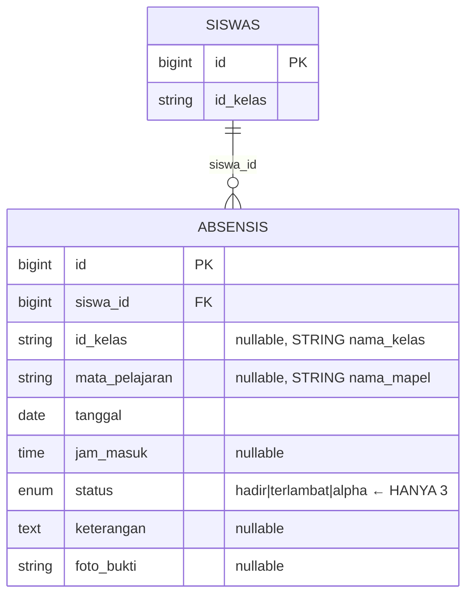
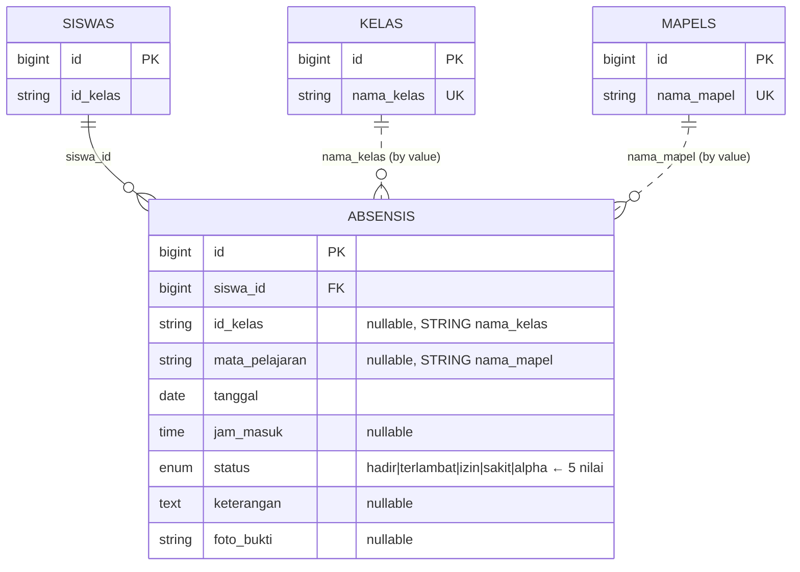
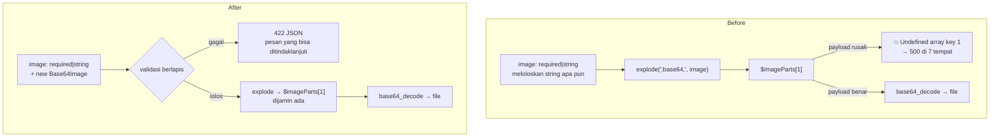

# Analisis: Validasi Absensi, Auth & Face Recognition (Sub-dokumen #5)

## 1. Metadata

- **Fitur**: Validasi form & endpoint absensi (siswa mandiri + scanner guru), autentikasi, dan pengenalan wajah
- **Slug**: `validasi-form-05-absensi-auth-face`
- **Tanggal**: 2026-07-30
- **Tipe**: `existing`
- **Status**: draft — **§4.1 butuh konfirmasi pengguna sebelum dieksekusi**
- **Area/Modul terdampak**: `AbsensiController`, `GuruAbsensiController`, `AuthController`, `FaceRecognitionController` + 4 view
- **Convention ref**: `G:\laragon\www\elearning-sdn-cibodas-2\docs\conventions.md`
- **Parent doc**: `G:\laragon\www\elearning-sdn-cibodas-2\docs\analysis\2026-07-30-validasi-form-menyeluruh.md`
- **Recommended implementer model**: `claude-sonnet-4-6`
- **Depends on**: sub-dokumen #1 (Fondasi) — **wajib selesai lebih dulu**, khususnya `app/Rules/Base64Image.php`

> ⚠️ **Dokumen ini menemukan satu bug yang tidak bisa diperbaiki oleh validasi saja.** Enum `absensis.status` di database tidak mencakup nilai yang dikirim form absensi guru, sehingga tombol **Izin** dan **Sakit** saat ini gagal disimpan. Memperbaikinya butuh satu migrasi — satu-satunya perubahan skema di seluruh lima dokumen. Lihat §4.1. **Konfirmasikan ke pengguna sebelum menjalankan T1.**

## 2. Deskripsi & Tujuan

Domain ini paling rawan karena semua input datang dari sumber yang tidak berbentuk form biasa: payload base64 dari kamera, array bersarang dari tabel absensi, dan kredensial login. Tidak satu pun dilindungi dengan benar sekarang.

**Tujuh titik crash pada payload kamera.** Ketujuh endpoint yang menerima gambar melakukan hal yang sama persis:

```php
$request->validate(['image' => 'required|string']);
$imageParts  = explode(";base64,", $request->image);
$imageBase64 = base64_decode($imageParts[1]);   // ← $imageParts[1] belum tentu ada
```

Validasi `required|string` meloloskan string apa pun. Kalau nilainya tidak mengandung `;base64,` — payload terpotong, koneksi buruk, atau seseorang mengirim `image=hai` — maka `$imageParts` hanya punya satu elemen dan `$imageParts[1]` melempar `ErrorException: Undefined array key 1`. Lokasinya: `AbsensiController:52`, `AuthController:55`, `FaceRecognitionController:62`, `:148`, `:222`, `:271`, dan `GuruAbsensiController:135`.

Yang menarik, `AdminController` justru **sudah benar** — ia memeriksa `count($imageParts) == 2` sebelum mengakses (baris 139, 227, 375, 449). Jadi pengetahuannya ada di codebase, hanya tidak diterapkan konsisten.

**Array absensi tidak divalidasi isinya.** `GuruAbsensiController::store` memvalidasi `'absensi' => 'required|array'` lalu langsung mengakses `$data['status']` di baris 116. Kalau satu baris tidak mengirim `status`, `Undefined array key "status"`. Key array-nya (`$siswaId`, baris 107) juga tidak pernah diperiksa — siapa pun bisa mengirim `absensi[9999][status]=hadir` dan membuat baris absensi untuk siswa yang tidak ada di kelas itu, atau tidak ada sama sekali.

**`getStudents` tanpa validasi apa pun.** `GuruAbsensiController::getStudents` (baris 87-92) mengambil `$request->kelas` dan mengembalikan daftar siswa beserta relasi `user` sebagai JSON. Tidak ada validasi, dan tidak ada pembatasan bahwa guru itu memang mengajar kelas tersebut. Guru mana pun bisa menarik daftar siswa kelas mana pun.

**Pesan login masih Bahasa Inggris dan hardcoded.** `AuthController` baris 35 mengembalikan `'The provided credentials do not match our records.'` — tidak lewat file bahasa, jadi tidak ikut diterjemahkan oleh dokumen #1.

**`sample_count` tanpa batas.** `FaceRecognitionController::registerFaceDataset` memvalidasi `'sample_count' => 'required|integer'` lalu memakainya langsung sebagai bagian nama file (baris 277): `"User.{$userId}.{$sample}.jpg"`. Nilai negatif, nol, atau 999999 semuanya diterima.

**Satu celah IDOR.** `AbsensiController::destroy` baris 113 memakai `Absensi::findOrFail($id)` tanpa memeriksa apa pun — guru mana pun bisa menghapus catatan absensi siswa mana pun di kelas mana pun.

## 3. Scope

**In-scope:**

| Endpoint | Route name | FormRequest baru |
|---|---|---|
| `POST /login` | `login.post` | `LoginRequest` |
| `POST /login/face` | `login.face` | `FaceLoginRequest` |
| `POST /face/register` | `face.register` | `RegisterFaceDatasetRequest` |
| `POST siswa/absensi/store` | `siswa.absensi.store` | `StoreAbsensiSiswaRequest` |
| `POST siswa/absensi/scan` | `siswa.absensi.scan` | `RecognizeAbsensiRequest` |
| `POST siswa/ujian/verify-face` | `siswa.ujian.verify` | `VerifySiswaAuthRequest` |
| `POST guru/absensi/store` | `guru.absensi.store` | `StoreGuruAbsensiRequest` |
| `POST guru/absensi/scanner/process` | `guru.absensi.scanner.process` | `ScannerProcessRequest` |
| `GET guru/absensi/students` | `guru.absensi.students` | `GetStudentsRequest` |
| `POST guru/scanner/process` | `guru.scanner.process` | `ProcessScannerRequest` |
| `POST guru/absensi/manual` | `guru.absensi.manual` | `StoreAbsensiManualRequest` |

Plus:
- Memasang `Base64Image` (dari #1) pada tujuh endpoint payload kamera
- **Satu migrasi** untuk memperbaiki enum `absensis.status` (§4.1) — butuh konfirmasi
- Menutup IDOR di `AbsensiController::destroy`
- Menerjemahkan pesan login ke Bahasa Indonesia
- Pasang `<x-input-error>` + `old()` di 4 view

**Out-of-scope:**
- `POST admin/face/train` (`face.train`) — `trainAdmin()` tidak menerima input
- `GET guru/scanner` — hanya menampilkan view
- `AbsensiController::index`, `GuruAbsensiController::index`, `SiswaAkademikController::*` — read-only
- Tidak mengubah ambang confidence biometrik (20% / 75%) — lihat §11
- Tidak menambah liveness detection
- Tidak mengubah `PythonRunner` maupun script Python
- Tidak memperbaiki `AbsensiController::store` yang mengabaikan konteks mapel (§11 tech-debt #2)
- Tidak menghapus route absensi guru yang redundan

## 4. Requirement & Edge Cases

### 4.1 ⚠️ Enum `absensis.status` — konflik yang butuh keputusan

Ini temuan paling serius di dokumen ini, dan satu-satunya yang tidak bisa diselesaikan validasi.

**Kondisi faktual:**

| Sumber | Nilai yang dikenali |
|---|---|
| Migrasi `2026_02_23_231624_create_absensis_table.php` baris 19 | `enum('status', ['hadir', 'terlambat', 'alpha'])` — **3 nilai** |
| Form guru `guru/absensi/index.blade.php` baris 143-146 | `hadir`, `izin`, `sakit`, `alpha` — **4 nilai** |
| Validasi `AbsensiController::storeManual` baris 98 | `in:hadir,izin,sakit,alpha` — **4 nilai** |
| `SiswaAkademikController::indexPresensi` baris 26-30 | menghitung `hadir`, `terlambat`, `izin`, `sakit`, `alpha` — **5 nilai** |
| View `siswa/akademik/presensi.blade.php` baris 86-95 | merender badge untuk kelima nilai — **5 nilai** |
| `AdminController::downloadLaporanBulananHadir` baris 42-44 | menghitung `hadir`, `terlambat`, `alpha` — **3 nilai** |

Database adalah satu-satunya pihak yang tidak mengenal `izin` dan `sakit`. Seluruh lapisan lain — form yang dipakai guru, controller yang memvalidasinya, controller statistik, dan view yang menampilkannya — sudah mengasumsikan keduanya ada.

**Akibatnya sekarang:** guru yang menekan tombol **I** (Izin) atau **S** (Sakit) lalu menyimpan akan mengirim nilai yang tidak ada di enum. MySQL dalam mode `strict` (default Laravel untuk MySQL) menolaknya dengan error `1265 Data truncated for column 'status'`, yang muncul sebagai `QueryException` → halaman error 500. Dalam mode non-strict, nilainya tersimpan sebagai string kosong secara diam-diam. Kedua kemungkinan itu rusak.

Jadi fitur Izin dan Sakit — yang tombolnya ada di UI dan statistiknya sudah dihitung — **tidak pernah benar-benar bekerja**.

**Dua jalan keluar:**

**A. Perluas enum database jadi 5 nilai (rekomendasi).** Satu migrasi aditif:

```php
// database/migrations/xxxx_xx_xx_fix_absensis_status_enum.php
public function up(): void
{
    DB::statement("ALTER TABLE absensis MODIFY COLUMN status
        ENUM('hadir', 'terlambat', 'izin', 'sakit', 'alpha') NOT NULL");
}

public function down(): void
{
    DB::statement("ALTER TABLE absensis MODIFY COLUMN status
        ENUM('hadir', 'terlambat', 'alpha') NOT NULL");
}
```

Keunggulannya: menyelaraskan database dengan seluruh lapisan lain yang sudah mengasumsikan 5 nilai, tanpa menghilangkan fungsi apa pun. Aditif — baris yang sudah ada tidak tersentuh, tidak ada kehilangan data, dan `down()` bekerja selama belum ada baris ber-status `izin`/`sakit`. Setelah itu rule validasinya `Rule::in(['hadir','terlambat','izin','sakit','alpha'])`.

Kelemahannya: ini **perubahan skema**, yang di keempat dokumen lain sudah saya nyatakan nol. Jadi ia melanggar batasan yang saya tetapkan sendiri — karena itu perlu persetujuanmu, bukan diputuskan sendiri.

**B. Batasi validasi ke 3 nilai yang ada di database.** Tidak ada migrasi, tapi tombol Izin dan Sakit harus **dihapus dari form guru**, dan statistik Izin/Sakit dihapus dari halaman presensi siswa. Ini menghilangkan fungsi yang jelas-jelas diniatkan ada oleh pembuat aplikasi.

**Rekomendasi saya: A.** Alasannya bukan kerapian skema, tapi karena B berarti menghapus fitur yang guru butuhkan (mencatat siswa izin dan sakit adalah kebutuhan dasar administrasi sekolah dasar) demi mempertahankan batasan yang saya buat untuk kenyamanan pekerjaan ini sendiri. Batasan itu ada supaya pekerjaan validasi tidak membengkak jadi proyek migrasi — bukan supaya bug yang butuh satu baris `ALTER TABLE` dibiarkan.

**Sampai keputusanmu keluar**, dokumen ini ditulis dengan asumsi **A**. Kalau kamu memilih B, T1 dilewati dan semua rule `status` memakai `Rule::in(['hadir','terlambat','alpha'])` plus dua view harus disesuaikan.

### 4.2 Absensi siswa mandiri

```php
// StoreAbsensiSiswaRequest  (AbsensiController::store)
public function authorize(): bool
{
    return auth()->user()?->siswa !== null;
}

public function rules(): array
{
    return [
        'image' => ['required', 'string', new Base64Image(maxKilobytes: 4096)],
    ];
}
```

```php
// RecognizeAbsensiRequest  (FaceRecognitionController::recognize)
// Identik — endpoint berbeda, kebutuhan validasi sama.
```

Keduanya endpoint AJAX yang dipanggil dari `siswa/absensi/index.blade.php` dan `siswa/dashboard.blade.php`. Validasi gagal harus menghasilkan **422 JSON**, bukan redirect — lihat §4.7.

### 4.3 Absensi oleh guru — array bersarang

```php
// StoreGuruAbsensiRequest  (GuruAbsensiController::store)
public function authorize(): bool
{
    return auth()->user()?->guru !== null;
}

public function rules(): array
{
    return [
        'kelas'   => ['required', 'string', 'exists:kelas,nama_kelas'],
        'mapel'   => ['required', 'string', 'exists:mapels,nama_mapel'],
        'tanggal' => ['required', 'date', 'before_or_equal:today'],

        'absensi'                => ['required', 'array', 'min:1'],
        'absensi.*.status'       => ['required', Rule::in(['hadir', 'terlambat', 'izin', 'sakit', 'alpha'])],
        'absensi.*.keterangan'   => ['nullable', 'string', 'max:500'],
    ];
}
```

`absensi.*.status` inilah yang menutup crash `$data['status']` di baris 116.

`before_or_equal:today` pada `tanggal` — mencegah guru mencatat kehadiran untuk hari yang belum terjadi. Kehadiran adalah catatan peristiwa, bukan rencana.

**Memvalidasi key array.** `absensi` di-key oleh `siswa_id` (view baris 149: `absensi[{{ $s->id }}][status]`). Rule Laravel biasa tidak bisa memvalidasi key, jadi pakai `after` hook:

```php
public function withValidator($validator): void
{
    $validator->after(function ($validator) {
        $absensi = $this->input('absensi');
        $kelas   = $this->input('kelas');

        if (! is_array($absensi) || blank($kelas)) {
            return;   // rule field masing-masing yang melapor
        }

        $siswaIdsValid = \App\Models\Siswa::where('id_kelas', $kelas)->pluck('id')->all();

        foreach (array_keys($absensi) as $siswaId) {
            if (! in_array((int) $siswaId, $siswaIdsValid, true)) {
                $validator->errors()->add(
                    "absensi.{$siswaId}",
                    'Terdapat data siswa yang tidak terdaftar di kelas ini.',
                );
            }
        }
    });
}
```

Ini menutup dua hal sekaligus: siswa yang tidak ada, dan siswa yang ada tapi bukan di kelas yang sedang diabsen.

```php
// StoreAbsensiManualRequest  (AbsensiController::storeManual)
'siswa_id' => ['required', 'integer', 'exists:siswas,id'],
'status'   => ['required', Rule::in(['hadir', 'terlambat', 'izin', 'sakit', 'alpha'])],
'tanggal'  => ['required', 'date', 'before_or_equal:today'],
```

```php
// GetStudentsRequest  (GuruAbsensiController::getStudents)
public function authorize(): bool
{
    return auth()->user()?->guru !== null;
}

public function rules(): array
{
    return [
        'kelas' => ['required', 'string', 'exists:kelas,nama_kelas'],
    ];
}
```

Ini satu-satunya endpoint **GET** yang mendapat FormRequest di seluruh lima dokumen. Dibenarkan karena ia bukan filter tampilan — ia endpoint AJAX yang mengembalikan data siswa beserta relasi `user` sebagai JSON, jadi parameternya adalah input yang menentukan data apa yang keluar.

**Catatan:** `authorize()` di sini hanya memastikan yang memanggil adalah guru, **tidak** memastikan guru itu mengajar kelas tersebut. Membatasi lebih jauh butuh keputusan: wali kelas boleh melihat kelasnya, guru bidang boleh melihat semua kelas yang dia ajar menurut `jadwals` — tapi data `jadwals` mungkin belum lengkap dan pembatasan yang terlalu ketat akan melumpuhkan fitur absensi. Dicatat sebagai tech-debt di §11.

### 4.4 Scanner wajah oleh guru

```php
// ScannerProcessRequest  (GuruAbsensiController::scannerProcess)
'image'   => ['required', 'string', new Base64Image(maxKilobytes: 4096)],
'kelas'   => ['required', 'string', 'exists:kelas,nama_kelas'],
'mapel'   => ['required', 'string', 'exists:mapels,nama_mapel'],
```

```php
// ProcessScannerRequest  (FaceRecognitionController::processScanner)
'image' => ['required', 'string', new Base64Image(maxKilobytes: 4096)],
```

Endpoint kedua adalah versi legacy (`routes/web.php` baris 95 menyebutnya "Legacy Dashboard Scanner"). Tetap divalidasi karena masih aktif — tapi **jangan** dihapus atau digabung.

### 4.5 Autentikasi

```php
// LoginRequest
public function authorize(): bool
{
    return true;   // route di balik middleware 'guest'
}

public function rules(): array
{
    return [
        'username' => ['required', 'string', 'max:255'],
        'password' => ['required', 'string', 'max:72'],
    ];
}
```

Sengaja **tidak** ada `exists:users,username`. Memvalidasi keberadaan username memberi tahu penyerang username mana yang terdaftar — celah enumerasi akun. Pesan kegagalan login harus tetap generik.

Pesan hardcoded di `AuthController` baris 34-36 diganti:

```php
return back()->withErrors([
    'username' => 'Username atau password salah.',
])->onlyInput('username');
```

Satu pesan untuk kedua kemungkinan — jangan membedakan "username tidak ditemukan" dari "password salah".

```php
// FaceLoginRequest
public function authorize(): bool
{
    return true;
}

public function rules(): array
{
    return [
        'image' => ['required', 'string', new Base64Image(maxKilobytes: 4096)],
    ];
}
```

```php
// RegisterFaceDatasetRequest
public function authorize(): bool
{
    return auth()->check();   // route di balik middleware 'auth'
}

public function rules(): array
{
    return [
        'image'        => ['required', 'string', new Base64Image(maxKilobytes: 2048)],
        'sample_count' => ['required', 'integer', 'min:1', 'max:20'],
    ];
}
```

`min:1|max:20` pada `sample_count` penting karena nilainya masuk langsung ke nama file (baris 277). Batas 20 sesuai asumsi `train.py` dan pemicu auto-training di baris 285.

```php
// VerifySiswaAuthRequest
public function authorize(): bool
{
    return auth()->user()?->siswa !== null;
}

public function rules(): array
{
    return [
        'image' => ['required', 'string', new Base64Image(maxKilobytes: 4096)],
    ];
}
```

### 4.6 Otorisasi kepemilikan

`AbsensiController::destroy` baris 111-116 tidak memeriksa apa pun. Tidak menerima input form, jadi tidak dapat FormRequest — perbaikannya langsung di controller.

Membatasi ke "absensi kelas yang diajar guru ini" butuh menelusuri `jadwals`, yang datanya mungkin tidak lengkap. Pembatasan yang paling aman dan tetap bermakna: **wali kelas boleh menghapus absensi kelasnya; guru bidang boleh menghapus absensi mapel yang dia ampu.**

```php
public function destroy($id)
{
    $guru = auth()->user()->guru;

    $absensi = Absensi::where('id', $id)
        ->where(function ($q) use ($guru) {
            // Wali kelas: seluruh absensi kelasnya.
            $q->where('id_kelas', $guru->id_kelas_wali)
              // Guru bidang: absensi pada mapel yang diampunya.
              ->orWhereIn('mata_pelajaran', $guru->mapels()->pluck('nama_mapel'));
        })
        ->firstOrFail();

    $absensi->delete();

    return back()->with('success', 'Data absensi berhasil dihapus.');
}
```

Kalau ternyata pembatasan ini menolak penghapusan yang sah pada data existing (mis. absensi lama tanpa `mata_pelajaran` karena kolomnya `nullable`), **laporkan ke pengguna** alih-alih melonggarkannya sendiri.

### 4.7 Respons 422 untuk endpoint AJAX

Tujuh endpoint di dokumen ini dipanggil lewat `fetch`/`axios`, bukan submit form:

| Endpoint | Pemanggil |
|---|---|
| `login.face` | `auth/login.blade.php` |
| `face.register` | `admin/guru/index`, `admin/siswa/index`, `guru/dashboard`, `siswa/dashboard` |
| `siswa.absensi.store` | `siswa/absensi/index.blade.php` |
| `siswa.absensi.scan` | `siswa/absensi/index`, `siswa/dashboard` |
| `siswa.ujian.verify` | `siswa/ujian/gateway.blade.php` |
| `guru.absensi.scanner.process` | `guru/absensi/index.blade.php` |
| `guru.scanner.process` | `guru/scanner.blade.php` |

FormRequest membalas 422 JSON **secara otomatis** bila request menyertakan `Accept: application/json` atau `X-Requested-With: XMLHttpRequest`. Tidak perlu kode tambahan di FormRequest.

Yang perlu diperiksa: apakah sisi JS mengirim header itu, dan apakah ia menangani 422. Contoh yang **sudah benar** ada di `siswa/ujian/gateway.blade.php` baris 188-196 — ia mengirim `'Accept': 'application/json'`.

Sisi JS perlu menangani bentuk respons 422 yang berbeda dari respons error aplikasi. Respons 422 berbentuk `{message, errors:{field:[...]}}`, sedangkan respons error aplikasi existing berbentuk `{success:false, message:"..."}`. Penanganan yang menutup keduanya:

```js
.then(async (response) => {
    const data = await response.json();

    if (response.status === 422) {
        // Error validasi: ambil pesan pertama dari field mana pun.
        const first = Object.values(data.errors ?? {})[0]?.[0];
        throw new Error(first ?? data.message ?? 'Data tidak valid.');
    }

    return data;
})
```

**Verifikasi tiap pemanggil** dan tambahkan header `Accept: application/json` bila belum ada. Tanpa header itu, FormRequest akan mengembalikan redirect 302 ke `fetch`, dan JS akan gagal mengurai HTML sebagai JSON — gejalanya "tidak terjadi apa-apa saat scan", yang sangat membingungkan untuk didiagnosis.

### 4.8 Edge cases

| Kondisi | Penanganan |
|---|---|
| `image` = `"hai"` (tanpa `;base64,`) | **422 dengan pesan jelas.** Sebelumnya: `Undefined array key 1` → 500 di 7 tempat |
| `image` = data-URI dengan MIME `text/plain` | Ditolak `Base64Image` |
| `image` = data-URI dengan header gambar tapi isi bukan gambar | Ditolak `getimagesizefromstring` |
| `image` = gambar 20 MB | Ditolak batas ukuran |
| `absensi[5]` dikirim tanpa `status` | **Ditolak** `absensi.*.status`. Sebelumnya: `Undefined array key "status"` → 500 |
| `absensi[9999][status]=hadir` (siswa tidak ada) | Ditolak `after` hook §4.3 |
| `absensi[12][status]=hadir` tapi siswa 12 di kelas lain | Ditolak `after` hook |
| `absensi[5][status]=bolos` | Ditolak `Rule::in` |
| `absensi[5][status]=izin` | **Diterima** setelah migrasi §4.1. Sebelumnya: error 500 dari MySQL |
| `tanggal` = besok | Ditolak `before_or_equal:today` |
| `getStudents?kelas=9Z` | Ditolak `exists:kelas,nama_kelas`. Sebelumnya: mengembalikan `[]` |
| `getStudents` tanpa `kelas` | Ditolak `required`. Sebelumnya: `Siswa::where('id_kelas', null)` → `[]` |
| `sample_count` = `0` atau `-5` | Ditolak `min:1`. Sebelumnya: nama file `User.3.-5.jpg` |
| `sample_count` = `9999` | Ditolak `max:20` |
| Login dengan username tidak terdaftar | Pesan generik "Username atau password salah." — tidak membocorkan bahwa username tidak ada |
| Login dengan password 200 karakter | Ditolak `max:72` sebelum menyentuh `Auth::attempt` |
| Guru A hapus absensi kelas yang bukan diajarnya | **404** dari `firstOrFail()`. Sebelumnya: berhasil |
| Wajah dikenali tapi confidence rendah | Tetap ditangani controller seperti sekarang (respons 400 + pesan). **Bukan** ranah validasi |
| Siswa presensi mandiri tanpa jadwal aktif | Tetap ditangani controller. **Bukan** ranah validasi |

### 4.9 Non-functional

- **Keamanan**: `Base64Image` menutup 7 titik crash yang membocorkan stack trace bila `APP_DEBUG=true`, dan mencegah penulisan file arbitrer ke `storage/app/public/temp` & `dataset/` yang **dapat diakses publik** setelah `storage:link`. Pesan login generik mencegah enumerasi akun. `GetStudentsRequest` menutup kebocoran daftar siswa.
- **Otorisasi**: `authorize()` dipakai untuk memastikan peran yang tepat (`siswa` untuk presensi mandiri, `guru` untuk scanner) dan kepemilikan pada `destroy`.
- **Performa**: `Base64Image` memanggil `getimagesizefromstring` sekali per request — jauh lebih murah daripada proses Python yang menyusul (30-60 detik timeout).
- **Concurrency**: `updateOrCreate` di semua jalur absensi bersifat idempoten. Aman.

## 5. API Contract

| Method | Path | Route name | Auth | Request | Sukses | Gagal validasi |
|---|---|---|---|---|---|---|
| POST | `/login` | `login.post` | `guest` | `username`, `password` | 302 dashboard per role | 302 back + `errors` |
| POST | `/login/face` | `login.face` | `guest` | `image` | 200 JSON `{success, message, redirect}` | **422 JSON** |
| POST | `/face/register` | `face.register` | `auth` | `image`, `sample_count` | 200 JSON `{success, message, is_finished}` | **422 JSON** |
| POST | `/siswa/absensi/store` | `siswa.absensi.store` | `role:siswa` | `image` | 200 JSON | **422 JSON** |
| POST | `/siswa/absensi/scan` | `siswa.absensi.scan` | `role:siswa` | `image` | 200 JSON | **422 JSON** |
| POST | `/siswa/ujian/verify-face` | `siswa.ujian.verify` | `role:siswa` | `image` | 200 JSON | **422 JSON** |
| POST | `/guru/absensi/store` | `guru.absensi.store` | `role:guru` | `kelas`, `mapel`, `tanggal`, `absensi[<siswa_id>][status]`, `absensi[<siswa_id>][keterangan]?` | 302 back + flash | 302 back + `errors` |
| POST | `/guru/absensi/scanner/process` | `guru.absensi.scanner.process` | `role:guru` | `image`, `kelas`, `mapel` | 200 JSON | **422 JSON** |
| GET | `/guru/absensi/students` | `guru.absensi.students` | `role:guru` | `kelas` | 200 JSON array | **422 JSON** |
| POST | `/guru/scanner/process` | `guru.scanner.process` | `role:guru` | `image` | 200 JSON | **422 JSON** |
| POST | `/guru/absensi/manual` | `guru.absensi.manual` | `role:guru` | `siswa_id`, `status`, `tanggal` | 302 back + flash | 302 back + `errors` |
| DELETE | `/guru/absensi/{id}` | `guru.absensi.destroy` | `role:guru` | — | 302 back + flash | **404 bila bukan haknya** |

Payload absensi guru:

```json
{
  "kelas": "3A",
  "mapel": "Matematika",
  "tanggal": "2026-07-30",
  "absensi": {
    "12": { "status": "hadir",  "keterangan": null },
    "13": { "status": "izin",   "keterangan": "Acara keluarga" },
    "14": { "status": "sakit",  "keterangan": "Demam" }
  }
}
```

Respons 422 untuk payload kamera yang rusak:

```json
{
  "message": "Data yang diberikan tidak valid.",
  "errors": {
    "image": ["Format data gambar tidak dikenali. Muat ulang halaman lalu coba lagi."]
  }
}
```

## 6. Sequence Diagram

Presensi mandiri siswa — memperlihatkan di mana `Base64Image` mencegah crash:

```mermaid
sequenceDiagram
    actor Siswa
    participant V as "siswa/absensi/index.blade.php"
    participant FR as "RecognizeAbsensiRequest"
    participant B64 as "Base64Image (dari #1)"
    participant C as "FaceRecognitionController::recognize"
    participant PY as "PythonRunner + recognize.py"
    participant DB as MySQL

    Siswa->>V: Klik Pindai Wajah
    V->>V: canvas.toDataURL('image/jpeg')
    V->>FR: POST siswa.absensi.scan<br/>Accept: application/json

    FR->>FR: authorize() — user punya profil siswa?

    alt Bukan siswa
        FR-->>V: 403 JSON
    else Siswa
        FR->>B64: validate(image)
        B64->>B64: cek ;base64, → MIME → decode<br/>→ getimagesizefromstring → ukuran

        alt Payload rusak / bukan gambar
            B64-->>FR: fail
            FR-->>V: 422 JSON {errors:{image:[...]}}
            V-->>Siswa: Pesan jelas: muat ulang lalu coba lagi
            Note over V,FR: SEBELUMNYA: explode lalu $imageParts[1]<br/>→ Undefined array key 1 → 500
        else Payload valid
            FR->>C: validated()
            C->>C: simpan temp file
            C->>PY: run(recognize.py, [tempPath])
            PY-->>C: {success, confidence, user_id}
            C->>C: cek jadwal aktif & belum absen
            C->>DB: updateOrCreate Absensi
            C-->>Siswa: 200 JSON {success:true, message}
        end
    end
```

## 7. Class Diagram

```mermaid
classDiagram
    class FormRequest {
        <<Illuminate>>
        +authorize() bool
        +rules() array
        +withValidator(validator) void
    }

    class LoginRequest {
        +rules() username, password
    }
    class FaceLoginRequest {
        +rules() image
    }
    class RegisterFaceDatasetRequest {
        +rules() image, sample_count 1..20
    }
    class StoreAbsensiSiswaRequest {
        +authorize() siswa exists
    }
    class RecognizeAbsensiRequest {
        +authorize() siswa exists
    }
    class VerifySiswaAuthRequest {
        +authorize() siswa exists
    }
    class StoreGuruAbsensiRequest {
        +rules() absensi.*.status
        +withValidator() cek key siswa_id vs kelas
    }
    class ScannerProcessRequest {
        +rules() image, kelas, mapel
    }
    class GetStudentsRequest {
        +rules() kelas
    }
    class ProcessScannerRequest {
        +rules() image
    }
    class StoreAbsensiManualRequest {
        +rules() siswa_id, status, tanggal
    }

    class Base64Image {
        <<ValidationRule>>
        +validate(attribute, value, fail)
    }

    class AuthController {
        +login(LoginRequest)
        +faceLogin(FaceLoginRequest)
    }
    class AbsensiController {
        +store(StoreAbsensiSiswaRequest)
        +storeManual(StoreAbsensiManualRequest)
        +destroy(id) scoped by wali/mapel
    }
    class GuruAbsensiController {
        +store(StoreGuruAbsensiRequest)
        +scannerProcess(ScannerProcessRequest)
        +getStudents(GetStudentsRequest)
    }
    class FaceRecognitionController {
        +recognize(RecognizeAbsensiRequest)
        +processScanner(ProcessScannerRequest)
        +verifySiswaAuth(VerifySiswaAuthRequest)
        +registerFaceDataset(RegisterFaceDatasetRequest)
    }

    FormRequest <|-- LoginRequest
    FormRequest <|-- FaceLoginRequest
    FormRequest <|-- RegisterFaceDatasetRequest
    FormRequest <|-- StoreAbsensiSiswaRequest
    FormRequest <|-- RecognizeAbsensiRequest
    FormRequest <|-- VerifySiswaAuthRequest
    FormRequest <|-- StoreGuruAbsensiRequest
    FormRequest <|-- ScannerProcessRequest
    FormRequest <|-- GetStudentsRequest
    FormRequest <|-- ProcessScannerRequest
    FormRequest <|-- StoreAbsensiManualRequest

    FaceLoginRequest ..> Base64Image
    RegisterFaceDatasetRequest ..> Base64Image
    StoreAbsensiSiswaRequest ..> Base64Image
    RecognizeAbsensiRequest ..> Base64Image
    VerifySiswaAuthRequest ..> Base64Image
    ScannerProcessRequest ..> Base64Image
    ProcessScannerRequest ..> Base64Image

    AuthController ..> LoginRequest
    AuthController ..> FaceLoginRequest
    AbsensiController ..> StoreAbsensiSiswaRequest
    AbsensiController ..> StoreAbsensiManualRequest
    GuruAbsensiController ..> StoreGuruAbsensiRequest
    GuruAbsensiController ..> ScannerProcessRequest
    GuruAbsensiController ..> GetStudentsRequest
    FaceRecognitionController ..> RecognizeAbsensiRequest
    FaceRecognitionController ..> ProcessScannerRequest
    FaceRecognitionController ..> VerifySiswaAuthRequest
    FaceRecognitionController ..> RegisterFaceDatasetRequest
```



## 8. ERD

**Ini satu-satunya sub-dokumen dengan perubahan skema** — dan hanya bila opsi A di §4.1 disetujui.

**Before:**



**After (opsi A):**



**Delta ERD:** hanya kolom `status` — dari 3 nilai enum menjadi 5. Aditif; tidak ada kolom ditambah/dihapus, tidak ada baris existing yang berubah.

## 9. Before / After

### Before — `GuruAbsensiController::store` (kode nyata, baris 94-124)

```php
public function store(Request $request)
{
    $request->validate([
        'kelas' => 'required|string',      // ❌ tanpa exists
        'mapel' => 'required|string',      // ❌ tanpa exists
        'tanggal' => 'required|date',      // ❌ boleh masa depan
        'absensi' => 'required|array',     // ❌ isi array tidak divalidasi
    ]);

    // ...
    foreach ($request->absensi as $siswaId => $data) {   // ❌ key tidak divalidasi
        Absensi::updateOrCreate(
            [/* ... */],
            [
                'status' => $data['status'],             // ❌ crash bila key hilang
                // ...
            ]
        );
    }
}
```

### After

```php
public function store(StoreGuruAbsensiRequest $request)
{
    $validated = $request->validated();
    // Sisa method tidak berubah — updateOrCreate, pesan flash, semuanya sama.
}
```

### Before / After — payload kamera



### Delta perilaku yang dialami pengguna

| Skenario | Before | After |
|---|---|---|
| Payload kamera terpotong / bukan data-URI | **500 Undefined array key 1** di 7 endpoint | 422 dengan pesan "Muat ulang halaman lalu coba lagi" |
| Payload data-URI berisi file non-gambar | File sampah tertulis ke folder publik | Ditolak |
| Guru menandai siswa **Izin** atau **Sakit** | **500 dari MySQL** (nilai di luar enum) | Tersimpan — setelah migrasi §4.1 |
| Baris absensi dikirim tanpa `status` | **500 Undefined array key "status"** | Ditolak dengan pesan |
| Kirim `absensi[9999][status]=hadir` | Baris absensi dibuat untuk siswa tak dikenal | Ditolak |
| Kirim absensi siswa kelas lain | Tersimpan | Ditolak |
| Absensi bertanggal besok | Tersimpan | Ditolak |
| `getStudents?kelas=9Z` | `[]`, tanpa pesan | 422 dengan pesan |
| `getStudents` tanpa parameter | `[]` | 422 |
| `sample_count=-5` | File `User.3.-5.jpg` tertulis | Ditolak |
| `sample_count=9999` | File tertulis, auto-training terpicu | Ditolak |
| Login username tidak terdaftar | `The provided credentials do not match our records.` (Inggris) | `Username atau password salah.` |
| Guru A hapus absensi kelas orang lain | Berhasil | 404 |

**Delta API contract:** tidak ada perubahan method/path/route name. Yang berubah: endpoint AJAX kini bisa membalas 422 (sebelumnya hanya 200/400/500), sehingga sisi JS harus menanganinya (§4.7).

## 10. Rekomendasi Implementasi (Reuse vs New)

### Reuse
- **`App\Rules\Base64Image`** dari dokumen #1 — dipakai di tujuh endpoint. **Jangan** membuat rule serupa yang baru.
- **Pola `count($imageParts) == 2`** di `AdminController` baris 139/227/375/449 — bukti pengetahuannya sudah ada di codebase. Setelah `Base64Image`, pemeriksaan serupa di controller dokumen ini **boleh** ditambahkan sebagai lapis kedua, tapi tidak wajib.
- **`App\Services\PythonRunner`** — tanpa perubahan apa pun.
- **Script `recognize.py` & `train.py`** — tanpa perubahan.
- **Seluruh logika pemeriksaan confidence** (`> 20`, `> 75`) — tanpa perubahan, meski ambangnya rendah (§11).
- **Logika cek jadwal aktif** di `AbsensiController::index` dan `FaceRecognitionController::recognize` — tanpa perubahan.
- **`updateOrCreate`** di semua jalur absensi — idempoten, benar.
- **`Auth::attempt` + `session()->regenerate()`** di `AuthController` — benar, hanya pesan errornya diganti.
- **Header `Accept: application/json`** di `siswa/ujian/gateway.blade.php` baris 193 — sudah benar, jadikan acuan untuk pemanggil lain.
- **`<x-input-error>`** dan blok flash layout — dari dokumen #1.

### New
- **11 FormRequest** di `app/Http/Requests/`.
- **1 migrasi** untuk enum `absensis.status` — **hanya bila opsi A §4.1 disetujui**.

### Modify
- **4 controller** — 11 signature + perbaikan IDOR `destroy` + pesan login.
- **4 view** — penanganan 422 di JS, `<x-input-error>`, `old()`.

## 11. Dampak & Risiko

**File berubah:**

| Path | Aksi |
|---|---|
| `database/migrations/xxxx_fix_absensis_status_enum.php` | CREATE — **hanya bila opsi A disetujui** |
| `app/Http/Requests/LoginRequest.php` | CREATE |
| `app/Http/Requests/FaceLoginRequest.php` | CREATE |
| `app/Http/Requests/RegisterFaceDatasetRequest.php` | CREATE |
| `app/Http/Requests/StoreAbsensiSiswaRequest.php` | CREATE |
| `app/Http/Requests/RecognizeAbsensiRequest.php` | CREATE |
| `app/Http/Requests/VerifySiswaAuthRequest.php` | CREATE |
| `app/Http/Requests/StoreGuruAbsensiRequest.php` | CREATE |
| `app/Http/Requests/ScannerProcessRequest.php` | CREATE |
| `app/Http/Requests/GetStudentsRequest.php` | CREATE |
| `app/Http/Requests/ProcessScannerRequest.php` | CREATE |
| `app/Http/Requests/StoreAbsensiManualRequest.php` | CREATE |
| `app/Http/Controllers/AuthController.php` | MODIFY |
| `app/Http/Controllers/AbsensiController.php` | MODIFY |
| `app/Http/Controllers/GuruAbsensiController.php` | MODIFY |
| `app/Http/Controllers/FaceRecognitionController.php` | MODIFY |
| `resources/views/auth/login.blade.php` | MODIFY |
| `resources/views/guru/absensi/index.blade.php` | MODIFY |
| `resources/views/guru/scanner.blade.php` | MODIFY |
| `resources/views/siswa/absensi/index.blade.php` | MODIFY |

Empat view lain memanggil `face.register` dan perlu penanganan 422: `admin/guru/index`, `admin/siswa/index`, `guru/dashboard`, `siswa/dashboard`. Ubah **hanya blok JS penanganan respons**-nya; jangan sentuh yang lain (view admin adalah wilayah dokumen #3 — kalau #3 sudah dikerjakan, koordinasikan agar tidak saling menimpa).

**Migrasi data:** satu migrasi skema (bukan data) bila opsi A disetujui. Aditif, reversible, tidak menyentuh baris existing.

**Breaking change:** endpoint AJAX kini bisa membalas 422. Sisi JS yang tidak menanganinya akan gagal mengurai respons — gejalanya "tidak terjadi apa-apa saat tombol scan ditekan". Karena itu §12.2 T10/T11 mewajibkan verifikasi setiap pemanggil.

**Risiko:**

| Risiko | Mitigasi |
|---|---|
| Migrasi enum dijalankan tanpa persetujuan | T1 ditandai butuh konfirmasi. Kalau ragu, **tanya dulu** |
| Opsi B dipilih tapi view tidak disesuaikan | Kalau B dipilih, tombol Izin/Sakit **wajib** dihapus dari `guru/absensi/index.blade.php` baris 144-145 dan statistik Izin/Sakit dari `siswa/akademik/presensi.blade.php` baris 42-43 |
| JS tidak mengirim `Accept: application/json` | Gejala membingungkan ("scan tidak merespons"). T10/T11 mewajibkan verifikasi tiap pemanggil |
| `Base64Image` menolak payload kamera yang sah | Batas 4096 KB lapang untuk satu frame. Verifikasi ukuran nyata `canvas.toDataURL('image/jpeg')` dari perangkat pengguna sebelum menurunkannya |
| `AbsensiController::destroy` menolak penghapusan yang sah | Absensi lama mungkin punya `mata_pelajaran` NULL (kolomnya `nullable`) sehingga tidak cocok kondisi mana pun. Uji dengan data nyata; kalau menolak yang sah, **laporkan** alih-alih melonggarkan |
| `GetStudentsRequest` menolak kelas yang sah | Terjadi bila ada siswa dengan `id_kelas` yang tidak terdaftar di tabel `kelas`. Periksa dengan query di tech-debt #6 |
| Guru bidang tanpa baris `guru_mapels` tidak bisa menghapus absensi | `GuruAbsensiController:51-53` membuktikan data seperti itu ada. Laporkan kalau terjadi |
| Data existing punya `status` = `''` (string kosong) | Kemungkinan bila MySQL berjalan non-strict dan guru pernah memilih Izin/Sakit. Periksa dengan query di tech-debt #7 |

**Tech-debt tercatat:**

1. **Ambang confidence biometrik tidak konsisten dan rendah.** `AbsensiController::store` dan `GuruAbsensiController::scannerProcess` memakai `> 75`, sementara `AuthController::faceLogin`, `FaceRecognitionController::recognize`, `processScanner`, dan `verifySiswaAuth` memakai `> 20`. Dua ambang berbeda untuk operasi yang setara, dan 20% terlalu rendah untuk biometrik. Ditambah tidak ada liveness detection — foto di layar ponsel bisa lolos. Di luar cakupan validasi form; butuh pekerjaan tersendiri.
2. **`AbsensiController::store` mengabaikan konteks mapel.** `updateOrCreate` hanya berkunci `siswa_id` + `tanggal` (baris 76), padahal tabelnya punya `id_kelas` dan `mata_pelajaran`, dan `GuruAbsensiController` memakai keempatnya dengan benar (baris 109-114). Akibatnya presensi mandiri siswa untuk mapel kedua di hari yang sama akan **menimpa** baris mapel pertama alih-alih membuat baris baru — padahal `AbsensiController::index` baris 36-39 justru memeriksa per-mapel. Ini inkonsistensi logika bisnis yang nyata, **bukan** validasi. Perlu diperbaiki terpisah.
3. **Route absensi guru redundan.** `AbsensiController::storeManual` + `GuruAbsensiController::store` tumpang tindih; komentar di `routes/web.php:105` menyebutnya "Legacy - remove later if redundant". Demikian juga `FaceRecognitionController::processScanner` vs `GuruAbsensiController::scannerProcess`. Keempatnya tetap divalidasi karena masih aktif.
4. **`getStudents` tidak membatasi guru ke kelas yang diajarnya.** `authorize()` hanya memastikan pemanggil adalah guru. Membatasi lebih jauh butuh keputusan tentang bagaimana hak akses guru bidang ditentukan (lewat `jadwals`? `guru_mapels`?) dan berisiko melumpuhkan fitur bila data pendukungnya tidak lengkap.
5. **Path temp tidak konsisten.** `AbsensiController` dan `AuthController` menulis ke `storage/app/public/temp`, sementara `FaceRecognitionController::processScanner`/`verifySiswaAuth` menulis ke `storage/app/temp` (tanpa `public`). Yang pertama dapat diakses publik, yang kedua tidak. `AbsensiController::store` bahkan **menyimpan** path publik itu sebagai `foto_bukti` (baris 77) sehingga foto wajah siswa dapat diakses siapa pun yang tahu URL-nya. Masalah privasi nyata, di luar cakupan dokumen ini.
6. **Data siswa mungkin punya `id_kelas` yang tidak terdaftar.** Periksa:
   ```sql
   SELECT DISTINCT id_kelas FROM siswas WHERE id_kelas NOT IN (SELECT nama_kelas FROM kelas);
   SELECT DISTINCT id_kelas FROM absensis WHERE id_kelas IS NOT NULL AND id_kelas NOT IN (SELECT nama_kelas FROM kelas);
   SELECT DISTINCT mata_pelajaran FROM absensis WHERE mata_pelajaran IS NOT NULL AND mata_pelajaran NOT IN (SELECT nama_mapel FROM mapels);
   ```
7. **Data absensi mungkin punya `status` kosong.** Periksa:
   ```sql
   SELECT id, siswa_id, tanggal, status FROM absensis WHERE status NOT IN ('hadir','terlambat','alpha');
   ```
   Hasil non-kosong menandakan MySQL berjalan non-strict dan nilai Izin/Sakit pernah tersimpan sebagai string kosong.

---

## 12. Handoff Contract

### 12.1 Header

- `source_doc`: `G:\laragon\www\elearning-sdn-cibodas-2\docs\analysis\2026-07-30-validasi-form-05-absensi-auth-face.md`
- `parent_doc`: `G:\laragon\www\elearning-sdn-cibodas-2\docs\analysis\2026-07-30-validasi-form-menyeluruh.md`
- `depends_on_doc`: `G:\laragon\www\elearning-sdn-cibodas-2\docs\analysis\2026-07-30-validasi-form-01-fondasi.md` — **wajib selesai lebih dulu**; dokumen ini memakai `app/Rules/Base64Image.php`
- `convention_ref`: `G:\laragon\www\elearning-sdn-cibodas-2\docs\conventions.md`
- `glossary_ref`: `G:\laragon\www\elearning-sdn-cibodas-2\CONTEXT.md`
- `feature_type`: `existing`
- `recommended_implementer_model`: `claude-sonnet-4-6`
- **`blocking_decision`**: §4.1 — pilihan A (migrasi enum) atau B (batasi ke 3 nilai). **Konfirmasi ke pengguna sebelum T1.**

### 12.2 Task List

| id | desc | targets | mode | refs | depends_on |
|----|------|---------|------|------|------------|
| T0 | Verifikasi `app/Rules/Base64Image.php` ada + jalankan query pemeriksaan data | — | — | §12.1, §11 | — |
| T1 | ⚠️ **KONFIRMASI DULU** — migrasi enum `absensis.status` | `database\migrations\xxxx_fix_absensis_status_enum.php` [CREATE] | new | §4.1 | T0 |
| T2 | Buat 3 FormRequest Auth & Face register | `LoginRequest.php`, `FaceLoginRequest.php`, `RegisterFaceDatasetRequest.php` [CREATE] | new | §4.5 | T0 |
| T3 | Buat 3 FormRequest payload kamera siswa | `StoreAbsensiSiswaRequest.php`, `RecognizeAbsensiRequest.php`, `VerifySiswaAuthRequest.php` [CREATE] | new | §4.2, §4.5 | T0 |
| T4 | Buat 4 FormRequest absensi guru | `StoreGuruAbsensiRequest.php`, `ScannerProcessRequest.php`, `GetStudentsRequest.php`, `ProcessScannerRequest.php` [CREATE] | new | §4.3, §4.4 | T1 |
| T5 | Buat `StoreAbsensiManualRequest` | `StoreAbsensiManualRequest.php` [CREATE] | new | §4.3 | T1 |
| T6 | Sambungkan `AuthController` + ganti pesan login ke Bahasa Indonesia | `app\Http\Controllers\AuthController.php` [MODIFY] | modify | §4.5 | T2 |
| T7 | Sambungkan `AbsensiController` + **perbaiki IDOR `destroy`** | `app\Http\Controllers\AbsensiController.php` [MODIFY] | modify | §4.6 | T3, T5 |
| T8 | Sambungkan `GuruAbsensiController` | `app\Http\Controllers\GuruAbsensiController.php` [MODIFY] | modify | §4.3 | T4 |
| T9 | Sambungkan `FaceRecognitionController` | `app\Http\Controllers\FaceRecognitionController.php` [MODIFY] | modify | §4.5 | T2, T3, T4 |
| T10 | Tangani 422 di JS — 4 view utama | `auth\login.blade.php`, `guru\absensi\index.blade.php`, `guru\scanner.blade.php`, `siswa\absensi\index.blade.php` [MODIFY] | modify | §4.7 | T6–T9 |
| T11 | Tangani 422 di JS — 4 view pemanggil `face.register` | `admin\guru\index`, `admin\siswa\index`, `guru\dashboard`, `siswa\dashboard` [MODIFY] | modify | §4.7 | T9 |
| T12 | Pasang `<x-input-error>` + `old()` di form non-AJAX | `guru\absensi\index.blade.php`, `auth\login.blade.php` [MODIFY] | modify | — | T10 |
| T13 | Pint + verifikasi manual | — | — | §12.3 | T1–T12 |

---

#### T0 — Prasyarat

```bash
ls G:/laragon/www/elearning-sdn-cibodas-2/app/Rules/Base64Image.php
```

Kalau tidak ada, **berhenti** — dokumen #1 belum selesai.

Jalankan query di §11 tech-debt #6 dan #7. Laporkan hasilnya ke pengguna. Hasil non-kosong pada #7 penting: itu berarti nilai Izin/Sakit pernah tersimpan rusak.

---

#### T1 — ⚠️ Migrasi enum — BUTUH KONFIRMASI

**Jangan jalankan task ini tanpa persetujuan eksplisit pengguna.** Ini satu-satunya perubahan skema di seluruh lima dokumen, dan dokumen induk menyatakan nol migrasi. Sampaikan §4.1 ke pengguna dan tunggu jawabannya.

**Bila opsi A disetujui:**

```php
<?php

use Illuminate\Database\Migrations\Migration;
use Illuminate\Support\Facades\DB;

return new class extends Migration
{
    public function up(): void
    {
        // Enum lama ['hadir','terlambat','alpha'] tidak mencakup 'izin' dan 'sakit',
        // padahal form absensi guru (guru/absensi/index.blade.php) mengirim keduanya
        // dan SiswaAkademikController sudah menghitung statistiknya.
        // Lihat docs/analysis/2026-07-30-validasi-form-05-absensi-auth-face.md §4.1
        DB::statement("ALTER TABLE absensis MODIFY COLUMN status
            ENUM('hadir', 'terlambat', 'izin', 'sakit', 'alpha') NOT NULL");
    }

    public function down(): void
    {
        DB::statement("ALTER TABLE absensis MODIFY COLUMN status
            ENUM('hadir', 'terlambat', 'alpha') NOT NULL");
    }
};
```

Nama file: `2026_07_30_000001_fix_absensis_status_enum.php` (sesuaikan timestamp agar berada setelah migrasi terakhir yang ada, `2026_06_16_050413`).

**Bila opsi B dipilih:** lewati task ini, lalu:
- Semua `Rule::in([...])` untuk `status` memakai `['hadir', 'terlambat', 'alpha']`
- Hapus baris 144-145 (`'izin'` dan `'sakit'`) dari `resources/views/guru/absensi/index.blade.php`
- Hapus blok statistik Izin/Sakit (baris ~42-43) dari `resources/views/siswa/akademik/presensi.blade.php`
- Hapus cabang `@elseif($absensi->status == 'izin')` dan `'sakit'` (baris ~90-93) dari view yang sama

---

#### T2 — FormRequest Auth

```php
<?php

namespace App\Http\Requests;

use Illuminate\Foundation\Http\FormRequest;

class LoginRequest extends FormRequest
{
    public function authorize(): bool
    {
        return true;   // route di balik middleware 'guest'
    }

    public function rules(): array
    {
        return [
            // SENGAJA tanpa exists:users,username — memvalidasi keberadaan username
            // membocorkan akun mana yang terdaftar (enumerasi akun).
            'username' => ['required', 'string', 'max:255'],
            'password' => ['required', 'string', 'max:72'],
        ];
    }
}
```

`FaceLoginRequest` dan `RegisterFaceDatasetRequest` per §4.5.

---

#### T3, T4, T5 — FormRequest absensi & face

Per §4.2, §4.3, §4.4. Yang paling substansial `StoreGuruAbsensiRequest` — sertakan `withValidator()` untuk memvalidasi key array sebagaimana §4.3.

---

#### T6 — `AuthController`

```php
use App\Http\Requests\LoginRequest;
use App\Http\Requests\FaceLoginRequest;

public function login(LoginRequest $request)
{
    $credentials = $request->validated();

    if (Auth::attempt($credentials)) {
        // ... tidak berubah
    }

    return back()->withErrors([
        'username' => 'Username atau password salah.',
    ])->onlyInput('username');
}
```

`$request->validated()` mengembalikan `['username' => ..., 'password' => ...]` yang cocok untuk `Auth::attempt()`.

**Yang WAJIB dipertahankan:** `session()->regenerate()`, seluruh logika redirect per role, `logout()`, dan seluruh alur `faceLogin` setelah validasi.

---

#### T7 — `AbsensiController` + IDOR

Ganti signature `store` dan `storeManual`. Lalu perbaiki `destroy` per §4.6.

**Yang WAJIB dipertahankan:** penulisan temp file, pemanggilan `PythonRunner::run`, pemeriksaan confidence `> 75`, `updateOrCreate` beserta kuncinya yang sekarang (**jangan** perbaiki masalah konteks mapel — §11 tech-debt #2), `@unlink`, dan semua respons JSON.

---

#### T8, T9 — `GuruAbsensiController` & `FaceRecognitionController`

Ganti signature, hapus blok `validate()`.

**Yang WAJIB dipertahankan:** seluruh alur temp file, `PythonRunner::run`, ambang confidence (`> 75` dan `> 20` masing-masing di tempatnya — **jangan diseragamkan**), pemeriksaan jadwal aktif, pemeriksaan `$siswa->id_kelas != $request->kelas`, pemicu auto-training di `sample >= 20`, dan semua respons JSON beserta status code-nya.

Boleh menambahkan `count($imageParts) == 2` sebagai lapis kedua setelah `Base64Image`, tapi tidak wajib.

---

#### T10, T11 — Penanganan 422 di JS

Untuk **setiap** pemanggil, periksa dua hal:

1. Apakah request menyertakan `'Accept': 'application/json'`? Kalau belum, **tambahkan**. Tanpa ini FormRequest mengembalikan redirect 302 dan `response.json()` gagal — gejalanya tombol scan seolah tidak merespons.
2. Apakah respons 422 ditangani? Tambahkan pola di §4.7.

Acuan yang **sudah benar**: `siswa/ujian/gateway.blade.php` baris 188-196.

Daftar lengkap pemanggil yang harus diperiksa:

| View | Endpoint yang dipanggil |
|---|---|
| `auth\login.blade.php` | `login.face` |
| `siswa\absensi\index.blade.php` | `siswa.absensi.store`, `siswa.absensi.scan` |
| `guru\absensi\index.blade.php` | `guru.absensi.scanner.process`, `guru.absensi.students` |
| `guru\scanner.blade.php` | `guru.scanner.process` |
| `admin\guru\index.blade.php` | `face.register` |
| `admin\siswa\index.blade.php` | `face.register` |
| `guru\dashboard.blade.php` | `face.register` |
| `siswa\dashboard.blade.php` | `face.register` |

**Untuk view admin (T11):** kalau dokumen #3 sudah dikerjakan, view ini sudah disentuh. Ubah **hanya blok JS penanganan respons** — jangan menimpa `<x-input-error>` dan `old()` yang sudah dipasang di sana.

---

#### T12 — Error per-field pada form non-AJAX

Hanya dua form di dokumen ini yang berupa submit HTML biasa:

| View | Field |
|---|---|
| `auth\login.blade.php` | `username`, `password` |
| `guru\absensi\index.blade.php` | `kelas`, `mapel`, `tanggal`, `absensi.*.status` |

Login:

```blade
<input type="text" name="username" value="{{ old('username') }}" class="..." required>
<x-input-error name="username" />

<input type="password" name="password" class="..." required>
<x-input-error name="password" />
```

`auth/login.blade.php` **tidak** memakai `layouts/app.blade.php` (halaman guest) — verifikasi apakah ia punya blok error sendiri. Kalau tidak, tambahkan blok ringkasan lokal di view itu; blok global dari dokumen #1 tidak menjangkaunya.

Absensi guru — error per baris siswa:

```blade
<x-input-error :messages="$errors->get('absensi.'.$s->id.'.status')" />
```

---

#### T13 — Pint & verifikasi

```bash
vendor/bin/pint app/Http/Requests app/Http/Controllers
php artisan view:clear
php artisan migrate    # hanya bila T1 dijalankan
```

### 12.3 Acceptance Criteria

**Prasyarat**
- [ ] `app/Rules/Base64Image.php` ada sebelum task lain dimulai
- [ ] Query §11 #6 dan #7 sudah dijalankan dan hasilnya dilaporkan
- [ ] Keputusan §4.1 (opsi A atau B) sudah dikonfirmasi pengguna **sebelum** T1

**Enum status (bila opsi A)**
- [ ] Migrasi enum ada, `up()` dan `down()` keduanya terisi
- [ ] `php artisan migrate` sukses
- [ ] Uji: guru menandai siswa **Izin**, simpan → **tersimpan**, tidak ada error 500
- [ ] Uji: guru menandai siswa **Sakit**, simpan → tersimpan
- [ ] Uji: halaman rekap presensi siswa menampilkan badge Izin/Sakit dengan benar
- [ ] `php artisan migrate:rollback` mengembalikan enum ke 3 nilai tanpa error (uji di database dev, bukan produksi)

**Enum status (bila opsi B)**
- [ ] Tidak ada file migrasi baru
- [ ] Tombol Izin & Sakit **dihapus** dari `guru/absensi/index.blade.php`
- [ ] Statistik & badge Izin/Sakit dihapus dari `siswa/akademik/presensi.blade.php`
- [ ] Semua `Rule::in` untuk `status` hanya berisi `hadir`, `terlambat`, `alpha`

**Payload kamera — 7 endpoint**
- [ ] Ketujuh endpoint memakai `new Base64Image(...)` pada field `image`
- [ ] Uji tiap endpoint dengan `image=hai` → **422 JSON dengan pesan**, bukan 500 `Undefined array key 1`
- [ ] Uji dengan `image=data:text/plain;base64,aGFsbw==` → ditolak
- [ ] Uji dengan data-URI gambar valid → diterima dan alur Python berjalan
- [ ] Tidak ada file baru di `storage/app/public/temp` maupun `storage/app/temp` ketika validasi gagal

**Array absensi guru**
- [ ] `absensi.*.status` divalidasi dengan `Rule::in`
- [ ] `absensi.*.keterangan` `nullable|string|max:500`
- [ ] `withValidator()` memvalidasi key array terhadap siswa di kelas tersebut
- [ ] Uji: kirim `absensi[<id>]` tanpa `status` → ditolak, bukan 500
- [ ] Uji: kirim `absensi[9999][status]=hadir` → ditolak
- [ ] Uji: kirim siswa dari kelas lain → ditolak
- [ ] Uji: `tanggal` = besok → ditolak
- [ ] Uji: simpan absensi 1 kelas penuh dengan status campuran → berhasil

**getStudents**
- [ ] `GetStudentsRequest` ada dan tersambung
- [ ] Uji: `?kelas=9Z` → 422
- [ ] Uji: tanpa `kelas` → 422
- [ ] Uji: `?kelas=1A` (valid) → 200 dengan daftar siswa

**sample_count**
- [ ] `min:1` dan `max:20` terpasang
- [ ] Uji: `sample_count=0` → ditolak; `-5` → ditolak; `9999` → ditolak
- [ ] Uji: `sample_count=20` → diterima dan auto-training terpicu (perilaku existing)

**Login**
- [ ] Pesan login gagal berbunyi **Bahasa Indonesia** dan generik: `"Username atau password salah."`
- [ ] `LoginRequest` **tidak** memakai `exists:users,username`
- [ ] `password` punya `max:72`
- [ ] Uji: login username tidak terdaftar dan login password salah → **pesan identik** (tidak membocorkan mana yang salah)
- [ ] Uji: login valid untuk admin/guru/siswa → redirect ke dashboard masing-masing

**IDOR**
- [ ] `AbsensiController::destroy` menyaring berdasarkan wali kelas atau mapel yang diampu
- [ ] Uji: guru A hapus absensi kelas/mapel yang bukan wilayahnya → **404**
- [ ] Uji: wali kelas hapus absensi kelasnya → **berhasil**
- [ ] Uji: guru bidang hapus absensi mapel yang diampunya → berhasil

**Penanganan 422 di JS**
- [ ] Kedelapan pemanggil di T10/T11 mengirim `Accept: application/json`
- [ ] Kedelapan pemanggil menangani `response.status === 422` dan menampilkan pesan
- [ ] Uji manual tiap tombol scan/register: payload rusak → pesan tampil di UI, bukan diam saja
- [ ] `siswa/ujian/gateway.blade.php` yang sudah benar **tidak dirusak**

**Error per-field**
- [ ] `auth/login.blade.php` menampilkan error di bawah `username` dan `password`, dan punya blok ringkasan (view ini tidak memakai `layouts/app`)
- [ ] `guru/absensi/index.blade.php` menampilkan error untuk `kelas`, `mapel`, `tanggal`, dan per baris siswa
- [ ] `old('username')` dipakai; `old()` **tidak** dipakai untuk `password`

**Regresi**
- [ ] Presensi mandiri siswa dengan jadwal aktif → tercatat seperti sebelumnya
- [ ] Presensi mandiri tanpa jadwal aktif → ditolak controller dengan pesan existing
- [ ] Scanner guru mengenali siswa di kelasnya → tercatat
- [ ] Scanner guru mengenali siswa kelas lain → ditolak dengan pesan existing
- [ ] Face login berhasil untuk user terdaftar
- [ ] Pendaftaran 20 sample wajah → auto-training berjalan
- [ ] Ambang confidence `> 75` dan `> 20` **tidak berubah** dari nilai aslinya
- [ ] Absensi manual oleh guru berfungsi
- [ ] `vendor/bin/pint --test` lolos
- [ ] Tidak ada migrasi lain selain enum status (bila opsi A)

### 12.4 Out-of-Scope Guardrails

- **JANGAN** menjalankan T1 (migrasi enum) tanpa konfirmasi eksplisit pengguna. Ini satu-satunya perubahan skema di seluruh lima dokumen dan melanggar batasan yang ditetapkan dokumen induk — sengaja diangkat sebagai keputusan pengguna, bukan keputusan implementer.
- **JANGAN** membuat `app/Rules/Base64Image.php`. Sudah dibuat di dokumen #1.
- **JANGAN** mengubah ambang confidence. `> 75` di `AbsensiController::store` & `GuruAbsensiController::scannerProcess`, `> 20` di `AuthController::faceLogin`, `FaceRecognitionController::recognize`/`processScanner`/`verifySiswaAuth`. Tidak konsisten dan rendah (§11 tech-debt #1), tapi mengubahnya adalah keputusan keamanan tersendiri.
- **JANGAN** menambah liveness detection.
- **JANGAN** menyentuh `App\Services\PythonRunner`, `recognize.py`, atau `train.py`.
- **JANGAN** menambahkan `exists:users,username` ke `LoginRequest`. Itu membuka enumerasi akun.
- **JANGAN** membuat pesan login yang membedakan "username tidak ada" dari "password salah". Satu pesan generik.
- **JANGAN** memperbaiki `AbsensiController::store` yang mengabaikan konteks mapel pada `updateOrCreate` (§11 tech-debt #2). Itu logika bisnis, bukan validasi.
- **JANGAN** menghapus atau menggabungkan route absensi/scanner yang redundan (§11 tech-debt #3), meski komentar di `routes/web.php` menyebutnya legacy.
- **JANGAN** menyeragamkan path temp (`storage/app/public/temp` vs `storage/app/temp`) atau memindahkan `foto_bukti` keluar dari folder publik (§11 tech-debt #5). Masalah privasi nyata tapi di luar cakupan.
- **JANGAN** membatasi `getStudents` ke kelas yang diajar guru. Butuh keputusan tentang hak akses guru bidang (§11 tech-debt #4).
- **JANGAN** menambah validasi ke `trainAdmin()` atau `scannerGuru()`. Keduanya tidak menerima input.
- **JANGAN** menulis `exists:kelas,id` atau `exists:mapels,id`. Kolomnya `string` berisi nama.
- **JANGAN** mengubah respons JSON existing (bentuk, pesan, status code) untuk kasus **non-validasi**. Hanya kasus validasi gagal yang jadi 422.
- **JANGAN** merusak penanganan yang sudah benar di `siswa/ujian/gateway.blade.php`.
- **JANGAN** memakai `old()` pada field `password`.
- **JANGAN** membuat FormRequest untuk domain lain (kelas, mapel, jadwal, guru, siswa, materi, tugas, ujian). Itu #2, #3, #4.
- **JANGAN** memperbaiki data lama yang melanggar rule baru. Laporkan hasil query T0.
- **JANGAN** membuat automated test.
- **JANGAN** menambah dependency composer atau npm.

### 12.5 Konvensi Relevan (restated)

Dikutip dari `docs/conventions.md`:

- **§4.1** — Validasi di FormRequest, bukan inline `$request->validate()`. Termasuk endpoint AJAX.
- **§4.2** — Rules sebagai **array**, bukan string pipe. `authorize()` memeriksa kepemilikan/peran yang tepat.
- **§4.3** — **`id_kelas` bukan foreign key.** `exists:kelas,nama_kelas`, `exists:mapels,nama_mapel`.
- **§4.4** — Logika validasi yang butuh parsing non-trivial masuk ke `app/Rules/` sebagai `ValidationRule`. `Base64Image` sudah ada dari #1 — pakai, jangan bikin ulang.
- **§4.6** — **Endpoint AJAX** → FormRequest otomatis membalas 422 JSON bila request-nya `Accept: application/json` atau `X-Requested-With: XMLHttpRequest`. **Pastikan sisi JS mengirim header itu.** Ini yang paling mudah terlewat di dokumen ini.
- **§6** — Controller tipis. **Jangan** `$request->all()`. Selalu `validated()` atau array eksplisit.
- **§7** — Role dijaga `RoleMiddleware` di route; kepemilikan dijaga `authorize()`. Jangan tambah Gate/Policy/Spatie.
- **§3** — FormRequest dinamai `<Aksi><Entitas>Request`. Custom Rule `PascalCase` di `app/Rules/`.
- **§5** — `<x-input-error>` untuk error per-field, `old()` untuk repopulate (kecuali `password`). Catatan: `auth/login.blade.php` tidak memakai `layouts/app`, jadi blok ringkasan global tidak menjangkaunya — butuh blok lokal.
- **§8** — PSR-12 via Pint. Import di blok `use`.
- **§9** — Semua pesan ke pengguna dalam Bahasa Indonesia. Yang membaca pesan error kamera adalah **siswa SD** — pesan harus menyertakan cara memulihkannya ("Muat ulang halaman lalu coba lagi"), bukan istilah teknis.
