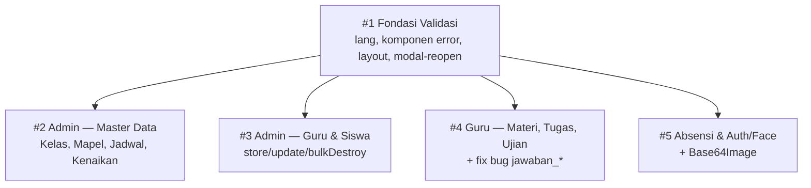

# Analisis: Validasi Form Menyeluruh (Dokumen Induk)

> **Dokumen induk.** Ini bukan dokumen implementasi — ia hanya menautkan lima sub-dokumen, menetapkan urutan & dependensinya, dan memusatkan keputusan yang berlaku untuk semuanya. Implementer **tidak** mengerjakan dokumen ini; ia mengerjakan sub-dokumen satu per satu.

## 1. Metadata

- **Fitur**: Validasi menyeluruh untuk seluruh form di aplikasi
- **Slug**: `validasi-form-menyeluruh`
- **Tanggal**: 2026-07-30
- **Tipe**: `existing`
- **Status**: draft
- **Area/Modul terdampak**: seluruh lapisan HTTP — 10 controller, 4 domain (Admin, Guru, Siswa, Auth), ±36 endpoint penerima input
- **Convention ref**: `G:\laragon\www\elearning-sdn-cibodas-2\docs\conventions.md`
- **Domain glossary**: `G:\laragon\www\elearning-sdn-cibodas-2\CONTEXT.md`
- **Recommended implementer model**: `claude-sonnet-4-6`
- **Sub-features**: lihat §4

## 2. Deskripsi & Tujuan

Aplikasi ini banyak sekali membuat form — CRUD guru, siswa, kelas, mapel, jadwal, materi, tugas, ujian, absensi, plus login dan pendaftaran wajah. Sekilas validasinya sudah ada: hampir semua method `store`/`update` memanggil `$request->validate()`. Tapi begitu ditelusuri, ada tiga lapis masalah yang membuat validasi itu tidak benar-benar melindungi apa pun.

**Lapis pertama — pengguna tidak tahu apa yang salah.** Direktif `@error` tidak dipakai di satu view pun. `old()` hanya dipakai di `guru/ujian/edit.blade.php`. Layout tidak punya blok `$errors` global, jadi hanya ~5 view yang menampilkan error, bentuknya daftar generik di atas halaman. Dan karena semua form admin ada di dalam Flowbite modal, validasi gagal berarti: halaman reload → modal tertutup → pengguna melihat daftar error tanpa tahu modal mana yang harus dibuka ulang → seluruh isian yang tadi ditulis hilang. Untuk admin yang menginput puluhan siswa, ini menyiksa. Ditambah lagi belum ada folder `lang/`, sehingga semua pesan masih English (`The nip field is required.`) padahal `APP_LOCALE=id`.

**Lapis kedua — rules-nya bocor.** Field yang merujuk master data (`id_kelas`, `mata_pelajaran`, `nama_mapel`, `mapel_ajar`, `target_kelas`) hanya divalidasi `string|max:N` tanpa `exists:`, padahal tabel `kelas` dan `mapels` ada. Siapa pun yang bisa membuka devtools bisa menyimpan materi ke kelas `"9Z"` yang tidak pernah ada. `Admin\JadwalController` menyimpan lewat `$request->all()` — mass-assignment mentah. Jadwal bisa dibuat bertumpuk di jam yang sama. Deadline tugas boleh diisi tanggal lampau, membuat tugas yang tidak mungkin dikumpulkan siapa pun.

**Lapis ketiga — ada yang benar-benar rusak.** `UjianController::submit` memvalidasi `'jawaban_*'`, sebuah pola yang tidak pernah cocok dengan apa pun karena wildcard Laravel hanya bekerja untuk array dot-notation. Artinya submit ujian pilihan ganda selama ini **tanpa validasi sama sekali**. Tujuh tempat mengakses `$imageParts[1]` hasil `explode` tanpa memeriksa hasilnya, sehingga payload kamera yang tidak berformat data-URI langsung melempar error. Dan empat endpoint tidak memeriksa kepemilikan, sehingga guru bisa mengedit materi dan tugas milik guru lain hanya dengan mengganti ID di URL.

**Tujuannya:** menutup ketiga lapis itu — rules yang benar, otorisasi kepemilikan, dan pesan error Bahasa Indonesia yang tampil tepat di bawah field yang salah tanpa menghilangkan isian pengguna.

## 3. Keputusan Lintas-Dokumen

Tujuh keputusan berikut sudah dipaku dan **berlaku untuk kelima sub-dokumen**. Implementer tidak perlu menimbangnya ulang.

| # | Keputusan | Konsekuensi |
|---|---|---|
| 1 | Validasi diekstrak ke **FormRequest** di `app/Http/Requests/` | ±36 class baru; controller jadi tipis |
| 2 | Skema `id_kelas` **dipertahankan** sebagai string berisi `nama_kelas` | Rule wajib `exists:kelas,nama_kelas`, **bukan** `exists:kelas,id` |
| 3 | `authorize()` **diisi cek kepemilikan** | Menutup 4 celah IDOR |
| 4 | Error UX **server-side**: `withInput()` + komponen error + modal auto-reopen | Tidak ada AJAX form; arsitektur redirect dipertahankan |
| 5 | Submit ujian ganda pakai array **`jawaban[<soal_id>]`**, semua soal wajib | View siswa & loop submit ikut berubah |
| 6 | Jadwal cegah bentrok **kelas dan guru** | Satu custom rule dipakai dua arah; tidak ada team teaching di sekolah ini |
| 7 | Password tetap `min:6` tanpa `confirmed`; deadline wajib masa depan **saat create saja**; `mimetypes:` ditambahkan; `Base64Image` custom rule; filter GET & automated test di luar cakupan | — |

### Kenapa `exists:kelas,id` akan merusak segalanya

Ini perlu diulang karena ini kesalahan yang paling mudah dilakukan secara refleks. Kolom bernama `id_kelas` **bukan** foreign key:

```php
// database/migrations/2026_02_23_231248_create_siswas_table.php
$table->string('id_kelas');          // ← string, isinya "1A"

// database/migrations/2026_04_15_041914_create_kelas_table.php
$table->string('nama_kelas')->unique();   // ← ini yang dirujuk
```

Dropdown di seluruh view mengisinya dari `Kelas::pluck('nama_kelas')`, dan seluruh query membandingkannya dengan nama (`where('id_kelas', $selectedKelas)`). Menulis `exists:kelas,id` akan menolak **100% input yang sah**.

## 4. Sub-Dokumen: Urutan & Dependensi



| # | Dokumen | Cakupan | Kuantitas | Depends on |
|---|---|---|---|---|
| 1 | [`...-01-fondasi.md`](./2026-07-30-validasi-form-01-fondasi.md) | `lang/id/validation.php`, `lang/id/attributes.php`, komponen `<x-input-error>`, blok `$errors`/flash global di layout, snippet modal-reopen, rule bersama `Base64Image` | 5 file baru, 6 modify | — |
| 2 | [`...-02-admin-master-data.md`](./2026-07-30-validasi-form-02-admin-master-data.md) | Kelas, Mapel, Jadwal, Kenaikan Kelas | 7 request + 1 rule | #1 |
| 3 | [`...-03-admin-guru-siswa.md`](./2026-07-30-validasi-form-03-admin-guru-siswa.md) | `AdminController` guru & siswa | 6 request | #1 |
| 4 | [`...-04-guru-materi-tugas-ujian.md`](./2026-07-30-validasi-form-04-guru-materi-tugas-ujian.md) | Materi, Tugas, Ujian, submission siswa | 12 request | #1 |
| 5 | [`...-05-absensi-auth-face.md`](./2026-07-30-validasi-form-05-absensi-auth-face.md) | Absensi siswa & guru, login, face recognition | 11 request | #1 |

**Dokumen #1 wajib selesai lebih dulu.** Semua sub-dokumen lain merender error lewat komponen dan file bahasa yang dibuat di #1; mengerjakannya lebih dulu akan menghasilkan view yang merujuk komponen yang belum ada.

`Base64Image` sengaja ditempatkan di **#1**, bukan di #5 tempat ia paling banyak dipakai. Alasannya: #3 juga membutuhkannya untuk memvalidasi `face_samples.*` saat admin mendaftarkan wajah guru/siswa. Kalau class itu lahir di #5, maka #3 tidak bisa dikerjakan sebelum #5 — dan klaim "#2–#5 saling independen" jadi bohong. Menaruh dependensi bersama di fondasi menjaga keempat sub-dokumen benar-benar bebas urutan.

Setelah #1 selesai, **#2–#5 saling independen** dan boleh dikerjakan dalam urutan apa pun, bahkan paralel — tidak ada file yang beririsan di antara keempatnya.

## 5. Ringkasan Temuan per Dokumen

Tabel ini memetakan setiap masalah ke dokumen yang menanganinya, supaya tidak ada temuan yang jatuh di celah.

| Temuan | Bukti | Ditangani di |
|---|---|---|
| `@error` tidak dipakai di view mana pun | 0 hasil grep di `resources/views/` | #1 |
| `old()` hanya di 1 view | `guru/ujian/edit.blade.php` | #1 + tiap dokumen |
| Layout tanpa blok `$errors` / flash global | `layouts/app.blade.php` | #1 |
| Pesan validasi masih English | folder `lang/` tidak ada | #1 |
| Modal tertutup & isian hilang saat validasi gagal | semua view admin | #1 + #2 + #3 |
| `id_kelas` tanpa `exists:` | 8 controller | #2, #3, #4, #5 |
| `mata_pelajaran` / `nama_mapel` tanpa `exists:` | 6 controller | #2, #4, #5 |
| `Jadwal::create($request->all())` | `Admin\JadwalController:55,73` | #2 |
| Bentrok jadwal tidak dicegah | `Admin\JadwalController` | #2 |
| `jam_mulai`/`jam_selesai` tanpa `date_format` | `Admin\JadwalController:51-52` | #2 |
| `kkm` tidak divalidasi | `Admin\KenaikanKelasController:19` | #2 |
| `target_kelas` tanpa `exists:` | `Admin\KenaikanKelasController:58` | #2 |
| `deadline` boleh tanggal lampau | `TugasController:50` | #4 |
| **Bug: `'jawaban_*'` tidak pernah match** | `UjianController:253` | #4 |
| IDOR — `MateriController::update`/`destroy` | `MateriController:73,105` | #4 |
| IDOR — `TugasController::update`/`destroy` | `TugasController:74,107` | #4 |
| IDOR — `UjianController::nilaiEssay` | `UjianController:297` | #4 |
| IDOR — `AbsensiController::destroy` | `AbsensiController:113` | #5 |
| `absensi.*.status` tidak divalidasi tapi diakses | `GuruAbsensiController:100,116` | #5 |
| **Enum `absensis.status` tidak mencakup `izin`/`sakit` yang dikirim form guru** — tombol Izin & Sakit gagal disimpan | migrasi `2026_02_23_231624:19` vs `guru/absensi/index.blade.php:143-146` | #5 ⚠️ |
| `terlambat` ada di enum DB tapi ditolak validasi `storeManual` | `AbsensiController:98` vs enum DB | #5 |
| Pesan login hardcoded Bahasa Inggris | `AuthController:35` | #5 |
| 7× `$imageParts[1]` tanpa penjaga | lihat #5 §4 | #5 |
| `sample_count` tanpa batas atas | `FaceRecognitionController:267` | #5 |
| `getStudents` tanpa validasi apa pun | `GuruAbsensiController:87-92` | #5 |
| `mimes:` tanpa `mimetypes:` | 5 endpoint upload | #4, #5 |
| **`username` tidak divalidasi `unique:users`** — NIP guru bertabrakan dengan NIS siswa menghasilkan error 500, bukan pesan validasi | `AdminController:92,170,337,406` vs `users.username`→`unique()` di migrasi | #3 |

## 6. Dampak Agregat

- **File baru**: ±36 FormRequest, 2 custom Rule (`Base64Image` di #1, `NoJadwalConflict` di #2), 2 file bahasa, 1 komponen Blade → ±41 file
- **File dimodifikasi**: 10 controller, ±14 view, 1 layout
- **Migrasi data**: tidak ada migrasi **data**. Satu migrasi **skema** muncul di #5 dan **butuh persetujuanmu** — lihat "Keputusan terbuka" di bawah.
- **Breaking change**: satu, terbatas dan disengaja — nama input submit ujian ganda berubah dari `jawaban_<id>` ke `jawaban[<id>]`. Ini memperbaiki bug, bukan mengubah fitur. Tidak ada data tersimpan yang terpengaruh karena `JawabanUjianGanda` menyimpan per `soal_ujian_id`, bukan per nama input.

### ⚠️ Keputusan terbuka — enum `absensis.status`

Saat mengerjakan #5 saya menemukan bug yang **tidak bisa diperbaiki oleh validasi**, dan yang membatalkan asumsi "nol perubahan skema" yang saya tetapkan sendiri di awal.

Enum kolom `absensis.status` hanya berisi `['hadir', 'terlambat', 'alpha']`. Tapi form absensi yang dipakai guru sehari-hari (`guru/absensi/index.blade.php` baris 143-146) menyediakan tombol **Hadir, Izin, Sakit, Alpha** — dan `SiswaAkademikController` sudah menghitung statistik untuk kelima nilai, sementara `siswa/akademik/presensi.blade.php` sudah merender badge-nya. Database adalah satu-satunya lapisan yang tidak mengenal `izin` dan `sakit`.

Akibatnya: **tombol Izin dan Sakit tidak pernah bekerja.** MySQL mode strict menolak nilai di luar enum dengan error `1265 Data truncated`, yang muncul sebagai halaman 500.

Dua jalan keluar, keduanya dijabarkan di #5 §4.1:

- **A (rekomendasi)** — satu migrasi aditif memperluas enum jadi 5 nilai. Menyelaraskan database dengan seluruh lapisan lain, tanpa menghilangkan fungsi. Konsekuensinya: pekerjaan ini menyentuh skema, yang tadinya saya nyatakan tidak akan terjadi.
- **B** — batasi validasi ke 3 nilai dan **hapus** tombol Izin & Sakit dari form guru beserta statistiknya. Tidak ada migrasi, tapi menghilangkan kemampuan mencatat siswa izin dan sakit.

Saya merekomendasikan **A**, karena B berarti menghapus fungsi yang jelas diniatkan ada dan dibutuhkan administrasi sekolah, hanya demi mempertahankan batasan yang saya buat untuk kenyamanan pekerjaan ini sendiri. Batasan itu ada agar pekerjaan validasi tidak membengkak jadi proyek migrasi — bukan agar bug yang butuh satu `ALTER TABLE` dibiarkan hidup.

Dokumen #5 ditulis dengan asumsi **A**, dan task T1-nya ditandai **butuh konfirmasi sebelum dijalankan**. Empat sub-dokumen lain tidak terpengaruh keputusan ini.

## 7. Tech-Debt yang Sengaja Dipertahankan

Dicatat di sini sekali, tidak diulang di tiap sub-dokumen kecuali relevan langsung.

1. **Penamaan `id_kelas` menyesatkan** — bertipe string berisi nama kelas. Memperbaikinya berarti migrasi data yang menyentuh hampir seluruh aplikasi. Sudah didokumentasikan di `CONTEXT.md` §Flagged ambiguities.
2. **Dua nama kolom untuk satu konsep** — `mata_pelajaran` (di `absensis`, `materis`, `tugas`, `ujians`) vs `nama_mapel` (di `jadwals`, `guru_mapels`).
3. **`gurus.mapel_ajar` sebagai string comma-separated** yang berdampingan dengan tabel pivot `guru_mapels` — dua sumber kebenaran untuk hal yang sama. `GuruAbsensiController:51-53` bahkan punya fallback parsing string-nya.
4. **Ambang confidence biometrik 20%** — terlalu rendah untuk standar keamanan, dan tidak ada liveness detection. Di luar cakupan pekerjaan validasi form.
5. **Validasi parameter filter/pencarian GET** — tidak dikerjakan. Nilai aneh menghasilkan list kosong, bukan data rusak.
6. **Tidak ada automated test** — project belum punya satu test pun. Memulai kultur testing adalah keputusan tersendiri.
7. **`AbsensiController::store` mengabaikan konteks mapel** — `updateOrCreate` hanya berkunci `siswa_id` + `tanggal`, padahal `absensis` sudah punya kolom `mata_pelajaran` dan `id_kelas`, dan `GuruAbsensiController` sudah memakainya dengan benar. Ini inkonsistensi logika bisnis, bukan validasi — dicatat saja, jangan diperbaiki di pekerjaan ini.
8. **Route absensi guru ganda** — `AbsensiController::storeManual` + `GuruAbsensiController::store` tumpang tindih; komentar di `routes/web.php:105` sendiri menyebutnya "Legacy - remove later if redundant".

## 8. Cara Memakai Dokumen Ini

1. Baca dokumen induk ini sekali untuk memahami keputusan lintas-dokumen (§3).
2. Kerjakan **#1 Fondasi** sampai selesai dan terverifikasi.
3. Kerjakan **#2–#5** satu per satu. Tiap sub-dokumen self-contained: §12-nya berisi task list, kriteria terima, dan guardrail yang lengkap.
4. Jangan mencampur pekerjaan dua sub-dokumen dalam satu sesi — itu menghilangkan keuntungan pemecahan ini.

> **Untuk implementer:** dokumen induk ini **tidak** punya §12 Handoff Contract karena tidak ada yang perlu diimplementasikan di sini. Jalankan sub-dokumen, bukan dokumen ini.
