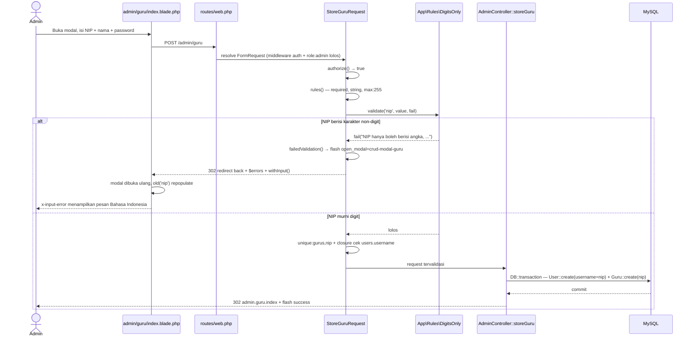
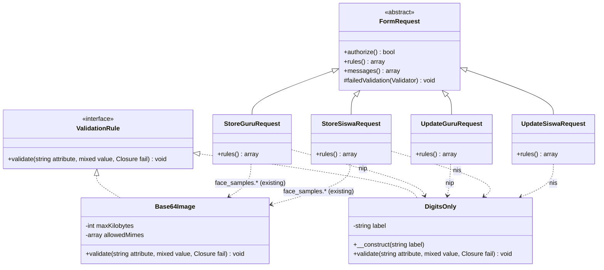
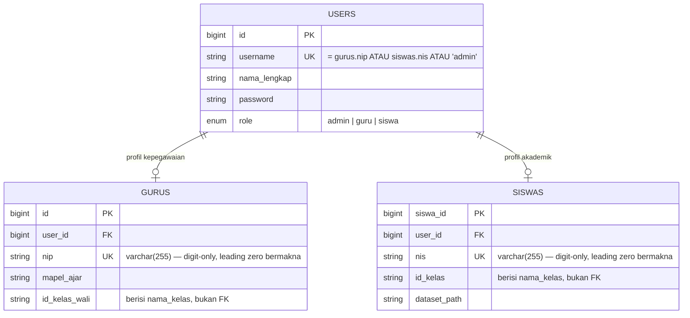
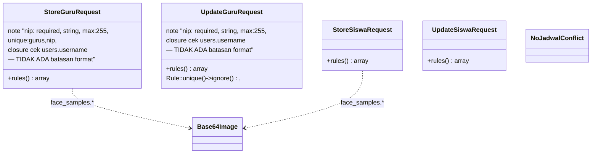
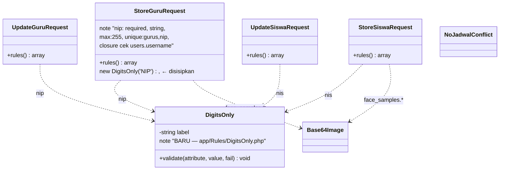

# Analisis: NIP & NIS Hanya Boleh Angka

## 1. Metadata

- **Fitur**: Validasi format NIP (Guru) dan NIS (Siswa) agar hanya menerima digit — menolak huruf, spasi, dan simbol
- **Slug**: `validasi-nip-nis-hanya-angka`
- **Tanggal**: 2026-07-31
- **Tipe**: `existing`
- **Status**: draft
- **Area/Modul terdampak**: `app/Rules/` (1 file baru), `app/Http/Requests/` (4 file), `resources/views/admin/guru/index.blade.php`, `resources/views/admin/siswa/index.blade.php`
- **Convention ref**: `G:\laragon\www\elearning-sdn-cibodas-2\docs\conventions.md`
- **Pendahulu (bukan dependency)**: `G:\laragon\www\elearning-sdn-cibodas-2\docs\analysis\2026-07-30-validasi-form-03-admin-guru-siswa.md` — dokumen itu **sudah terimplementasi**; keempat FormRequest yang dimodifikasi di sini adalah hasilnya. Dokumen ini melanjutkan, bukan mengulang.
- **Recommended implementer model**: `claude-sonnet-4-6`

## 2. Deskripsi & Tujuan

Ketika admin sekolah menambahkan guru, ia mengisi satu field bernama **NIP**. Nilai itu tidak berhenti di tabel `gurus` — ia langsung dipakai sebagai **`users.username`**, yaitu kredensial yang dipakai guru tersebut untuk login (`AdminController.php:109`). Hal yang sama berlaku untuk **NIS** siswa.

Masalahnya, validasi yang ada sekarang hanya menyatakan bahwa NIP adalah `string` dengan panjang maksimal 255 dan harus unik. **Tidak ada satu pun aturan yang mengharuskan isinya berupa angka.** Admin bisa menyimpan guru dengan NIP `"budi santoso"`, `"NIP-2024/A"`, atau `"-"`, dan sistem menerimanya tanpa protes.

Akibatnya nyata bagi pengguna:

**Identitas kepegawaian jadi tidak bisa dipercaya.** NIP adalah nomor, bukan nama. Begitu ada baris berNIP `"budi"`, kolom NIP di tabel daftar guru berhenti berfungsi sebagai identitas dan berubah jadi kolom catatan bebas. Data yang sudah masuk seperti ini tidak bisa dibedakan dari salah ketik oleh sistem — hanya manusia yang tahu.

**Pencarian jadi ambigu.** Kotak "Cari Guru atau NIP" (`AdminController.php:72-76`) mencari di `nama_lengkap`, `username`, `nip`, dan `mapel_ajar` sekaligus. Kalau NIP boleh berisi huruf, kata kunci `"budi"` bisa cocok dengan nama guru *dan* dengan NIP guru lain — admin tidak tahu kenapa hasilnya muncul.

**Kredensial login jadi tidak konsisten.** Guru diberi tahu "username kamu adalah NIP kamu". Kalau sebagian NIP berisi huruf dengan kapitalisasi bebas dan spasi, instruksi itu jadi jebakan — guru mengetik `"Budi Santoso"` padahal yang tersimpan `"budi santoso"`, lalu gagal login tanpa tahu sebabnya. Angka tidak punya masalah ini.

**Salah ketik lolos tanpa terdeteksi.** NIP resmi 18 digit yang salah tempel bersama karakter sisa (`"197805122006041002 "` → tertrim, atau `"197805122006041002x"` → lolos) akan tersimpan sebagai akun yang berbeda dari yang dimaksud. Dengan aturan digit-only, karakter asing langsung ditolak di form.

Tujuan pekerjaan ini sempit dan tegas: **NIP dan NIS hanya boleh berisi digit `0`–`9`**, ditolak di layer validasi dengan pesan Bahasa Indonesia yang menyebut penyebabnya secara eksplisit, dan admin diberi tahu aturannya di form *sebelum* ia salah input.

### Kondisi data existing — aman

Pemeriksaan `database/elearning_sd.sql` menunjukkan seluruh data yang ada sudah numerik:

```
gurus.nip   → '1234567890', '7475126451', '4400111921', '0993485667', '0653076316', …  (10 digit)
siswas.nis  → '987654321', '787866625', '548827625', '713367208', …                     (9 digit)
```

Dua konsekuensi penting dari fakta ini:

1. **Tidak ada backfill atau migrasi.** Tidak ada satu baris pun yang akan gagal validasi saat admin membuka lalu menyimpan form edit. Aturan baru bisa dipasang langsung.
2. **Leading zero itu nyata dan bermakna.** `'0993485667'` dan `'0653076316'` akan berubah jadi `993485667` dan `653076316` bila nilainya pernah di-cast ke integer — dan karena nilai ini adalah `users.username`, guru yang bersangkutan **kehilangan akses login**. Karena itu NIP/NIS **wajib tetap bertipe `string`**, dan rule `integer` maupun `numeric` dilarang dipakai di sini (lihat §4.3).

## 3. Scope

### In-scope

- Custom rule baru `app/Rules/DigitsOnly.php` yang menolak nilai apa pun selain rangkaian digit `0`–`9`.
- Pemasangan rule tersebut pada field `nip` di `StoreGuruRequest` dan `UpdateGuruRequest`.
- Pemasangan rule tersebut pada field `nis` di `StoreSiswaRequest` dan `UpdateSiswaRequest`.
- Perbaikan copy (label + hint) pada 4 input NIP/NIS di dua view admin, dalam Bahasa Indonesia.
- Unit test untuk `DigitsOnly` dan feature test untuk penolakan NIP/NIS beralfabet.

### Out-of-scope

Semua hal berikut **sengaja tidak dikerjakan** dan menjadi guardrail di §12.4:

- **Batasan panjang.** `max:255` dipertahankan apa adanya. Tidak menambah `digits_between`, `min`, atau panjang tetap 18 digit. Alasan: 8 baris `gurus` existing semuanya 10 digit — panjang tetap akan mengunci admin dari menyimpan form edit guru mana pun.
- **Migrasi atau `CHECK` constraint di database.** Validasi tetap di layer aplikasi, sesuai `conventions.md`.
- **Validasi client-side.** Tanpa JavaScript, tanpa atribut `pattern`, tanpa `inputmode="numeric"`, tanpa `type="number"`. Input tetap `type="text"` — server adalah satu-satunya otoritas.
- **Refactor `AdminController`.** Method `storeGuru`/`updateGuru`/`storeSiswa`/`updateSiswa` masih memakai `$request->nip` alih-alih `$request->validated()`, melanggar `conventions.md` §6. Dibiarkan apa adanya, dicatat di §11.
- **Aturan `nip`/`nis` di luar 4 FormRequest tersebut.** `DatabaseSeeder` sudah menghasilkan nilai numerik (`$faker->unique()->numerify('##########')`) dan tidak disentuh.
- **Perubahan skema, tipe kolom, atau relasi apa pun.**
- **Normalisasi data lama.** Tidak diperlukan; sudah numerik seluruhnya.

## 4. Requirement & Edge Cases

### 4.1 Happy path

1. Admin membuka `admin/guru`, menekan tombol tambah, modal Flowbite `crud-modal-guru` terbuka.
2. Admin mengisi NIP `197805122006041002`, nama lengkap, password, lalu submit ke `POST /admin/guru`.
3. `StoreGuruRequest` menjalankan seluruh rule; `DigitsOnly` lolos.
4. `AdminController::storeGuru` membuat `User` (`username` = NIP) dan `Guru` di dalam satu `DB::transaction`.
5. Redirect ke `admin.guru.index` dengan flash `success`.

Alur NIS di `admin/siswa` identik strukturnya.

### 4.2 Alur gagal — inilah inti fitur ini

1. Admin mengisi NIP `"1978A5122"` lalu submit.
2. `DigitsOnly` memanggil `$fail(...)`.
3. `failedValidation()` yang **sudah ada** me-flash `open_modal` (`StoreGuruRequest.php:53`) sehingga modal terbuka kembali setelah redirect.
4. Laravel redirect back dengan `$errors` dan `withInput()`.
5. Input NIP me-repopulate lewat `old('nip')` yang **sudah ada** (`admin/guru/index.blade.php:75`), dan `<x-input-error name="nip" />` yang **sudah ada** (baris 78) merender pesannya.

**Konsekuensi penting:** karena keempat view sudah punya `old()`, `<x-input-error>`, dan `failedValidation()` dengan `open_modal`, **tidak ada perubahan view yang bersifat wajib**. Perubahan view di dokumen ini murni copy/UX, bukan perbaikan jalur error.

### 4.3 Edge cases

| # | Input | Hasil yang diharapkan | Catatan |
|---|---|---|---|
| E1 | `"budi"` | **Ditolak** | Kasus utama yang diminta. |
| E2 | `"1978A5122"` | **Ditolak** | Huruf di tengah — salah ketik paling umum. |
| E3 | `"197805122006041002"` | Diterima | NIP resmi 18 digit. |
| E4 | `"0993485667"` | Diterima, tersimpan **dengan** leading zero | Data existing. Wajib lolos, dan nilainya tidak boleh berubah. |
| E5 | `"-12345"` | **Ditolak** | Inilah kenapa `integer` salah — `integer` **meloloskan** nilai negatif. |
| E6 | `"+12345"` | **Ditolak** | `numeric` meloloskan tanda plus. |
| E7 | `"1.5"` / `"1,5"` | **Ditolak** | `numeric` meloloskan desimal. |
| E8 | `"1e5"` | **Ditolak** | `numeric` meloloskan notasi ilmiah dan menganggapnya `100000`. |
| E9 | `"0x1A"` | **Ditolak** | Notasi heksadesimal. |
| E10 | `"123 456"` | **Ditolak** | Spasi di tengah tidak dihapus middleware. |
| E11 | `" 123456 "` | **Diterima sebagai `"123456"`** | Middleware `TrimStrings` sudah menghapus spasi tepi sebelum validasi. Bukan bug — ini perilaku Laravel yang diinginkan. |
| E12 | `""` (string kosong) | **Ditolak oleh `required`** | Middleware `ConvertEmptyStringsToNull` mengubahnya jadi `null`, lalu `required` yang menangkap. `DigitsOnly` tidak perlu menangani ini. |
| E13 | `nip[]=1&nip[]=2` (array) | **Ditolak** | Rule wajib punya guard `is_string()`. Rule `'string'` memang berjalan lebih dulu tapi Laravel tetap mengeksekusi rule berikutnya, jadi `DigitsOnly` bisa menerima `array` dan akan `TypeError` bila tidak dijaga. |
| E14 | NIP `"123"` yang sudah dipakai siswa berNIS `"123"` | Ditolak oleh closure `users.username` yang **sudah ada** | Perilaku existing dari dokumen #3, tidak berubah. |
| E15 | NIP beralfabet **dan** duplikat sekaligus | **Dua pesan error tampil bersamaan** | Disengaja. `<x-input-error>` merender seluruh pesan sebagai `<ul>` (`resources/views/components/input-error.blade.php:11-13`). Tidak memakai `bail`. |
| E16 | Admin edit guru tanpa mengubah NIP `"0993485667"` | Tersimpan, tidak ada error | Verifikasi bahwa aturan baru tidak mengunci data lama. |

### 4.4 Kenapa `numeric` dan `integer` adalah jawaban yang salah

Ini jebakan yang paling mungkin diambil implementer, jadi dicatat eksplisit:

| Rule | Meloloskan yang seharusnya ditolak | Verdict |
|---|---|---|
| `numeric` | `-12`, `+12`, `1.5`, `1e5`, `0x1A` | ✗ Bukan "hanya angka". |
| `integer` | `-12`, `+12` | ✗ Selain itu berisiko meng-cast dan membunuh leading zero. |
| `digits_between:1,255` | (format benar) | ✗ Formatnya benar, tapi pesan `lang/id/validation.php:35` berbunyi *":attribute harus terdiri dari 1 sampai 255 digit."* — bicara soal **jumlah** digit, bukan soal huruf tidak boleh. Menyesatkan admin. |
| `regex:/^[0-9]+$/` | (format benar) | ~ Format benar, tapi pesan `lang/id/validation.php:124` hanya *"Format :attribute tidak valid."* → butuh `messages()` kustom di 4 file = duplikasi pesan 4×. |
| `DigitsOnly` (custom rule) | — | ✓ **Dipilih.** Satu tempat untuk pesan spesifik, dipakai 4×. |

### 4.5 Non-functional

- **Security**: rule ini secara tidak langsung mempersempit permukaan input untuk nilai yang berakhir di `users.username`. Ia **bukan** pengganti proteksi mass-assignment; `AdminController` tetap memakai array eksplisit.
- **Performance**: rule murni in-memory (`preg_match` / `ctype_digit`), tanpa query. Nol tambahan beban DB.
- **Auth**: tidak berubah. Role dijaga `RoleMiddleware` (`role:admin`), `authorize()` tetap `return true` karena manajemen guru/siswa tidak punya kepemilikan resource.
- **Concurrency**: tidak relevan; keunikan tetap dijaga `unique` + constraint DB di dalam `DB::transaction` seperti sebelumnya.

## 5. API Contract

Bukan REST API — endpoint Blade form di `routes/web.php`, semuanya di bawah middleware `auth` + `role:admin`. Tidak ada endpoint baru; **hanya aturan validasi request yang berubah**.

| Method | Path | Auth | Request (field terdampak) | Response sukses | Response gagal |
|--------|------|------|---------------------------|-----------------|----------------|
| `POST` | `/admin/guru` | `auth`, `role:admin` | `nip` — **string digit-only** (sebelumnya string bebas) | `302` → `admin.guru.index` + flash `success` | `302` back + `$errors` + `withInput()` + flash `open_modal=crud-modal-guru` |
| `PUT` | `/admin/guru/{id}` | `auth`, `role:admin` | `nip` — **string digit-only** | `302` → `admin.guru.index` + flash `success` | `302` back + `$errors` + flash `open_modal=edit-modal-guru-{id}` |
| `POST` | `/admin/siswa` | `auth`, `role:admin` | `nis` — **string digit-only** | `302` → `admin.siswa.index` + flash `success` | `302` back + `$errors` + flash `open_modal=crud-modal-siswa` |
| `PUT` | `/admin/siswa/{id}` | `auth`, `role:admin` | `nis` — **string digit-only** | `302` → `admin.siswa.index` + flash `success` | `302` back + `$errors` + flash `open_modal=edit-modal-siswa-{id}` |

Keempat form **bukan AJAX** — tidak ada `axios`/`fetch`/`FormData` di kedua view. Jadi jalur respons validasi adalah redirect-back murni sesuai `conventions.md` §4.6, bukan 422 JSON.

Contoh request yang ditolak:

```
POST /admin/guru
Content-Type: application/x-www-form-urlencoded

nama_lengkap=Budi+Santoso&nip=1978A5122&password=rahasia123
```

Isi `$errors` yang dihasilkan:

```json
{
  "nip": ["NIP hanya boleh berisi angka, tanpa huruf, spasi, atau tanda baca."]
}
```

## 6. Sequence Diagram



Alur NIS pada `admin/siswa` identik; ganti `StoreGuruRequest`→`StoreSiswaRequest`, `nip`→`nis`, `crud-modal-guru`→`crud-modal-siswa`.

## 7. Class Diagram



`DigitsOnly` berdiri sejajar dengan `Base64Image` dan `NoJadwalConflict` — pola yang sama, folder yang sama, kontrak yang sama.

## 8. ERD

**Tidak ada perubahan skema.** Diagram ini disertakan hanya untuk menegaskan mengapa aturan digit-only berlaku pada dua kolom sekaligus dan mengapa tipe `string` wajib dipertahankan.



**Delta skema: nol.** Tipe `varchar(255)`, constraint `unique`, dan seluruh relasi tetap sama. Yang berubah hanya *himpunan nilai yang diterima layer aplikasi* untuk `gurus.nip` dan `siswas.nis`.

Perhatikan bahwa satu nilai NIP hidup di **dua kolom unik**: `gurus.nip` dan `users.username`. Itulah alasan closure pemeriksa `users.username` di keempat FormRequest tetap harus ada — jangan dihapus.

## 9. Before / After

### 9.1 Struktur — Before (cerminan kode nyata)



`app/Rules/` hanya berisi `Base64Image` dan `NoJadwalConflict`. Tidak ada rule format numerik apa pun di seluruh project.

### 9.2 Struktur — After



### 9.3 Delta rule — before/after per file

`StoreGuruRequest.php:23-31`

```php
// BEFORE
'nip' => [
    'required', 'string', 'max:255',
    'unique:gurus,nip',
    function ($attribute, $value, $fail) {
        if (User::where('username', $value)->exists()) {
            $fail('NIP sudah dipakai sebagai username akun lain.');
        }
    },
],

// AFTER — satu elemen disisipkan, sisanya utuh
'nip' => [
    'required', 'string', new DigitsOnly('NIP'), 'max:255',
    'unique:gurus,nip',
    function ($attribute, $value, $fail) {
        if (User::where('username', $value)->exists()) {
            $fail('NIP sudah dipakai sebagai username akun lain.');
        }
    },
],
```

`UpdateGuruRequest.php:27-35`

```php
// BEFORE
'nip' => [
    'required', 'string', 'max:255',
    Rule::unique('gurus', 'nip')->ignore($guru->id),
    function ($attribute, $value, $fail) use ($guru) { /* … */ },
],

// AFTER
'nip' => [
    'required', 'string', new DigitsOnly('NIP'), 'max:255',
    Rule::unique('gurus', 'nip')->ignore($guru->id),
    function ($attribute, $value, $fail) use ($guru) { /* … */ },
],
```

`StoreSiswaRequest.php:23-31` dan `UpdateSiswaRequest.php:27-35` — pola identik dengan `new DigitsOnly('NIS')` disisipkan pada posisi yang sama.

**Posisi penyisipan itu disengaja:** setelah `'string'` (supaya guard tipe berjalan lebih dulu) dan **sebelum** `unique` (supaya pesan format tampil lebih dulu di `<ul>` bila keduanya gagal).

### 9.4 Delta copy view — before/after

| Lokasi | Before | After |
|---|---|---|
| `admin/guru/index.blade.php:68` (label create) | `NIP / ID Pegawai` | `NIP` — frasa "ID Pegawai" dibuang karena mengesankan identitas bebas-huruf diperbolehkan |
| `admin/guru/index.blade.php:77` (hint create) | `NIP otomatis digunakan sebagai username.` | `Hanya angka, tanpa huruf atau spasi. NIP otomatis digunakan sebagai username.` |
| `admin/guru/index.blade.php:314` (label edit) | `NIP / Username` | tetap — sudah akurat |
| `admin/guru/index.blade.php` (hint edit) | *tidak ada* | tambah `<p class="text-xs text-gray-500 mt-1">Hanya angka. Nilai ini juga menjadi username login guru.</p>` |
| `admin/siswa/index.blade.php:68` (label create) | `NIS (Username)` | tetap — sudah akurat |
| `admin/siswa/index.blade.php` (hint create) | *tidak ada* | tambah `<p class="text-xs text-gray-500 mt-1">Hanya angka, tanpa huruf atau spasi. NIS otomatis digunakan sebagai username.</p>` |
| `admin/siswa/index.blade.php:278` (label edit) | `NIS / Username` | tetap — sudah akurat |
| `admin/siswa/index.blade.php` (hint edit) | *tidak ada* | tambah `<p class="text-xs text-gray-500 mt-1">Hanya angka. Nilai ini juga menjadi username login siswa.</p>` |

Atribut `type`, `name`, `value="{{ old(...) }}"`, `class`, `required`, dan `<x-input-error>` pada keempat input **tidak disentuh sama sekali**.

### 9.5 Delta API contract

Tidak ada endpoint, method, path, atau bentuk respons yang berubah. Yang berubah hanya himpunan nilai `nip`/`nis` yang diterima: dari *string apa pun ≤255 karakter* menjadi *string digit-only ≤255 karakter*. Konsekuensinya, request yang sebelumnya `302 → index` (sukses) untuk NIP beralfabet sekarang menjadi `302 back + $errors`. Lihat tabel §5.

### 9.6 Delta ERD

Nol. Lihat §8.

### 9.7 Delta perilaku yang dirasakan admin

| Skenario | Before | After |
|---|---|---|
| Simpan guru NIP `"budi"` | **Tersimpan**, akun login `username=budi` terbentuk | Ditolak, modal terbuka ulang dengan pesan Bahasa Indonesia, isian tidak hilang |
| Simpan guru NIP `"1978A5122"` | Tersimpan | Ditolak |
| Simpan guru NIP `"197805122006041002"` | Tersimpan | Tersimpan (tidak berubah) |
| Edit guru NIP `"0993485667"` tanpa ubah apa pun | Tersimpan | Tersimpan (tidak berubah) |
| Admin belum tahu aturannya | Tidak ada petunjuk apa pun | Hint di bawah input menyebut "Hanya angka" sebelum submit |
| Simpan siswa NIS `"tidak ada"` | **Tersimpan** | Ditolak |

## 10. Rekomendasi Implementasi (Reuse vs New)

### New

**`app/Rules/DigitsOnly.php`** — satu-satunya file baru.

Alasan **new** dan bukan inline: rule ini dipakai di **4 FormRequest**. Ditulis inline sebagai `regex`, pesan Bahasa Indonesia-nya harus diduplikasi 4× di `messages()` — dan begitu redaksinya perlu diubah, ada 4 tempat yang bisa lupa disentuh. `conventions.md` §4.4 sudah menyediakan rumah untuk kasus ini (`app/Rules/`, `implements ValidationRule`, PascalCase deskriptif), dan `Base64Image` sudah membuktikan polanya jalan di project ini.

Kepatuhan konvensi:
- Namespace `App\Rules`, `implements Illuminate\Contracts\Validation\ValidationRule` — sama seperti `Base64Image.php:8`.
- Constructor dengan named parameter untuk label, dipanggil `new DigitsOnly('NIP')` — mengikuti gaya `new Base64Image(maxKilobytes: 2048)`.
- Pesan `$fail()` dalam Bahasa Indonesia, sesuai `conventions.md` §9.
- Nama class PascalCase English (`DigitsOnly`) sejajar `Base64Image`, `NoJadwalConflict` — bukan Bahasa Indonesia, karena ini istilah teknis bukan istilah domain (`conventions.md` §3).

### Modify

**`app/Http/Requests/StoreGuruRequest.php`** — sisipkan `new DigitsOnly('NIP')` ke array `nip`, tambah `use App\Rules\DigitsOnly;`. Tidak ada perubahan lain. `messages()` **tidak** perlu entri baru karena pesan sudah dibawa rule-nya.

**`app/Http/Requests/UpdateGuruRequest.php`** — sama.

**`app/Http/Requests/StoreSiswaRequest.php`** — sisipkan `new DigitsOnly('NIS')` ke array `nis`, tambah import.

**`app/Http/Requests/UpdateSiswaRequest.php`** — sama.

**`resources/views/admin/guru/index.blade.php`** — copy label + hint saja (2 lokasi).

**`resources/views/admin/siswa/index.blade.php`** — copy hint saja (2 lokasi).

### Reuse (dipakai apa adanya, JANGAN diubah)

- **`failedValidation()` + flash `open_modal`** di keempat FormRequest — sudah menangani reopening modal Flowbite. Tidak perlu disentuh.
- **`<x-input-error name="nip" />`** di `resources/views/components/input-error.blade.php` — sudah merender seluruh pesan sebagai `<ul>`. Tidak perlu komponen baru.
- **`old('nip')` / `old('nis', $guru->nip)`** di keempat input — repopulate sudah benar.
- **Closure pemeriksa `users.username`** di keempat FormRequest — mencegah tabrakan NIP↔NIS, hasil dokumen #3. **Jangan dihapus atau digabung** ke `DigitsOnly`; concern-nya berbeda (keunikan vs format).
- **`lang/id/validation.php`** — tidak perlu key baru; pesan datang dari rule.
- **`Base64Image`** — tidak disentuh.

### Ditolak (pertimbangan yang sudah dinilai dan dibuang)

- Rule `numeric` / `integer` — lihat §4.4, keduanya meloloskan input yang harus ditolak.
- `digits_between` / `regex` inline — format benar tapi pesannya menyesatkan atau harus diduplikasi 4×.
- Mutator/cast di model `Guru`/`Siswa` — akan menyembunyikan masalah alih-alih menolaknya, dan berisiko mengubah nilai leading-zero.
- `CHECK` constraint di migrasi — validasi bukan tanggung jawab layer DB di project ini.

## 11. Dampak & Risiko

### File berubah

| # | Path absolut | Aksi |
|---|---|---|
| 1 | `G:\laragon\www\elearning-sdn-cibodas-2\app\Rules\DigitsOnly.php` | CREATE |
| 2 | `G:\laragon\www\elearning-sdn-cibodas-2\app\Http\Requests\StoreGuruRequest.php` | MODIFY |
| 3 | `G:\laragon\www\elearning-sdn-cibodas-2\app\Http\Requests\UpdateGuruRequest.php` | MODIFY |
| 4 | `G:\laragon\www\elearning-sdn-cibodas-2\app\Http\Requests\StoreSiswaRequest.php` | MODIFY |
| 5 | `G:\laragon\www\elearning-sdn-cibodas-2\app\Http\Requests\UpdateSiswaRequest.php` | MODIFY |
| 6 | `G:\laragon\www\elearning-sdn-cibodas-2\resources\views\admin\guru\index.blade.php` | MODIFY (copy saja) |
| 7 | `G:\laragon\www\elearning-sdn-cibodas-2\resources\views\admin\siswa\index.blade.php` | MODIFY (copy saja) |
| 8 | `G:\laragon\www\elearning-sdn-cibodas-2\tests\Unit\Rules\DigitsOnlyTest.php` | CREATE |
| 9 | `G:\laragon\www\elearning-sdn-cibodas-2\tests\Feature\Admin\GuruNipFormatTest.php` | CREATE |
| 10 | `G:\laragon\www\elearning-sdn-cibodas-2\tests\Feature\Admin\SiswaNisFormatTest.php` | CREATE |

Sudah dikerjakan di luar handoff (oleh analis, tidak perlu diulang implementer): `CONTEXT.md` — entri glossary **NIP** dan **NIS** ditambahkan, entri **Username** diperjelas soal keunikan ganda.

### Migrasi data

**Tidak ada.** Seluruh `gurus.nip` (8 baris) dan `siswas.nis` sudah numerik. Tidak ada backfill, tidak ada migrasi, tidak ada normalisasi.

### Breaking change

**Ada, dan disengaja** — tapi terbatas pada input di masa depan, bukan pada data yang sudah ada:

- Request `POST /admin/guru` dan `PUT /admin/guru/{id}` dengan `nip` non-digit yang **sebelumnya berhasil** sekarang gagal validasi. Sama untuk `nis`.
- **Tidak ada** data existing yang jadi tidak bisa disimpan. Diverifikasi terhadap `database/elearning_sd.sql` (§2).
- `DatabaseSeeder` tidak terpengaruh — `numerify('##########')` menghasilkan digit murni.
- Tidak ada guru/siswa yang kehilangan akses login, karena tidak ada nilai yang diubah.

### Risiko

| Risiko | Tingkat | Mitigasi |
|---|---|---|
| Implementer memakai `numeric`/`integer` | **Sedang** | §4.4 mendaftar tepat apa yang masing-masing loloskan; §12.4 melarangnya eksplisit. |
| Leading zero hilang karena cast | **Tinggi bila terjadi** — guru kehilangan login | Rule tidak boleh mengembalikan atau memodifikasi nilai; hanya `$fail()`. Ditegaskan di §12.3 dengan test E4/E16. |
| `TypeError` saat `nip` dikirim sebagai array | Rendah | Guard `is_string()` diwajibkan di §12.2 T1. |
| Implementer ikut "merapikan" `AdminController` | Sedang | Dilarang eksplisit di §12.4. |
| Implementer menghapus closure `users.username` karena dianggap tumpang tindih | Sedang | §10 Reuse menyatakan jangan disentuh; §12.4 melarangnya. |
| Implementer menambah panjang tetap 18 digit | Sedang | §3 out-of-scope + §12.4; akan mengunci 8 baris existing yang 10 digit. |

### Tech-debt tercatat (sengaja dipertahankan)

1. **`max:255` untuk NIP/NIS terlalu longgar.** NIP 200 digit tetap diterima. Dipertahankan atas keputusan eksplisit agar tidak menolak data 10-digit existing maupun NIP resmi 18 digit. Perbaikan wajar di masa depan: `digits_between:5,20`.
2. **`AdminController` memakai `$request->nip` bukan `$request->validated()`** di `AdminController.php:109`, `117`, `174`, `185` (dan padanannya di method siswa) — melanggar `conventions.md` §6. Nilainya tetap tervalidasi karena FormRequest sudah menahan request sebelum controller berjalan, jadi tidak ada lubang keamanan langsung di sini. Dibiarkan; di luar scope.
3. **Label `NIP / ID Pegawai`** menyisakan jejak asumsi lama bahwa identitas pegawai boleh bebas-format. Diperbaiki di dokumen ini untuk NIP, tapi frasa serupa mungkin ada di tempat lain yang belum diaudit.
4. **Aturan format NIP/NIS tidak dijaga di level database.** Insert langsung via SQL/seeder/tinker masih bisa memasukkan huruf. Konsisten dengan sikap project (validasi di aplikasi), tapi perlu diketahui.

---

## 12. Handoff Contract

> Interface formal untuk implementer (Sonnet 4.6). Briefing ini **self-contained** — redundansi dengan bagian atas disengaja. Jangan mengandalkan pembacaan ulang banyak file.

### 12.1 Header

- `source_doc`: `G:\laragon\www\elearning-sdn-cibodas-2\docs\analysis\2026-07-31-validasi-nip-nis-hanya-angka.md`
- `convention_ref`: `G:\laragon\www\elearning-sdn-cibodas-2\docs\conventions.md`
- `feature_type`: `existing`
- `recommended_implementer_model`: `claude-sonnet-4-6`
- **Ringkasan satu baris**: buat `app/Rules/DigitsOnly.php`, pasang di field `nip` (2 FormRequest guru) dan `nis` (2 FormRequest siswa), perbaiki copy hint di 2 view, tulis 3 file test.

### 12.2 Task List (terurut)

| id | desc | targets | mode | refs | depends_on |
|----|------|---------|------|------|------------|
| T1 | Buat custom rule `DigitsOnly` | `app\Rules\DigitsOnly.php` [CREATE] | new | §7, §10 | — |
| T2 | Pasang `DigitsOnly` pada `nip` di StoreGuruRequest | `app\Http\Requests\StoreGuruRequest.php` [MODIFY] | modify | §9.3 | T1 |
| T3 | Pasang `DigitsOnly` pada `nip` di UpdateGuruRequest | `app\Http\Requests\UpdateGuruRequest.php` [MODIFY] | modify | §9.3 | T1 |
| T4 | Pasang `DigitsOnly` pada `nis` di StoreSiswaRequest | `app\Http\Requests\StoreSiswaRequest.php` [MODIFY] | modify | §9.3 | T1 |
| T5 | Pasang `DigitsOnly` pada `nis` di UpdateSiswaRequest | `app\Http\Requests\UpdateSiswaRequest.php` [MODIFY] | modify | §9.3 | T1 |
| T6 | Perbaiki label + hint NIP (create & edit) | `resources\views\admin\guru\index.blade.php` [MODIFY] | modify | §9.4 | — |
| T7 | Tambah hint NIS (create & edit) | `resources\views\admin\siswa\index.blade.php` [MODIFY] | modify | §9.4 | — |
| T8 | Unit test `DigitsOnly` | `tests\Unit\Rules\DigitsOnlyTest.php` [CREATE] | new | §4.3 | T1 |
| T9 | Feature test penolakan NIP non-digit | `tests\Feature\Admin\GuruNipFormatTest.php` [CREATE] | new | §4.3, §5 | T2, T3 |
| T10 | Feature test penolakan NIS non-digit | `tests\Feature\Admin\SiswaNisFormatTest.php` [CREATE] | new | §4.3, §5 | T4, T5 |
| T11 | Jalankan `vendor\bin\pint` lalu `php artisan test` | — | — | §12.3 | T1–T10 |

---

#### T1 — `app\Rules\DigitsOnly.php` [CREATE]

Buat class yang meng-implement `Illuminate\Contracts\Validation\ValidationRule`. Signature dan struktur yang harus dipenuhi:

```php
<?php

namespace App\Rules;

use Closure;
use Illuminate\Contracts\Validation\ValidationRule;

class DigitsOnly implements ValidationRule
{
    /** @param string $label Nama field untuk pesan error, mis. 'NIP'. */
    public function __construct(private string $label = 'Kolom ini') {}

    public function validate(string $attribute, mixed $value, Closure $fail): void
    {
        // …
    }
}
```

Perilaku wajib di dalam `validate()`:

1. Bila `! is_string($value)` → `$fail("{$this->label} harus berupa teks angka.")` lalu `return`. **Guard ini wajib** — tanpa itu, kiriman `nip[]=1&nip[]=2` melempar `TypeError` (edge case E13). Rule `'string'` memang berjalan lebih dulu tapi Laravel tetap mengeksekusi rule berikutnya.
2. Bila `$value === ''` → `return` tanpa `$fail`. Biarkan `required` yang bicara, jangan menumpuk dua pesan (edge case E12).
3. Bila `preg_match('/^[0-9]+$/', $value) !== 1` → `$fail("{$this->label} hanya boleh berisi angka, tanpa huruf, spasi, atau tanda baca.")`.
4. **Jangan** mengembalikan, memodifikasi, meng-`trim`, atau meng-cast `$value`. Rule ini murni memeriksa. Mengubah nilai akan membunuh leading zero dan mematikan login guru yang berNIP `0993485667`.

Catatan implementasi:
- Pakai `preg_match('/^[0-9]+$/', ...)`, **bukan** `ctype_digit()` saja tanpa guard tipe — `ctype_digit()` punya perilaku aneh untuk integer di rentang tertentu. Kalau memakai `ctype_digit()`, guard `is_string()` di langkah 1 mutlak wajib.
- Pakai kelas karakter `[0-9]`, **bukan** `\d`. Tanpa flag Unicode `\d` di PCRE memang hanya ASCII, tapi `[0-9]` menyatakan maksudnya tanpa bergantung pada konfigurasi.
- Seluruh pesan dalam **Bahasa Indonesia** (`conventions.md` §9).
- Komentar kode boleh English atau Indonesia, ikuti gaya `app\Rules\Base64Image.php`.

#### T2 — `app\Http\Requests\StoreGuruRequest.php` [MODIFY]

Tambahkan import:

```php
use App\Rules\DigitsOnly;
```

Ubah **hanya** array `nip` di `rules()`. Sebelum:

```php
'nip' => [
    'required', 'string', 'max:255',
    'unique:gurus,nip',
    function ($attribute, $value, $fail) {
        if (User::where('username', $value)->exists()) {
            $fail('NIP sudah dipakai sebagai username akun lain.');
        }
    },
],
```

Sesudah:

```php
'nip' => [
    'required', 'string', new DigitsOnly('NIP'), 'max:255',
    'unique:gurus,nip',
    function ($attribute, $value, $fail) {
        if (User::where('username', $value)->exists()) {
            $fail('NIP sudah dipakai sebagai username akun lain.');
        }
    },
],
```

**Posisi `new DigitsOnly('NIP')` harus tepat setelah `'string'` dan sebelum `'max:255'`.** Alasan: guard tipe lebih dulu, dan pesan format tampil di atas pesan `unique` bila keduanya gagal.

Jangan tambah entri di `messages()` — pesan sudah dibawa rule. Jangan sentuh `authorize()`, `failedValidation()`, closure `users.username`, atau field lain (`nama_lengkap`, `password`, `id_kelas_wali`, `mapel_ajar`, `face_samples`).

#### T3 — `app\Http\Requests\UpdateGuruRequest.php` [MODIFY]

Identik dengan T2. Array `nip` di file ini memakai `Rule::unique('gurus', 'nip')->ignore($guru->id)` alih-alih string `'unique:gurus,nip'` — **biarkan seperti itu**, cukup sisipkan `new DigitsOnly('NIP')` setelah `'string'`:

```php
'nip' => [
    'required', 'string', new DigitsOnly('NIP'), 'max:255',
    Rule::unique('gurus', 'nip')->ignore($guru->id),
    function ($attribute, $value, $fail) use ($guru) { /* biarkan utuh */ },
],
```

Jangan sentuh `$guru = Guru::findOrFail($this->route('id'));` di awal `rules()`.

#### T4 — `app\Http\Requests\StoreSiswaRequest.php` [MODIFY]

Sama dengan T2, tapi field-nya `nis` dan label-nya `'NIS'`:

```php
'nis' => [
    'required', 'string', new DigitsOnly('NIS'), 'max:255',
    'unique:siswas,nis',
    function ($attribute, $value, $fail) { /* biarkan utuh */ },
],
```

#### T5 — `app\Http\Requests\UpdateSiswaRequest.php` [MODIFY]

Sama dengan T4, dengan `Rule::unique('siswas', 'nis')->ignore($siswa->id)` dibiarkan utuh.

#### T6 — `resources\views\admin\guru\index.blade.php` [MODIFY]

Dua lokasi, **copy saja**.

**(a) Modal create, sekitar baris 68 & 77.** Ubah label dan hint:

```blade
{{-- baris 68: sebelum --}}
<label for="nip" class="…">NIP / ID Pegawai</label>
{{-- sesudah --}}
<label for="nip" class="…">NIP</label>

{{-- baris 77: sebelum --}}
<p class="text-xs text-gray-500 mt-1">NIP otomatis digunakan sebagai username.</p>
{{-- sesudah --}}
<p class="text-xs text-gray-500 mt-1">Hanya angka, tanpa huruf atau spasi. NIP otomatis digunakan sebagai username.</p>
```

Pertahankan seluruh atribut `class` yang ada pada `<label>` — jangan disederhanakan.

**(b) Modal edit, sekitar baris 314–316.** Label `NIP / Username` **dibiarkan**. Tambahkan hint di antara `<input>` (baris 315) dan `<x-input-error name="nip" />` (baris 316):

```blade
<p class="text-xs text-gray-500 mt-1">Hanya angka. Nilai ini juga menjadi username login guru.</p>
```

**Jangan** ubah `type`, `name`, `value="{{ old(...) }}"`, `class`, atau `required` pada `<input>` mana pun. **Jangan** tambah `pattern`, `inputmode`, atau `type="number"`.

#### T7 — `resources\views\admin\siswa\index.blade.php` [MODIFY]

Dua lokasi, **hanya menambah hint**. Kedua label (`NIS (Username)` di baris 68, `NIS / Username` di baris 278) sudah akurat — biarkan.

**(a) Modal create.** Tambahkan sebelum `<x-input-error name="nis" />` (sekitar baris 77):

```blade
<p class="text-xs text-gray-500 mt-1">Hanya angka, tanpa huruf atau spasi. NIS otomatis digunakan sebagai username.</p>
```

**(b) Modal edit.** Tambahkan antara `<input name="nis" …>` (sekitar baris 279) dan `<x-input-error name="nis" />` (baris 280):

```blade
<p class="text-xs text-gray-500 mt-1">Hanya angka. Nilai ini juga menjadi username login siswa.</p>
```

Batasan sama dengan T6: tidak ada perubahan atribut input, tidak ada JS, tidak ada `pattern`/`inputmode`.

#### T8 — `tests\Unit\Rules\DigitsOnlyTest.php` [CREATE]

Uji `DigitsOnly` langsung lewat `Validator::make()`. Ikuti gaya test yang sudah ada di `tests\` (periksa dulu apakah proyek memakai atribut `#[Test]` atau prefix `test_`, lalu samakan).

Kasus yang **wajib** ditutup:

| Input | Ekspektasi |
|---|---|
| `'1234567890'` | lolos |
| `'0993485667'` | lolos — leading zero |
| `'197805122006041002'` | lolos — 18 digit |
| `'budi'` | gagal |
| `'1978A5122'` | gagal |
| `'-12345'` | gagal |
| `'+12345'` | gagal |
| `'1.5'` | gagal |
| `'1e5'` | gagal |
| `'0x1A'` | gagal |
| `'123 456'` | gagal — spasi di tengah |
| `['1', '2']` (array) | gagal, **tanpa** melempar `TypeError` |

Tambahan satu assertion: nilai yang lolos **tidak berubah** setelah validasi — `'0993485667'` tetap persis `'0993485667'` (10 karakter, nol di depan utuh), bukan `'993485667'`.

#### T9 — `tests\Feature\Admin\GuruNipFormatTest.php` [CREATE]

Feature test lewat HTTP sebagai user ber-`role = 'admin'`. Periksa dulu apakah proyek punya factory untuk `User`/`Guru`; kalau tidak ada, buat data langsung dengan `User::create()` + `Guru::create()` di dalam test (jangan tambah package factory baru).

Kasus wajib:

1. `POST /admin/guru` dengan `nip = '1978A5122'` → `assertSessionHasErrors('nip')`, dan `assertDatabaseMissing('gurus', ['nip' => '1978A5122'])` **serta** `assertDatabaseMissing('users', ['username' => '1978A5122'])` — pastikan tidak ada `User` yatim yang terbentuk.
2. `POST /admin/guru` dengan `nip = 'budi'` → `assertSessionHasErrors('nip')`.
3. `POST /admin/guru` dengan `nip = '197805122006041002'` + field valid lain → `assertSessionHasNoErrors()`, guru & user terbentuk, `users.username` sama persis dengan NIP.
4. `PUT /admin/guru/{id}` pada guru berNIP `'0993485667'` yang mengirim NIP **tidak berubah** → `assertSessionHasNoErrors()` dan `assertDatabaseHas('gurus', ['nip' => '0993485667'])`. Ini penjaga regresi paling penting: memastikan aturan baru tidak mengunci data existing dan tidak memangkas leading zero.
5. `PUT /admin/guru/{id}` dengan `nip = 'ganti-nip'` → `assertSessionHasErrors('nip')` dan NIP lama masih utuh di database.

#### T10 — `tests\Feature\Admin\SiswaNisFormatTest.php` [CREATE]

Cermin T9 untuk siswa: route `POST /admin/siswa` & `PUT /admin/siswa/{id}`, field `nis`, tabel `siswas`. Field wajib lain pada form siswa adalah `nama_lengkap`, `id_kelas` (harus berisi **`nama_kelas`** yang ada di tabel `kelas`, mis. `'6A'` — **bukan** `kelas.id`), dan `password`. Sediakan baris `kelas` di dalam test agar `exists:kelas,nama_kelas` lolos.

Gunakan NIS existing berformat 9 digit (mis. `'987654321'`) untuk kasus regresi update.

#### T11 — Format & test

```
vendor\bin\pint
php artisan test
```

`vendor\bin\pint` wajib dijalankan sebelum selesai (`conventions.md` §8, PSR-12). Bila ada test yang sudah gagal **sebelum** perubahan ini, laporkan apa adanya dan jangan diperbaiki di luar scope.

### 12.3 Acceptance Criteria (checklist biner)

- [ ] `app\Rules\DigitsOnly.php` ada, `implements ValidationRule`, namespace `App\Rules`.
- [ ] `DigitsOnly` **menolak**: `'budi'`, `'1978A5122'`, `'-12345'`, `'+12345'`, `'1.5'`, `'1e5'`, `'0x1A'`, `'123 456'`.
- [ ] `DigitsOnly` **menerima**: `'1234567890'`, `'0993485667'`, `'197805122006041002'`.
- [ ] `DigitsOnly` menerima input non-string (array) **tanpa** melempar `TypeError`, dan menolaknya lewat `$fail`.
- [ ] `DigitsOnly` mengembalikan `void` dan **tidak** memodifikasi nilai — leading zero utuh setelah tersimpan.
- [ ] `DigitsOnly` **tidak** memicu `$fail` untuk string kosong (dibiarkan ke `required`).
- [ ] Seluruh pesan `$fail` berbahasa Indonesia dan menyebut kata "angka".
- [ ] `new DigitsOnly('NIP')` terpasang di `StoreGuruRequest` dan `UpdateGuruRequest`, tepat setelah `'string'`.
- [ ] `new DigitsOnly('NIS')` terpasang di `StoreSiswaRequest` dan `UpdateSiswaRequest`, tepat setelah `'string'`.
- [ ] `'max:255'` masih ada di keempat field; tidak ada `digits_between`, `min`, `numeric`, atau `integer` yang ditambahkan.
- [ ] Closure pemeriksa `users.username` masih utuh di keempat FormRequest.
- [ ] `authorize()` dan `failedValidation()` di keempat FormRequest tidak berubah.
- [ ] `POST /admin/guru` dengan `nip='1978A5122'` → redirect back, `$errors` punya `nip`, **tidak ada** baris baru di `gurus` maupun `users`.
- [ ] `POST /admin/siswa` dengan `nis='tidak ada'` → redirect back, `$errors` punya `nis`, tidak ada baris baru.
- [ ] `PUT /admin/guru/{id}` pada guru berNIP `'0993485667'` tanpa mengubah NIP → sukses, nilai di DB masih `'0993485667'` (10 karakter, nol di depan).
- [ ] Modal Flowbite terbuka kembali setelah validasi gagal, dan isian NIP/NIS ter-repopulate.
- [ ] Label create guru berbunyi `NIP` (frasa "ID Pegawai" hilang); hint-nya menyebut "Hanya angka".
- [ ] Keempat input NIP/NIS masih `type="text"`; tidak ada `pattern`, `inputmode`, `type="number"`, atau JS baru.
- [ ] Tidak ada file di `database\migrations\` yang dibuat atau diubah.
- [ ] `app\Http\Controllers\AdminController.php` **tidak** diubah sama sekali.
- [ ] `vendor\bin\pint` bersih.
- [ ] `php artisan test` — tiga file test baru lulus, tidak ada regresi baru.

### 12.4 Out-of-Scope Guardrails (instruksi negatif eksplisit)

- **JANGAN** pakai rule `numeric` atau `integer` untuk `nip`/`nis`. `numeric` meloloskan `-12`, `+12`, `1.5`, `1e5`; `integer` meloloskan `-12` dan `+12`. Keduanya bukan "hanya angka".
- **JANGAN** meng-cast, `trim`, `intval`, `str_pad`, atau memodifikasi nilai `nip`/`nis` di mana pun — leading zero `'0993485667'` bermakna, dan nilai itu adalah `users.username`. Mengubahnya membuat guru tidak bisa login.
- **JANGAN** menambah `$casts` untuk `nip`/`nis` di `app\Models\Guru.php` atau `app\Models\Siswa.php`.
- **JANGAN** mengubah `'max:255'` atau menambah batasan panjang apa pun (`digits_between`, `min`, `size`, `digits:18`). 8 baris `gurus` existing berNIP 10 digit akan terkunci.
- **JANGAN** menyentuh `app\Http\Controllers\AdminController.php`. Pemakaian `$request->nip` alih-alih `$request->validated()` di baris 109, 117, 174, 185 adalah tech-debt yang **sengaja** dipertahankan (§11).
- **JANGAN** menghapus, menggabungkan, atau "menyederhanakan" closure pemeriksa `users.username` di keempat FormRequest. Itu penjaga tabrakan NIP↔NIS dari dokumen analisis #3 dan concern-nya berbeda dari format.
- **JANGAN** mengubah `authorize()`, `failedValidation()`, atau flash `open_modal` di FormRequest mana pun.
- **JANGAN** membuat atau mengubah migrasi, dan **JANGAN** menambah `CHECK` constraint di database.
- **JANGAN** menulis skrip normalisasi/backfill data — seluruh data existing sudah numerik.
- **JANGAN** menambah validasi client-side: tidak ada JavaScript, tidak ada atribut `pattern`, tidak ada `inputmode="numeric"`, tidak ada `type="number"`.
- **JANGAN** mengubah atribut `type`/`name`/`value`/`class`/`required` pada input NIP/NIS, dan jangan mengganti `<x-input-error>` dengan `@error` mentah.
- **JANGAN** memperluas perubahan ke field lain (`nama_lengkap`, `password`, `id_kelas`, `id_kelas_wali`, `mapel_ajar`, `face_samples`) atau ke FormRequest di luar keempat file yang disebut.
- **JANGAN** menyentuh `app\Rules\Base64Image.php`, `app\Rules\NoJadwalConflict.php`, atau `lang\id\validation.php`.
- **JANGAN** menambah dependency Composer/npm apa pun.
- **JANGAN** mengubah `DatabaseSeeder` — `numerify('##########')` sudah menghasilkan digit murni.
- **JANGAN** melakukan refactor lain yang "kebetulan terlihat" saat mengerjakan file-file ini.

### 12.5 Konvensi Relevan (restated dari `docs\conventions.md`)

Aturan berikut dikutip ulang supaya tidak perlu membaca seluruh file standar:

- **§4.1 — FormRequest adalah tempat kanonik validasi.** Jangan tulis `$request->validate([...])` inline di controller. Seluruh perubahan validasi di task ini masuk ke `app\Http\Requests\`.
- **§4.2 — Rules ditulis sebagai array, bukan string pipe.** `['required', 'string']`, bukan `'required|string'`. Ini yang memungkinkan `Rule::` object dan instance rule custom disisipkan.
- **§4.2 — `authorize()` memeriksa kepemilikan, bukan role.** Role sudah dijaga `RoleMiddleware` di `routes\web.php`. Untuk manajemen guru/siswa tidak ada kepemilikan, jadi `return true` adalah benar — biarkan.
- **§4.4 — Logika validasi non-trivial masuk ke `app\Rules\` sebagai class yang `implements ValidationRule`.** Polanya sudah ada di `app\Rules\Base64Image.php`; ikuti struktur itu (constructor named-parameter, `$fail()` berbahasa Indonesia, `return` dini setelah setiap kegagalan).
- **§4.6 — Respons validasi untuk form Blade biasa**: biarkan Laravel redirect back otomatis dengan `$errors` + `withInput()`. Jangan menangkapnya manual. Keempat form ini bukan AJAX.
- **§3 — Penamaan.** Custom Rule: PascalCase deskriptif dalam English (`NoJadwalConflict`, `Base64Image`, dan sekarang `DigitsOnly`). Nama domain pakai Bahasa Indonesia; kata kerja teknis pakai English. Jangan mencampur dalam satu identifier.
- **§4.3 — Jebakan paling berbahaya di project ini**: kolom berawalan `id_` bertipe `string` dan berisi **nama**, bukan ID. `id_kelas` berisi `nama_kelas` (mis. `'6A'`). Rule yang benar `exists:kelas,nama_kelas` — `exists:kelas,id` akan menolak semua input sah. Relevan untuk T10 saat menyiapkan data test siswa.
- **§5 — Tampilan error di Blade.** Error per-field wajib pakai `<x-input-error :messages="$errors->get('nama_field')" />` atau `<x-input-error name="nama_field" />`. Input wajib repopulate dengan `old()`. Blok ringkasan error sudah global di `layouts\app.blade.php` — jangan diduplikasi.
- **§6 — Controller tipis.** Terima FormRequest, panggil Eloquent, redirect. Jangan menambah logika validasi ke controller.
- **§8 — Format kode.** PSR-12 via `vendor\bin\pint`, jalankan sebelum selesai. Import class di blok `use` di atas — jangan pakai FQCN inline seperti `\App\Rules\DigitsOnly` di badan method.
- **§9 — Bahasa pesan ke pengguna.** Semua yang dibaca admin — pesan validasi, label form, hint, flash message — dalam **Bahasa Indonesia**. `APP_LOCALE=id`. Komentar kode dan identifier teknis boleh English.
- **Istilah domain** ada di `G:\laragon\www\elearning-sdn-cibodas-2\CONTEXT.md` — entri **NIP**, **NIS**, dan **Username** sudah diperbarui untuk pekerjaan ini dan menegaskan aturan digit-only serta larangan cast ke integer.
